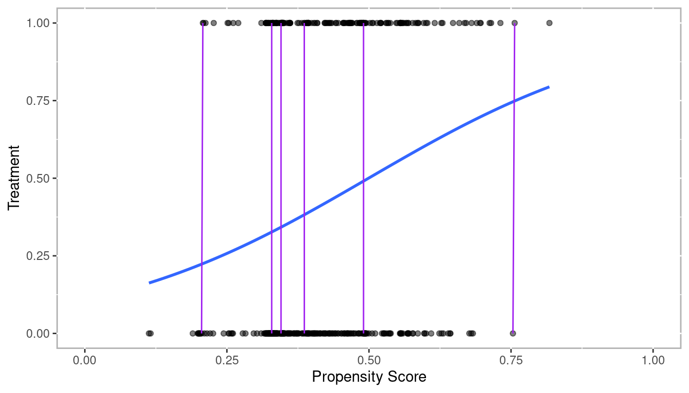

---
output:
  pdf_document: default
  html_document: default
---

# Introduction

The use of propensity score methods [@RosenbaumRubin1983] for estimating causal effects in observational studies or certain kinds of quasi-experiments has been increasing in the social sciences [@ThoemmesKim2011] and in medical research [@Austin2008a] in the last decade. Propensity score analysis (PSA) attempts to adjust selection bias that occurs due to the lack of randomization. Analysis is typically conducted in two phases where in phase I, the probability of placement in the treatment is estimated to identify matched pairs or clusters so that in phase II, comparisons on the dependent variable can be made between matched pairs or within clusters. R [@R-base] is ideal for conducting PSA given its wide availability of the most current statistical methods vis-à-vis add-on packages as well as its superior graphics capabilities.

This book will provide a theoretical overview of propensity score methods as well as illustrations and discussion of PSA applications. Methods used in phase I of PSA (i.e. models or methods for estimating propensity scores) include logistic regression, classification trees, and matching. Discussions on appropriate comparisons and estimations of effect size and confidence intervals in phase II will also be covered. The use of graphics for diagnosing covariate balance as well as summarizing overall results will be emphasized. Lastly, the extension of PSA methods for multilevel data will also be presented.

<div class="figure" style="text-align: center">

<p class="caption">(\#fig:popularity)PSA Citations per Year</p>
</div>


## Counterfactual Model for Causality

In order to understand how propensity score analysis allows us to make causal estimates from observational data, we must first understand the basic principals of causality, particulary the counterfactual model. Figure \@ref(fig:introduction-causality) depicts a conterfactual model. We begin with our research subject. This can be a student, patient, rat, asteroid, or any other object we wish to know whether some condition has an effect on. Consider two parallel universes: one where the subject receives condition A and another where they receive condition B. Typically one condition is some treatment whereas the other condition is the absense of that treatment (also referred to as the control). We will use treatment and control throughout this book to refer to these two conditions. Once the individual has been exposed to the two conditions, the outcome is measured. The difference between these outcomes is the true causal effect. However, it is impossible for an object to exist in two universes at the same time, therefore we can never actually observe the true causal effect. @Holland1986 referred to this as the *Fundamental Problem of Causal Inference*.

<div class="figure" style="text-align: center">

<p class="caption">(\#fig:introduction-causality)Causal Model</p>
</div>

## Randomized Control Trials "The Gold Standard"

The randomized experiment has been the goals standard for estimating causal effects. Effects can be estimated using simple means between groups, or blocks in randomized block design. Randomization presumes unbiasedness and balance between groups. However, randomization is often not feasible for many reasons, especially in educational contexts.

The strong ignorability assumtion states that an outcome is independent of any observed or unobserved covariates under randomization. This is represented mathematically as:

$$\left( { Y }_{ i }\left( 1 \right) ,{ Y }_{ i }\left( 0 \right)  \right) \bot { T }_{ i }$$

For all ${X}_{i}$

Therefore, it follows that the causal effect of a treatment is the difference in an individual’s outcome under the situation they were given the treatment and not (referred to as a counterfactual).

$${\delta}_{i} = { Y }_{ i1 }-{ Y }_{ i0 }$$

However, it is impossible to directly observe \\({\delta}_{i}\\) (referred to as The Fundamental Problem of Causal Inference, Holland 1986). Rubin framed this problem as a missing data problem.


### Rubin's Causal Model

## Conceptual Steps for Conducting Propensity Score Analysis

### Phase I: Modeling for Selection Bias

#### Estimate Propensity Scores

The goal in phase one of PSA is to estimate the probability of being in the treatment. Since in most cases this is a binary outcome, logistic regressionis a common approach to estimating propensity scores. 

$$ \sigma =\frac { { e }^{ t } }{ { e }^{ t }+1 } =\frac { 1 }{ 1+{ e }^{ -1 } }  $$

$$ t={ \beta  }+{ \beta  }_{ 1 }x+\cdots +{ \beta  }_{ k } $$

$$ F\left( x \right) =\frac { 1 }{ 1+{ e }^{ -\left( { \beta  }+{ \beta  }_{ 1 }x+\cdots +{ \beta  }_{ k } \right)  } } $$

Figure \@ref(fig:introduction-logistic) depicts a fitted logistic regression along with a sample of matchs connected by the purple lines.^[The data in this figure are from the [`lalonde`](#lalonde) dataset that will be described at the end of this chapter.]

<div class="figure" style="text-align: center">

<p class="caption">(\#fig:introduction-logistic)Propensity Scores from Logistic Regression with Sample of Matched Pairs</p>
</div>

#### Evaluate Balance

### Phase II: Estimate Causal Effects


## R Primer

R is a statistical software language designed to be extended vis-à-vis packages. As of September 2016, there are currently over 9,000. Given the ease by which R can be extended, it has become the tool of choice for conducting propensity score analysis. This book will make use of a number of packages matching, multiple imputation of missing values, and to visualize results.

* [`MatchIt`](http://gking.harvard.edu/gking/matchit) [@R-MatchIt] Nonparametric Preprocessing for Parametric Causal Inference
* [`Matching`](http://sekhon.berkeley.edu/matching/) [@R-Matching] Multivariate and Propensity Score Matching Software for Causal Inference
* [`multilevelPSA`](http://jason.bryer.org/multilevelPSA) [@R-multilevelPSA] Multilevel Propensity Score Analysis
* [`party`](http://cran.r-project.org/web/packages/party/index.html) [@R-party] A Laboratory for Recursive Partytioning
* [`PSAboot`](http://jason.bryer.org/PSAboot) [@R-PSAboot] Bootstrapping for Propensity Score Analysis
* [`PSAgraphics`](http://www.jstatsoft.org/v29/i06/paper) [R-PSAgraphics] An R Package to Support Propensity Score Analysis
* [`rbounds`](http://www.personal.psu.edu/ljk20/rbounds%20vignette.pdf) [@R-rbounds] An Overview of rebounds: An R Package for Rosenbaum bounds sensitivity analysis with matched data.
* [`rpart`](http://cran.r-project.org/web/packages/rpart/index.html) [@R-rpart] Recursive Partitioning
* [`TriMatch`](http://jason.bryer.org/TriMatch) [@R-TriMatch] Propensity Score Matching for Non-Binary Treatments

The following command will install the R packages we will use in this book.


```r
pkgs <- c('granova', 'granovaGG', 'Matching', 'MatchIt', 'mice', 
          'multilevelPSA', 'party', 'PSAboot', 'PSAgraphics', 'rbounds', 
		  'TriMatch')
install.packages(pkgs)
```

## Datasets

### National Supported Work Demonstration {#lalonde}

[@DehejiaWahba1999] [@Lalonde1986]


```r
data(lalonde, package='Matching')
```

### Lindner Center {#lindner}


```r
data(lindner, package='PSAgraphics')
```

### Tutoring {#tutoring}


```r
data(tutoring, package='TriMatch')
tutoring$treat2 <- tutoring$treat != 'Control'
```

### Programme of International Student Assessment (PISA) {#pisa}


```r
data(pisana, package='multilevelPSA')
pisa.usa <- pisana[pisana$Country == 'United States',]
```

### National Medical Expenditure Study {#nmes}


```r
data(nmes, package='TriMatch')
```
