---
editor_options:
  chunk_output_type: console
output: pdf_document
---

# Introduction {#chapter-introduction}

The use of propensity score methods [@RosenbaumRubin1983] for estimating causal effects in observational studies or certain kinds of quasi-experiments has been increasing over the last couple of decades (see Figure \@ref(fig:popularity)), especially in the social sciences [@ThoemmesKim2011] and medical research [@Austin2008a]. Propensity score analysis (PSA) attempts to adjust selection bias that occurs due to the lack of randomization. Analysis is typically conducted in three phases where in phase I, the probability of placement in the treatment is estimated to identify matched pairs or clusters so that in phase II, comparisons on the dependent variable can be made between matched pairs or within clusters. Lastly, phase III involves testing the robustness of estimates to any unobserved confounders. R [@R-base] is ideal for conducting PSA given its wide availability of the most current statistical methods vis-à-vis add-on packages as well as its superior graphics capabilities.

This book will provide a theoretical overview of propensity score methods as well as illustrations and discussion of implementing PSA methods in R. Chapter \@ref(chapter-introduction) provides an overview of all three phases of PSA with minimal R code. Chapters \@ref(chapter-stratification), \@ref(chapter-matching), and \@ref(chapter-weighting) will discuss the details of implementing the three major approaches to PSA. Chapter \@ref(chapter-missing) provides some strategies to conducting PSA when there is missing data. Chapters \@ref(chapter-sensitivity) and \@ref(chapter-bootstrapping) provide details for phase III of PSA using sensitivity analysis and bootstrapping, respectively. Lastly, chapter \@ref(chapter-non-binary) provides methods for implementing PSA with non-binary treatments and chapter \@ref(chapter-multilevelpsa) discusses methods for PSA with cluster, or Hierarchical, data. The appendices contain additional details regarding the PSA Shiny application (Appendix \@ref(appendix-shiny)), limitations of interpreting fitted values from logistic regression (Appendix \@ref(appendix-psranges)), and additional methods and packages for estimating propensity scores (Appendix \@ref(appendix-psmodels)).


<div class="figure" style="text-align: center">

<p class="caption">(\#fig:popularity)PSA Citations per year</p>
</div>


## Counterfactual Model for Causality

In order to understand how propensity score analysis allows us to make causal estimates from observational data, we must first understand the basic principals of causality, particularly the counterfactual model. Figure \@ref(fig:introduction-causality) depicts a conterfactual model. We begin with our research subject. This can be a student, patient, mouse, asteroid, or any other object we wish to know whether some condition has an effect on. Consider two parallel universes: one where the subject receives condition A and another where they receive condition B. Typically one condition is some treatment whereas the other condition is the absence of that treatment (also referred to as the control). We will use treatment and control throughout this book to refer to these two conditions. Once the individual has been exposed to the two conditions, the outcome is measured. The difference between these outcomes is the true causal effect. However, unless your Dr. Strange living in the Marvell multiverse, it is impossible for an object to exist in two universes at the same time, therefore we can never actually observe the true causal effect. @Holland1986 referred to this as the *Fundamental Problem of Causal Inference*.

<div class="figure" style="text-align: center">

<p class="caption">(\#fig:introduction-causality)Theoretical Causal Model</p>
</div>

## Randomized Control Trials: "The Gold Standard"

The randomized control trials (RCT) has been the gold standard for estimating causal effects. Effects can be estimated using simple means between groups, or blocks in randomized block design. Randomization presumes unbiasedness and balance between groups. However, randomization is often not feasible for many reasons, especially in educational contexts. Although the RCT is the gold standard, it is important to recognize that it only *estimates* the causal effect. We will look at an example of where the RCT can be wrong and why on average it provides good estimates of the true causal effect so we can build a model to closely mimic the RCT with non-randomized data.


The Intelligence Quotient (IQ) is a common measure of intelligence. It is designed such that the mean is 100 and the standard deviation is 15. Consider we have developed an intervention that is known to increase anyone's IQ by 4.5 points (or a standardized effect size of 0.3). Figure \@ref(fig:rct1) represents such a scenario with 30 individuals. The left panel has the individual's outcome if they were assigned to the control condition (in blue) and to the treatment condition (in red). The distance between the red and blue points for any individual is 4.5, our stipulated counterfactual difference. For RCTs we only ever get to observe one outcome for any individual. The right pane represents one possible set of outcomes from an RCT. That is, we randomly selected one outcome for each individual from the left pane.

<div class="figure" style="text-align: center">
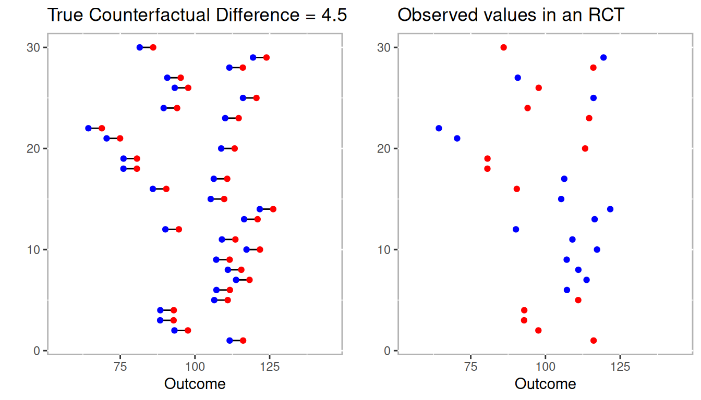
<p class="caption">(\#fig:rct1)Example conterfactuals (left panel) with one possible randomized control trial.</p>
</div>

Figure \@ref(fig:rct2) includes the mean differences between treatment and control as vertical lines in blue and red, respectively. On the left where we observe the true counterfactuals the difference between the treatment (in red) and control (in blue) vertical lines is 4.5. However, on the right the difference between treatment and control is -5.3! 


<div class="figure" style="text-align: center">
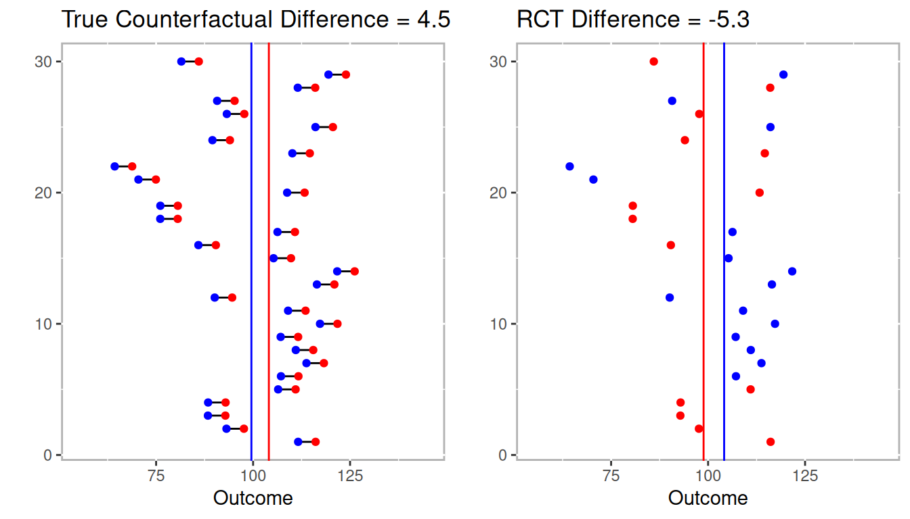
<p class="caption">(\#fig:rct2)Estimated differences for full counterfactual model and one RCT.</p>
</div>

In this example not only did the RCT not estimate the true effect, it estimated in the wrong direction. However, Figure \@ref(fig:rctc) represents the distribution of effects after conducting 1,000 RCTs from the 30 individuals above. The point here is that the RCT is already compromise to estimating the true counterfactual (i.e. causal effect). It is consider the gold standard because over many trials it will nearly approximate the true counterfactual.

<div class="figure" style="text-align: center">

<p class="caption">(\#fig:rctc)Distribution of differences across many RCTs</p>
</div>

The RCT works because the probability of anyone being in the treatment is 50%. Statistically, we call this the strong ignorability assumption. The strong ignorability assumption states that an outcome is independent of any observed or unobserved covariates^[Covariates used in this book and in the context of propensity score analysis are the independent variables that influence statistical models for predicting treatment placement and outcomes.] under randomization. This is represented mathematically as:

\begin{equation}
\begin{aligned}
\left( { Y }_{ i }\left( 1 \right) ,{ Y }_{ i }\left( 0 \right)  \right) \bot { T }_{ i }
\end{aligned}
(\#eq:eq1)
\end{equation}

For all ${X}_{i}$ Here, $Y$ is our outcome of interest and *i* is an individual response such that $Y_i(1)$ is the outcome for subject *i* if assigned to the treatment group and $Y_i(0)$ is the outcome for subject *i* if assigned to the control group. The $\bot$ means independent and $T_i$ is assignment indicator subject *i*. Therefore, it follows that the causal effect of a treatment is the difference in an individual's outcome under the situation they were given the treatment and not (referred to as a counterfactual).

\begin{equation}
\begin{aligned}
{\delta}_{i} = { Y }_{ i1 }-{ Y }_{ i0 }
\end{aligned}
(\#eq:eq2)
\end{equation}

However, it is impossible to directly observe \\({\delta}_{i}\\) (referred to as The Fundamental Problem of Causal Inference, Holland 1986). Rubin framed this problem as a missing data problem and the details will be discussed in the next section. 


### Rubin's Causal Model

Returning to Figure \@ref(fig:introduction-causality), the problem with getting a true causal effect is that we only observe outcome A **or** outcome B, never both. As a result, we are missing data to estimate the causal effect. @Neyman1923 first coined the term *potential outcomes* when referring to randomized trials. However, Donald Rubin extended Neyman's idea to include both observational and experimental data. Rubin's student @Holland1986 later coined this the Rubin Causal Model.

@Rubin1974 discussed an example of the effect of aspirin on a headache:

> "Intuitively, the causal effect of one treatment, E, over another, C, for a particular unit and an interval of time from $t_{1}$
 to $t_{2}$ is the difference between what would have happened at time $t_{2}$ if the unit had been exposed to E initiated at $t_{1}$ and what would have happened at $t_{2}$ if the unit had been exposed to C initiated at $t_{1}$: 'If an hour ago I had taken two aspirins instead of just a glass of water, my headache would now be gone,' or 'because an hour ago I took two aspirins instead of just a glass of water, my headache is now gone.' Our definition of the causal effect of the E versus C treatment will reflect this intuitive meaning."

Under the Rubin Causal Model, whether or not you have a headache is the cause of whether or not your took aspirin one hour ago, but we can only observe one. The key to estimating the causal effect has to do with understanding the mechanism for the selecting whether or nor to take the aspirin. Imagine you get chronic headaches so you need to decide many times whether or not to take an aspirin. Let's also stimulate that the aspirin is more likely to be effective if you take it in the morning than the afternoon. If you decide to flip a coin to decide whether or not to take the aspirin there should be balance between observed headaches in morning and afternoon. That is, even though there is a difference between morning and afternoon, that does not influence the observed outcomes. However, you decide that you will take the aspirin only if it is above 50 degrees outside. Since it is more likely to be warmer in the afternoon then the morning, comparing the outcomes will provide a bias estimate, in part because deciding whether to take the aspirin is no longer 50%. But if we observed the weather we can potentially determine the probability of taking the aspirin or not. With enough observations, we compare situations where the probability of taking the aspirin was low, but there were some observations with and without aspirin all the way across the spectrum to where there was a high probability fo taking the aspirin. 


### Propensity Scores

Propensity scores were first introduced by @RosenbaumRubin1983. They defined propensity scores as "the conditional probability of assignment to a particular treatment given a vector of observed covariates." What Rosenbaum and Rubin showed in their seminal 1983 paper, *The Central Role of the Propensity Score in Observational Studies for Causal Effects* is that the "scalar propensity score is sufficient to remove bias due to all observed covariates." Propensity scores can then be used in a variety of ways including matching, stratification, or weighting. 

Mathematically we can define the probability of being in the treatment group as:

\begin{equation}
\begin{aligned}
\pi(X_i) = Pr(T_i = 1 \; | \; X_i)
\end{aligned}
(\#eq:eq3)
\end{equation}

Where $X$ is a matrix of observed covariates and $\pi(X_i)$ is the propensity score. The balancing property under exogeneity states that,

\begin{equation}
\begin{aligned}

T_i \; \mathrel{\unicode{x2AEB}} \; X_i \; | \; \pi (X_i)
\end{aligned}
(\#eq:eq4)
\end{equation}

Where Ti is the treatment indicator for subject i. In the case of randomized experiments, the strong ignorability assumption states,

\begin{equation}
\begin{aligned}

Y_i(1), \; Y_i(0)) \; \mathrel{\unicode{x2AEB}} \; T_i \; | \; X_i
\end{aligned}
(\#eq:eq5)
\end{equation}

For all $X_i$. That is, treatment is independent of all covariates, observed or otherwise. However, the strong ignorability assumption can be restated with the propensity score as,

\begin{equation}
\begin{aligned}

({ Y }_{ i }(1),{ Y }_{ i }(0)) \; \mathrel{\unicode{x2AEB}} \; { T }_{ i } \; | \; \pi({ X }_{ i })
\end{aligned}
(\#eq:eq6)
\end{equation}

So that treatment placement is ignorable given the propensity score presuming sufficient balance^[Balance in the context of PSA refers to differences in observed covariates between treatment and control units is minimized.] is achieved. 

The average treatment effect (ATE) is defined as $E(r_1) - E(r_0)$ where $E(.)$ is the expected value in the population. Given a set of covariates, $X$, and outcomes $Y$, where 0 denotes the control group and 1 denotes the treatment group, ATE is defined as:

\begin{equation}
\begin{aligned}
ATE \; = \; E(Y_1 - Y_0 \; | \; X) \; = \; E(Y_1 \; | \; X) - E(Y_0 \; | \; X)
\end{aligned}
(\#eq:eq7)
\end{equation}

Or the difference treatment and control groups given the set observed covariates. In section \@ref(introduction-effects) we will discuss ATE in addition to other causal estimators in detail.

::: {.rmdtip}
Simply put, what Rosenbaum and Rubin (1983) proved was that observations similar propensity scores should be roughly equivalent (balanced) across all observed covariates. As we will see in the rest of this chapter, having a scalar that summarizes many variables is convenient for finding matches, stratifying, and for applying regression weights. Although we will verify that balance is achieved as some methods for estimating propensity scores are better than others.
:::

## Phases of Propensity Score Analysis

Propensity score analysis is typically conducted in three phases, namely:

1. Model for selection bias

	A. Estimate propensity scores  
	B. Check balance  
	C. Repeat A and B until sufficient balance is optimized

2. Estimate causal effects.

3. Check for sensitivity to unobserved confounders.

The following sections will provide an overview of these phases and the details on implementing each phase using one of the three main methods for conducting PSA, stratification (chapter \@ref(chapter-stratification)), matching (chapter \@ref(chapter-matching)), and weighting (chapter \@ref(chapter-weighting)).

### Phase I: Estimate Propensity Scores

Phase one of propensity score analysis is a cyclical process where propensity scores are estimated using a statistical model, balance in observed covariates is checked, and modifications to the model are modified until sufficient balance is achieved. For simplicity we will use logistic regression to estimate propensity scores throughout the book. However, will introduce classification trees in chapter \@ref(chapter-stratification) given how they are uniquely applicable to stratification methods in and in appendix \@ref(appendix-psmodels) outlines some additional statistical methods, with R code, for estimating propensity scores.


Propensity scores are the conditional probability of being in the treatment given a set of observed covaraites. In practice we use statistical models where the dependent variable is dichotomous (treatment or control). Very often logistic regression is used, but with the advances in predictive models we have an ever increasing number of model choices including classification trees, Bayesian models, ensemble such as random forests, and many more. To demonstrate the main features of propensity score analysis we will use a simulated dataset with three pre-treatment covariates, `x1` and `x2` which are continuous and `x3` which is categorical, a treatment indicator, and an outcome variable with a treatment effect of 1.5. Figure \@ref(fig:sim-scatter) is a scatter plot of the simulated data.^[This simulated dataset is adapted from a [blog post](https://livefreeordichotomize.com/posts/2019-01-17-understanding-propensity-score-weighting/index.html) by [Lucy D’Agostino McGowan](https://www.lucymcgowan.com)]

<div class="figure" style="text-align: center">

<p class="caption">(\#fig:sim-scatter)Scatterplot of simulated datatset</p>
</div>

Figure \@ref(fig:sim-ggpairs) is a pairs plot [@R-GGally] showing the relationship between the covariates (i.e. `x1` and `x2`) and the outcome grouped by treatment. There is a statistically significant correlation between each of the covariates and the outcome suggesting there is selection bias that would bias any causal estimate. 

<!-- Indeed a simple null hypothesis test resulted in a difference of 1.44 ($t_{805} = -21.53$, *p* < 0.01), however we setup the simulation to have a mean difference of 2! -->


<div class="figure" style="text-align: center">

<p class="caption">(\#fig:sim-ggpairs)Pairs plot showing the relationships between covariates, treatment, and outcome</p>
</div>


Our goal is to adjust for this selection bias using propensity scores. In this example we used logistic regression to estimate the propensity scores. Figure \@ref(fig:sim-dist) is a histogram showing the distribution of propensity scores for the treatment group in green above and control group in orange below. Note how the distributions are skewed; treatment group is negatively skewed and the control group is positively skewed. This should hopefully make intuitive sense. As the probability of being in the treatment increases, we should see the number of treatment observations increase while the number of control observations decrease. 


<div class="figure" style="text-align: center">

<p class="caption">(\#fig:sim-dist)Distribution of propensity scores</p>
</div>


#### Evaluate Balance {#intro-balance}

Once propensity scores are estimated it is important to verify that balance between the observed covariates is achieved. There are a number of ways of doing this. For matching methods where treatment and control units are paired, dependent sample tests can be used (e.g. *t*-tests for continuous variables and $\chi^2$ tests for categorical variables). However, significance testing alone is generally problematic. Given the number of covariates, and hence the number of null hypothesis tests being conducted, the likelihood of committing type I and type II errors is very high. Moreover, many observational studies that we wish to use PSA with have very large sample sizes which, all else being equal, will shrink the standard error estimate often resulting in small *p*-values. Instead utilizing standardized effect sizes and graphical representations will provide better evidence as to whether balance has been achieved. The `PSAgraphics` package [@R-PSAgraphics] provides a number of functions to assist with evaluating balance. Figure \@ref(fig:intro-multiple-balance-plots) is a multiple covariate balance plot the summarizes all covariates together. The *x*-axis is the absolute standardized effect size and the *y*-axis is each covariate. The red line is the effect before propensity score adjustment and the blue is the effect after propensity score adjustment. Unfortunately the literature doesn't provide good guidance for an adjusted effect size threshold which indicates sufficient balance has been achieved. @Cohen1988 is frequently cited for having indicated that an effect size between 0.2 and 0.3 is small. In general, I recommend trying to achieve adjusted effect sizes of less than 0.1. 

<div class="figure" style="text-align: center">
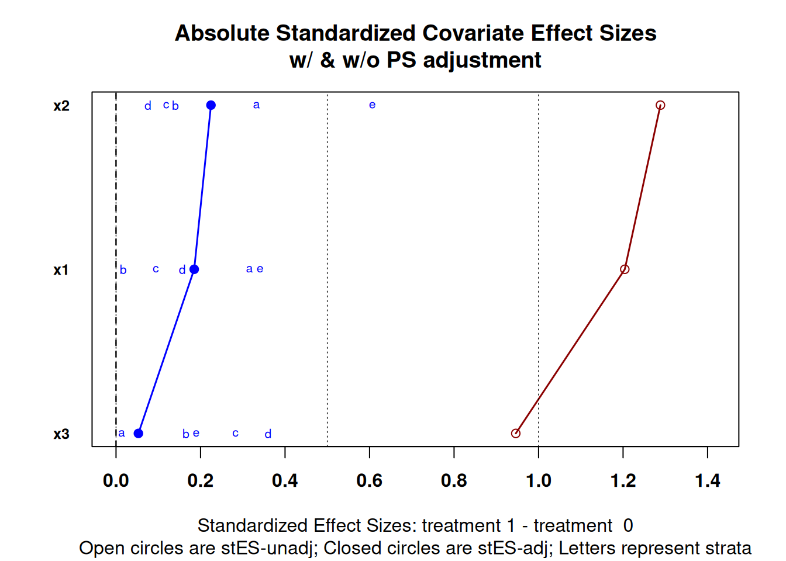
<p class="caption">(\#fig:intro-multiple-balance-plots)Multiple covariate balance assessment plot</p>
</div>

The plot on the left in Figure \@ref(fig:intro-balance-plots) is balance assessment plot for a continuous variable. The exact procedures for stratification will be discussed in chapter \@ref(chapter-stratification), but in short, we divide the propensity scores into five strata using quintiles so that each stratum has the same number of observations. The yellow bars are the control group and the orange bars are the treatment group. We are looking for the center and spread to be roughly equivalent within each stratum. From this example we can see that stratum 5 has higher values than stratum 1. The plot on the right is a plot for categorical data using a bar plot.

The plot on the right is a balance assessment plot for a qualitative variable. Here, stacked bars for treatment and control by strata show the distribution of the categories. Like the continuous counterpart, we are looking for similar distributions within each stratum.

<div class="figure" style="text-align: center">

<p class="caption">(\#fig:intro-balance-plots)Continuous (left) and categorical (right) covariate balance assessment plots</p>
</div>

We will see there are many choices for estimating propensity scores in the remainder of this book. In practice you will find that phase I of PSA will occupy most of your time. The robustness of your causal estimates will rely on achieving good balance in your observed covariates.

::: {.rmdtip}
**Which propensity score method should you use?**  
*Whichever one gives the best balance!*
:::

### Phase II: Estimate Causal Effects {#introduction-effects}

Now that sufficient balance has been achieved in the observed covariates, it is time to estimate the causal effect. This section will provide an overview of the three most used approaches to conducting propensity score analysis: stratification, matching, and weighting. These will be covered in more details in chapters \@ref(chapter-stratification), \@ref(chapter-matching), and \@ref(chapter-weighting), respectively.

Before using one of the three approaches to conducting PSA, it is often helpful to plot the propensity scores against the outcome. Figure \@ref(fig:sim-loess) is a scatter plot with propensity scores (*x*-axis) and outcome (*y*-axis), grouped/colored by treatment, along with a Loess regression line [@Cleveland1979]. There are a number of features to observe here. First, we see that the propensity score increases the outcome increases. This is a direct representation of selection bias. Second, the Loess regression lines with approximate 95% confidence intervals (in grey) do not overlap across the entire range of propensity scores. Additionally the distance between the two Loess regression lines is roughly equal. This is an indication that the treatment effect is homogeneous (i.e. the same for all units). We will see in later chapters that this is often not the case. This will become an important feature of PSA in detecting heterogeneous, or uneven, treatments based upon different "profiles."


<div class="figure" style="text-align: center">
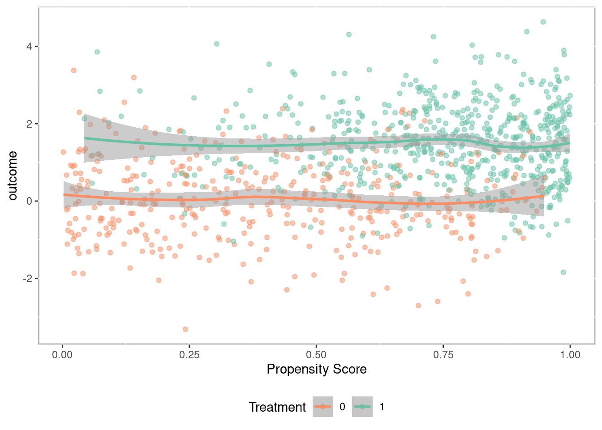
<p class="caption">(\#fig:sim-loess)Scatter plot of propensity scores against outcome with Loess regression lines</p>
</div>


#### Stratification

Stratification involves dividing observations into strata (or subclasses) based upon the propensity scores so that treated and comparison units are similar within each strata. Cochran (1968) observed that creating five subclassifications (stratum) removes at least 90% of the bias in the estimated treatment effect. With larger sample sizes it may be appropriate to use up to 10 strata, however more typically does not provide much additional benefit. Figure \@ref(fig:intro-stratification) provides density distribution of propensity scores for the treatment and control observations. For this example, strata are defined using quintiles so that each stratum has the same number of observations. The vertical lines separate the strata. We can see that for stratum A there are many more control observations than treatment observations. Conversely, stratum E has many more treatment observations than control observations. As we will see in section \@ref(intro-treatment-effects) this will have implications for how treatment effects are calculated. However, what is important, and what we verified in section \@ref(intro-balance), observations within each stratum are very similar across all observed covariates.

<div class="figure" style="text-align: center">
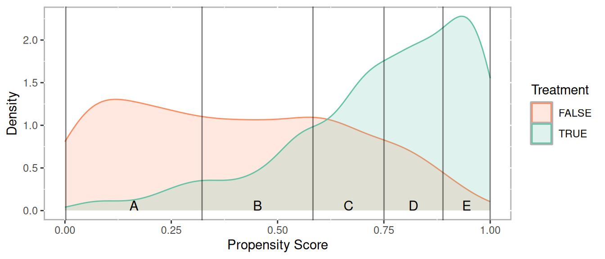
<p class="caption">(\#fig:intro-stratification)Density distribution of propensity scores by treatment</p>
</div>

Figure \@ref(fig:intro-stratification-scatter) plots the propensity score against the outcome. The horizontal lines correspond to the mean for each group within each stratum. To calculate an overall effect size, independent sample tests (e.g. *t*-tests) are conducted within each stratum and pooled to provide an overall estimate.

<div class="figure" style="text-align: center">
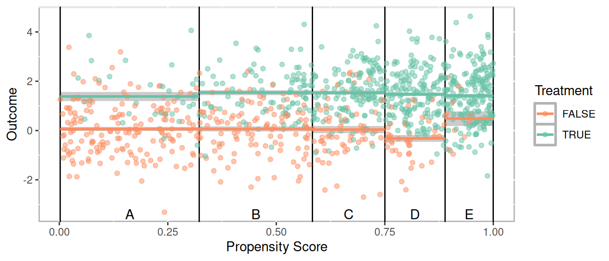
<p class="caption">(\#fig:intro-stratification-scatter)Scatter plot of propensity scores versus outcome</p>
</div>

Figure \@ref(fig:intro-circ-psa) provides an alternative way of depicting the results [@R-PSAgraphics]. This plots the average treatment (*x*-axis) versus control (*y*-axis) for each strata. The means are projected to a line perpendicular to the unit line (i.e. the line $y = x$) such that the tick marks represent the distribution of differences. The green bar corresponds to the 95% confidence interval. The size of the circles a proportional to the sample size within each stratum. In this example they are all the same but can be different when using other methods for estimation propensity scores such as classification trees (discussed in chapter \@ref(chapter-stratification) and appendix \@ref(appendix-psmodels)). Since $y = x$ points that fall on that line indicate a difference of zero (i.e. $y - x = 0$). By extension, if the confidence interval represented by the green line spans the unit line then one would fail to reject the null hypothesis. In this example however, there is a statistically significant treatment effect.

<div class="figure" style="text-align: center">

<p class="caption">(\#fig:intro-circ-psa)Propensity score assessment plot for five strata</p>
</div>

#### Matching

For matching methods we wish to pair treatment observations with control observations. As will be discussed in chapter \@ref(chapter-matching) there are numerous algorithms for finding matches. For this example a simple one-to-one match was found using the nearest neighbor based upon the propensity score. Additionally, a caliper of 0.1 was used meaning that an observation would not be matched if the distance to another observation was more than 0.1 standard deviations away. The lines in the figure correspond to the observations that were matched. Since observations are matched, dependent sample tests (e.g. *t*-tests) are used to estimate the treatment effects.

<div class="figure" style="text-align: center">
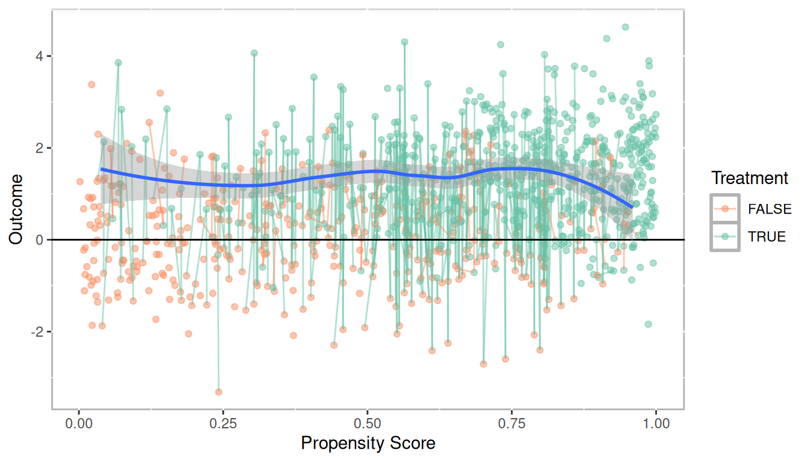
<p class="caption">(\#fig:intro-matching)Scatterplot of propensity score versus outcome with matched pairs connected</p>
</div>

Similar to Figure \@ref(fig:intro-circ-psa) for stratification, Figure \@ref(fig:intro-matching-granovads) is a dependent sample assessment plot [@R-granovaGG] where each point represents a matched pair. The treatment observations are plotted on the *x*-axis and control observations on the *y*-axis. The points on the line perpendicular to the unit line represent the distribution of difference scores. The confidence interval is in purple and clearly does not span the unit line indicating a statistically significant treatment effect.

<div class="figure" style="text-align: center">

<p class="caption">(\#fig:intro-matching-granovads)Dependent sample assessment plot</p>
</div>


#### Weighting

Propensity score weighting is useful when you wish to use the propensity scores within other regression models. Specifically, each observation is weighted by the inverse of the probability of being in that group. Figure \@ref(fig:intro-weighting) plots the propensity scores against the outcome, however here the size of the point is proportional to the propensity score weight. In this example the weights are calculated to estimate the average treatment effect. Details on the different treatment effects are discussed in section \@ref(intro-treatment-effects). A Loess regression line (blue) with an approximate 95% confidence interval (grey) is provided along with a line $y - 0$. Since the Loess regression lines does not overlap zero, we would conclude there is a statistically significant treatment effect across the entire range of propensity scores. In later examples of the book we will find that not all treatment effects are homogeneous meaning the treatment effect is not the same across the entire range of propensity scores. This plot, along with the Loess regression plot (Figure \@ref{sim-loess}) are effective tools for determining whether treatment effects may differ depending on different covariate profiles.


<div class="figure" style="text-align: center">
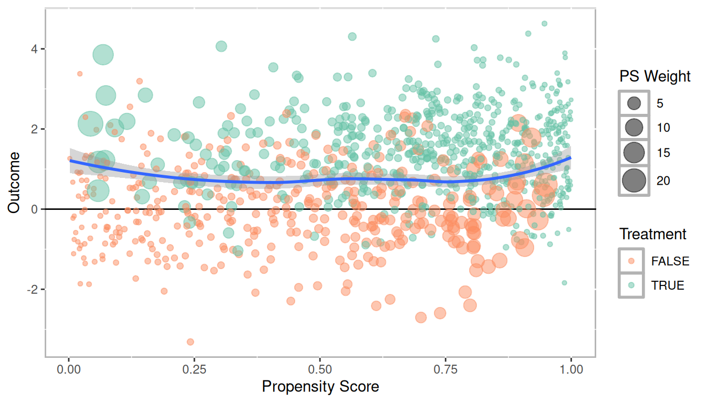
<p class="caption">(\#fig:intro-weighting)Scatter plot of propensity scores versus outcome with point sizes corresponding to propensity score weights</p>
</div>


#### Treatment Effects {#intro-treatment-effects}

For randomized control trials we typically conduct a null hypothesis test of the differences between the means of the treatment and control groups (as defined in equation \@ref(eq:eq7) above). For PSA this is often done, but it is important to recognize that not all observations are counted equal in the causal estimation. And moreover, average treatment effect is not the only causal estimate measure we can calculate. This section defines four different causal estimates. They are presented in the context of propensity score weighting (see \@ref(chapter-weighting)) but conceptually apply to stratification and matching.

##### Average Treatment Effect (ATE)

The average treatment effect (ATE) is the most understood estimate given that it has a direct analog to RCTs. We could estimate ATE from an RCT using this approach by simply assuming everyone has a propensity score of 0.5 since they all have a 50% of being in the treatment. That is, we assume that every treatment unit could be interchangeable with a control unit. For PSA though, each unit has a different propensity score. The goal is to compare units with similar propensity scores. And as we saw above in Figure \@ref(fig:sim-dist) the distributions for treatment and control are not the same. Figure \@ref(fig:ate-hist) depicts how the ATE works in practice, in particular how different units are weighted more or less towards the ATE estimate as we move across the propensity score range. The darker color represents the propensity score distribution as estimated above, but the light bars represent the distribution used in the ATE calculation. For treatment units with lower propensity scores (for which there are fewer of) a weighted more to ATE calculation. As we move right across the propensity score range control units with large propensity scores will be weighted more in that range. 

\begin{equation}
\begin{aligned}
ATE = E(Y_1 - Y_0 | X) = E(Y_1|X) - E(Y_0|X)
\end{aligned}
(\#eq:eqate)
\end{equation}

<div class="figure" style="text-align: center">

<p class="caption">(\#fig:ate-hist)Histogram of average treatement effect</p>
</div>

##### Average Treatment Effect Among the Treated (ATT)

The average treatment effect among the treated (ATT) uses the treated units as the primary focus. From Figure \@ref(fig:att-hist) we see that the entire treatment group is used and there is no weighting up or down. However, for the control group we weight down (the grey bars) their values on the lower end of the propensity score range to match the distribution of the treatment group. Conversely, control group observations are weighted up on the right side of the propensity score range, again, to closely match the distribution of the treatment group. In the context of matching where we wish to pair treatment and control units, the goal is to use all treatment observations, therefore it is possible to not use some control observations with smaller propensity scores whereas some control observations with larger propensity scores may be reused in order to find a match for every treatment observation.

Mathematically, ATT is defined in equation \@ref(eq:eqatt). The important difference between this at ATE is that we are calculating the expected value given $X = 1$, which indicates placement in the treatment.

\begin{equation}
\begin{aligned}
ATT = E(Y_1 - Y_0 | X = 1) = E(Y_1 | X = 1) - E(Y_0 | X = 1)
\end{aligned}
(\#eq:eqatt)
\end{equation}

<div class="figure" style="text-align: center">
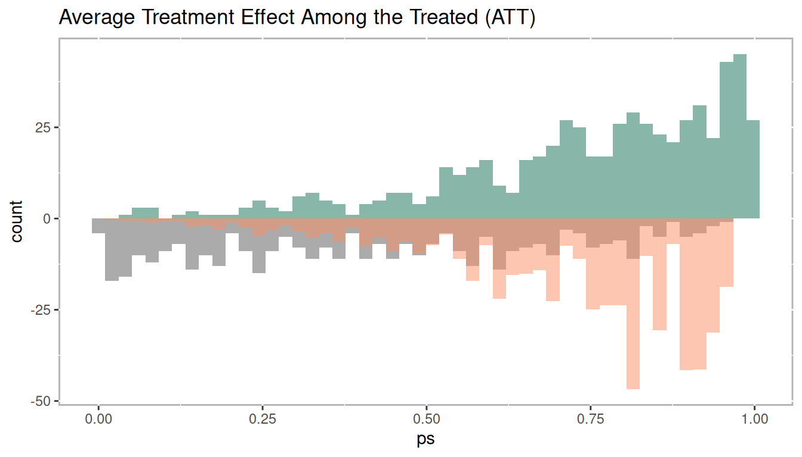
<p class="caption">(\#fig:att-hist)Histogram of average treatement among the treated</p>
</div>

##### Average Treatment Effect Among the Control (ATC)

The average treatment effect among the control (ATC) is exactly the opposite as ATT. Here, we wish to use every control observation which means some treatment observations with larger propensity scores will not be used (in the case of matching) or weighted down (in the case of weighting or stratification) as represented by the grey. Conversely, treatment observations with smaller propensity scores may be match with multiple control observations (in the case of matching) or weighted up (in the case of weighting or stratification).

Mathematically, ATC is defined in equation \@ref(eq:eqatc). The important difference between this at ATE is that we are calculating the expected value given $X = 1$, which indicates placement in the control

\begin{equation}
\begin{aligned}
ATC = E(Y_1 - Y_0 | X = 0) = E(Y_1 | X = 0) - E(Y_0 | X = 0)
\end{aligned}
(\#eq:eqatc)
\end{equation}

<div class="figure" style="text-align: center">
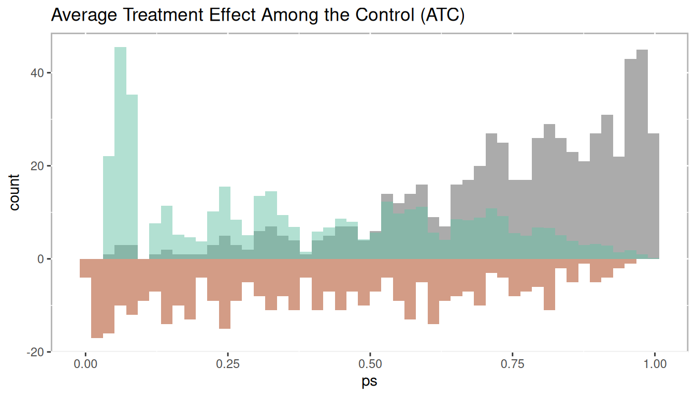
<p class="caption">(\#fig:atc-hist)Histogram of average treatement among the control</p>
</div>

##### Average Treatment Effect Among the Evenly Matched (ATM)

The average treatment effect among the evenly matched (ATM) is a relatively new estimate developed specifically for propensity score weighting but is closely related to what is estimated when conducting one-to-one matching. Unlike ATT and ATC where not all observations are weighted equally, for the calculation of ATM all observations included in the estimation have equal weight. As depicted in Figure \@ref(fig:acm-hist) there are control observations with small propensity scores that are not used and treatment observations with large propensity scores that are not used (represented by the grey bars). This closely mimics what occurs in one-to-one matching. In one-to-one matching any observation can be used only once and can only be matched to one observation of the other group. Hence, it tends to work out that only observations near the mean of the propensity score range are included. See @LiGreene2013, @McGowan2018, and @Samuels2017 for more details.

\begin{equation}
\begin{aligned}
ATM_d = E(Y_1 - Y_0 | M_d = 1)
\end{aligned}
(\#eq:eqatm)
\end{equation}

<div class="figure" style="text-align: center">
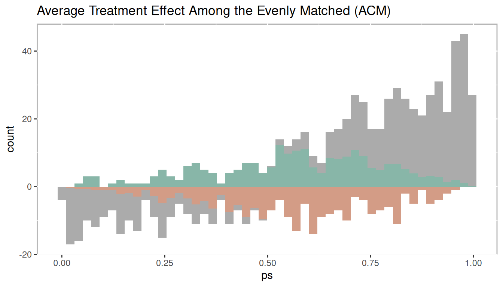
<p class="caption">(\#fig:acm-hist)Histogram of average treatment effect among the evenly matched</p>
</div>


### Phase III: Sensitivity Analysis

The final phase of propensity score analysis is to evaluate the robustness of causal estimates. We will discuss two approaches to test the robustness: sensitivity analysis (covered in detail in chapter \@ref(chapter-sensitivity)) and bootstrapping (covered in detail in chapter \@ref(chapter-bootstrapping)). Sensitivity analysis is a procedure where the results are tested under increasing factors of an unmeasured confounder in changing the randomization process. That is, it tests how much another variable would have change the prediction of treatment to result in non rejecting the null hypothesis. 

Sensitivity analysis is only well defined for matching methods. @Rosenbaum2012 proposed testing the null hypothesis more than once, in part, to also test the sensitivity to the chosen method. In this spirit of testing the null hypothesis more than once, the `PSAboot` R package [@R-PSAboot] has been developed for conducting bootstrapping for propensity score analysis. This framework addresses the issues sensitivity to method choice, but also provides a framework for addressing issues of imbalance in treatment placement. Bootstrapping [@Efron1979] has become an effective approach to estimating parameters. The approach discussed in chapter \@ref(chapter-bootstrapping) avoids the issues of multiple hypothesis testing and increased type I error rates by using the bootstrap samples to estimate the standard errors and confidence intervals.

## R Packages

R is a statistical software language designed to be extended vis-à-vis packages. As of April 20, 2023, there are currently 19,369 packages available on [CRAN](https://cran.r-project.org). Given the ease by which R can be extended, it has become the tool of choice for conducting propensity score analysis. If you are new to R I highly recommend [*R for Data Science*](https://r4ds.had.co.nz) [@Wickham2016] as an excellent introduction to R. This book will make use of a number of R 


* [`MatchIt`](http://gking.harvard.edu/gking/matchit) [@R-MatchIt] Nonparametric Preprocessing for Parametric Causal Inference
* [`Matching`](http://sekhon.berkeley.edu/matching/) [@R-Matching] Multivariate and Propensity Score Matching Software for Causal Inference
* [`multilevelPSA`](https://github.com/jbryer/multilevelPSA) [@R-multilevelPSA] Multilevel Propensity Score Analysis
* [`party`](http://cran.r-project.org/web/packages/party/index.html) [@R-party] A Laboratory for Recursive Partytioning
* [`PSAboot`](https://github.com/jbryer/PSAboot) [@R-PSAboot] Bootstrapping for Propensity Score Analysis
* [`PSAgraphics`](http://www.jstatsoft.org/v29/i06/paper) [@R-PSAgraphics] An R Package to Support Propensity Score Analysis
* [`rbounds`](http://www.personal.psu.edu/ljk20/rbounds%20vignette.pdf) [@R-rbounds] An Overview of rebounds: An R Package for Rosenbaum bounds sensitivity analysis with matched data.
* [`rpart`](http://cran.r-project.org/web/packages/rpart/index.html) [@R-rpart] Recursive Partitioning
* [`TriMatch`](https://github.com/jbryer/TriMatch) [@R-TriMatch] Propensity Score Matching for Non-Binary Treatments

The [`psa` R package](https://github.com/jbryer/psa) was specifically designed to accompany this book including some utility functions to assist with conducting propensity score analysis. The following command will install the `psa` R package along with all the R packages we will use in this book.


```r
remotes::install_github('jbryer/psa', dependencies = 'Enhances')
```

## Datasets {#intro-datasets}


This section provides a description of the datasets that will be used throughout this book.

### National Supported Work Demonstration (`lalonde`) {#lalonde}

The `lalonde` dataset is perhaps one of the most used datasets when introducing or evaluating propensity score methods. The data was collected by @Lalonde1986 but became widely used in the PSA literature after @DehejiaWahba1999 used it in their paper to evaluate propensity score matching. The dataset originated from the National Supported Work Demonstration study conducted in the 1970s. The program provided 12 to 18 months of employment to people with longstanding employment problems. The dataset contains 445 observations of 12 variables. The primary outcome is `re78` which is real earnings in 1978. Observed covariates used to adjust for selection bias include `age` (age in years), `edu` (number of years of education), `black` (black or not), `hisp` (Hispanic or not), `married` (married or not), `nodegr` (whether the worker has a degree or not, note that 1 = no degree), `re74` (real earnings in 1974), and `re75` (real earnings in 1975).


```r
data(lalonde, package='Matching')
```

* `age`: Integer with mean = 25 and SD = 7.1
* `educ`: Integer with mean = 10 and SD = 1.8
* `black`: Integer with mean = 0.83 and SD = 0.37
* `hisp`: Integer with mean = 0.088 and SD = 0.28
* `married`: Integer with mean = 0.17 and SD = 0.37
* `nodegr`: Integer with mean = 0.78 and SD = 0.41
* `re74`: Numeric with mean = 2,102 and SD = 5,364
* `re75`: Numeric with mean = 1,377 and SD = 3,151
* `re78`: Numeric with mean = 5,301 and SD = 6,631
* `u74`: Integer with mean = 0.73 and SD = 0.44
* `u75`: Integer with mean = 0.65 and SD = 0.48
* `treat`: Integer with mean = 0.42 and SD = 0.49

### Lindner Center (`lindner`) {#lindner}

Data from an observational study of 996 patients receiving a PCI at Ohio Heart Health in 1997 and followed for at least 6 months by the staff of the Lindner Center. This is a landmark dataset in the literature on propensity score adjustment for treatment selection bias due to practice of evidence based medicine; patients receiving `abciximab` tended to be more severely diseased than those who did not receive a IIb/IIIa cascade blocker.


```r
data(lindner, package='PSAgraphics')
```

* `lifepres`: Numeric with mean = 11 and SD = 1.9
* `cardbill`: Integer with mean = 15,674 and SD = 11,182
* `abcix`: Integer with mean = 0.7 and SD = 0.46
* `stent`: Integer with mean = 0.67 and SD = 0.47
* `height`: Integer with mean = 171 and SD = 11
* `female`: Integer with mean = 0.35 and SD = 0.48
* `diabetic`: Integer with mean = 0.22 and SD = 0.42
* `acutemi`: Integer with mean = 0.14 and SD = 0.35
* `ejecfrac`: Integer with mean = 51 and SD = 10
* `ves1proc`: Integer with mean = 1.4 and SD = 0.66

### Tutoring (`tutoring`) {#tutoring}

The `tutoring` dataset originates from a study conducted at an online adult serving institution examining the effects of tutoring services for students in English 101, English 201, and History 310. Tutoring services were available to all students but Treatment (`treat`) is operationalized as students who used tutoring services at least once during the course. Only 19.6% of students used tutoring services with approximately half using it more than once. We will use this dataset with both a dichotomous treatment (used tutoring or not) or as a two level treatment (used tutoring services once, used tutoring services two or more times).


```r
data(tutoring, package='TriMatch')
tutoring$treat2 <- tutoring$treat != 'Control'
table(tutoring$Course, tutoring$treat)
```

```
##          
##           Control Treat1 Treat2
##   ENG*101     349     22     31
##   ENG*201     518     36     32
##   HSC*310      51     76     27
```

* `treat`: Factor with 3 levels: Control; Treat1; Treat2
* `Course`: Character with 3 unique values
* `Grade`: Integer with mean = 2.9 and SD = 1.5
* `Gender`: Factor with 2 levels: FEMALE; MALE
* `Ethnicity`: Factor with 3 levels: Other; White; Black
* `Military`: Logical with 31% TRUE and 69% FALSE
* `ESL`: Logical with 8.1% TRUE and 92% FALSE
* `EdMother`: Integer with mean = 3.8 and SD = 1.5
* `EdFather`: Integer with mean = 3.7 and SD = 1.7
* `Age`: Numeric with mean = 37 and SD = 9
* `Employment`: Integer with mean = 2.7 and SD = 0.68
* `Income`: Numeric with mean = 5.1 and SD = 2.3
* `Transfer`: Numeric with mean = 52 and SD = 25
* `GPA`: Numeric with mean = 3.2 and SD = 0.57
* `GradeCode`: Character with 6 unique values
* `Level`: Factor with 2 levels: Lower; Upper
* `ID`: Integer with mean = 572 and SD = 330
* `treat2`: Logical with 20% TRUE and 80% FALSE

### Programme of International Student Assessment (`pisana`) {#pisa}

[The Programme of International Student Assessment](https://www.oecd.org/pisa) (PISA) is a study conducted by [OECD](https://www.oecd.org) every three years to measure 15-year-olds' academic abilities in reading, mathematics, and science along with a rich set of demographic and background information. The `pisana` dataset included in the `multilevelPSA` package contains the results from the 2009 study for North America (i.e. Canada, Mexico, and the United States).


```r
data(pisana, package='multilevelPSA')
```

* `Country`: Character with 3 unique values
* `CNT`: Character with 3 unique values
* `SCHOOLID`: Factor with 1,534 levels
* `ST01Q01`: Factor with 0 levels: NA (66,548 missing values)
* `ST04Q01`: Factor with 2 levels: Female; Male
* `ST05Q01`: Factor with 3 levels: Yes, more than one year; Yes, one year or less; No
* `ST06Q01`: Numeric with mean = 5.7 and SD = 0.81
* `ST07Q01`: Factor with 3 levels: No, never; Yes, once; Yes, twice or more
* `ST08Q01`: Factor with 2 levels: Yes; No
* `ST08Q02`: Factor with 2 levels: Yes; No
* `ST08Q03`: Factor with 2 levels: No; Yes
* `ST08Q04`: Factor with 2 levels: Yes; No
* `ST08Q05`: Factor with 2 levels: No; Yes
* `ST08Q06`: Factor with 2 levels: No; Yes
* `ST10Q01`: Factor with 5 levels: <ISCED level 3A>; <ISCED level 2>; <ISCED level 3B, 3C>; Did not complete <ISCED level 1>; <ISCED level 1>
* `ST12Q01`: Factor with 4 levels: Working Full-time; Working Part-Time; Other; Looking for work
* `ST14Q01`: Factor with 5 levels: <ISCED level 3A>; <ISCED level 2>; <ISCED level 1>; Did Not Complete <ISCED level 1>; <ISCED level 3B, 3C>
* `ST16Q01`: Factor with 4 levels: Working Full-time; Working Part-Time; Looking for work; Other
* `ST19Q01`: Factor with 2 levels: Language of test; Another language
* `ST20Q01`: Factor with 2 levels: Yes; No
* `ST20Q02`: Factor with 2 levels: Yes; No
* `ST20Q03`: Factor with 2 levels: Yes; No
* `ST20Q04`: Factor with 2 levels: Yes; No
* `ST20Q05`: Factor with 2 levels: Yes; No
* `ST20Q06`: Factor with 2 levels: Yes; No
* `ST20Q07`: Factor with 2 levels: Yes; No
* `ST20Q08`: Factor with 2 levels: Yes; No
* `ST20Q09`: Factor with 2 levels: Yes; No
* `ST20Q10`: Factor with 2 levels: Yes; No
* `ST20Q12`: Factor with 2 levels: Yes; No
* `ST20Q13`: Factor with 2 levels: Yes; No
* `ST20Q14`: Factor with 2 levels: Yes; No
* `ST21Q01`: Factor with 4 levels: Three or more; Two; One; None
* `ST21Q02`: Factor with 4 levels: Three or more; Two; One; None
* `ST21Q03`: Factor with 4 levels: Three or more; One; Two; None
* `ST21Q04`: Factor with 4 levels: Two; One; Three or more; None
* `ST21Q05`: Factor with 4 levels: One; Two; Three or more; None
* `ST22Q01`: Factor with 6 levels: 26-100 books; 0-10 books; 201-500 books; 11-25 books; 101-200 books; More than 500 books
* `ST23Q01`: Factor with 5 levels: More than 2 hours a day; 30 minutes or less a day; I don't read for enjoyment; Between 30 and 60 minutes; 1 to 2 hours a day
* `ST31Q01`: Factor with 2 levels: No; Yes
* `ST31Q02`: Factor with 2 levels: No; Yes
* `ST31Q03`: Factor with 2 levels: No; Yes
* `ST31Q05`: Factor with 2 levels: No; Yes
* `ST31Q06`: Factor with 2 levels: No; Yes
* `ST31Q07`: Factor with 2 levels: Yes; No
* `ST32Q01`: Factor with 5 levels: Do not attend; Less than 2 hours a week; 2 up to 4 Hours a week; 6 or more hours a week; 4 up to 6 hours per week
* `ST32Q02`: Factor with 5 levels: Less than 2 hours a week; Do not attend; 6 or more hours a week; 2 up to 4 Hours a week; 4 up to 6 hours per week
* `ST32Q03`: Factor with 5 levels: Do not attend; Less than 2 hours a week; 4 up to 6 hours per week; 2 up to 4 Hours a week; 6 or more hours a week
* `PV1MATH`: Numeric with mean = 461 and SD = 92
* `PV2MATH`: Numeric with mean = 461 and SD = 92
* `PV3MATH`: Numeric with mean = 461 and SD = 92
* `PV4MATH`: Numeric with mean = 461 and SD = 92
* `PV5MATH`: Numeric with mean = 461 and SD = 92
* `PV1READ`: Numeric with mean = 465 and SD = 94
* `PV2READ`: Numeric with mean = 465 and SD = 94
* `PV3READ`: Numeric with mean = 465 and SD = 94
* `PV4READ`: Numeric with mean = 465 and SD = 94
* `PV5READ`: Numeric with mean = 465 and SD = 94
* `PV1SCIE`: Numeric with mean = 460 and SD = 94
* `PV2SCIE`: Numeric with mean = 460 and SD = 94
* `PV3SCIE`: Numeric with mean = 460 and SD = 94
* `PV4SCIE`: Numeric with mean = 460 and SD = 94
* `PV5SCIE`: Numeric with mean = 460 and SD = 94
* `PUBPRIV`: Factor with 2 levels: Public; Private
* `STRATIO`: Numeric with mean = 26 and SD = 31 (8,576 missing values)

### National Medical Expenditure Study (`nmes`) {#nmes}

The National Medical Expenditure Study dataset was used by @Imai2004 in evaluating a method for non-binary treatments. This study examined the relationship between smoking status and medical expenditures.


```r
data(nmes, package='TriMatch')
```

* `PIDX`: Integer with mean = 2.9e+07 and SD = 5,107,973
* `LASTAGE`: Integer with mean = 46 and SD = 19
* `MALE`: Integer with mean = 0.44 and SD = 0.5
* `RACE3`: Factor with 3 levels: 3; 1; 2
* `eversmk`: Integer with mean = 0.52 and SD = 0.5
* `current`: Integer with mean = 0.55 and SD = 0.5 (9,872 missing values)
* `former`: Integer with mean = 0.23 and SD = 0.42
* `smoke`: Factor with 3 levels: 0; 1; 2
* `AGESMOKE`: Integer with mean = 18 and SD = 5.4 (10,382 missing values)
* `CIGSSMOK`: Integer with mean = 18 and SD = 12 (11,362 missing values)
* `SMOKENOW`: Integer with mean = 1.4 and SD = 0.5 (9,872 missing values)
* `SMOKED`: Integer with mean = 1.5 and SD = 0.5
* `CIGSADAY`: Integer with mean = 19 and SD = 12 (14,990 missing values)
* `AGESTOP`: Integer with mean = 39 and SD = 16 (16,242 missing values)
* `packyears`: Numeric with mean = 12 and SD = 21 (1,119 missing values)
* `yearsince`: Integer with mean = 3 and SD = 8.2 (416 missing values)
* `INCALPER`: Numeric with mean = 7,171 and SD = 3,560
* `HSQACCWT`: Numeric with mean = 7,850 and SD = 3,796
* `TOTALEXP`: Numeric with mean = 1,947 and SD = 6,207
* `TOTALSP3`: Numeric with mean = 494 and SD = 3,418
* `lc5`: Integer with mean = 0.011 and SD = 0.1
* `chd5`: Integer with mean = 0.053 and SD = 0.23
* `beltuse`: Factor with 3 levels: 3; 2; 1
* `educate`: Factor with 4 levels: 1; 2; 3; 4
* `marital`: Factor with 5 levels: 2; 1; 5; 3; 4; NA (76 missing values)
* `SREGION`: Factor with 4 levels: 1; 2; 3; 4
* `POVSTALB`: Factor with 5 levels: 1; 3; 4; 5; 2; NA (85 missing values)
* `flag`: Integer with mean = 0.15 and SD = 0.53
* `age`: Integer with mean = 0.56 and SD = 0.5
