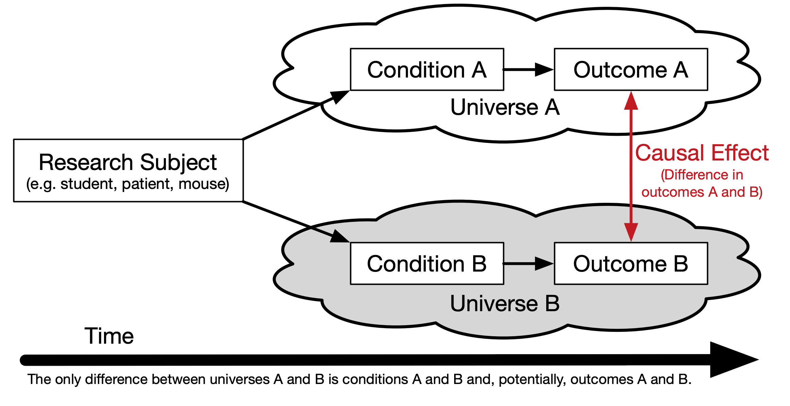

# Introduction

The use of propensity score methods [@RosenbaumRubin1983] for estimating causal effects in observational studies or certain kinds of quasi-experiments has been increasing in the social sciences [@ThoemmesKim2011] and in medical research [@Austin2008a] in the last decade. Propensity score analysis (PSA) attempts to adjust selection bias that occurs due to the lack of randomization. Analysis is typically conducted in two phases where in phase I, the probability of placement in the treatment is estimated to identify matched pairs or clusters so that in phase II, comparisons on the dependent variable can be made between matched pairs or within clusters. R [@R-base] is ideal for conducting PSA given its wide availability of the most current statistical methods vis-à-vis add-on packages as well as its superior graphics capabilities.

This book will provide a theoretical overview of propensity score methods as well as illustrations and discussion of PSA applications. Methods used in phase I of PSA (i.e. models or methods for estimating propensity scores) include logistic regression, classification trees, and matching. Discussions on appropriate comparisons and estimations of effect size and confidence intervals in phase II will also be covered. The use of graphics for diagnosing covariate balance as well as summarizing overall results will be emphasized. Lastly, the extension of PSA methods for multilevel data will also be presented.

<div class="figure" style="text-align: center">

<p class="caption">(\#fig:popularity)PSA Citations per Year</p>
</div>


## Counterfactual Model for Causality

In order to understand how propensity score analysis allows us to make causal estimates from observational data, we must first understand the basic principals of causality, particulary the counterfactual model. Figure \@ref(fig:introduction-causality) depicts a conterfactual model. We begin with our research subject. This can be a student, patient, rat, asteroid, or any other object we wish to know whether some condition has an effect on. Consider two parallel universes: one where the subject receives condition A and another where they receive condition B. Typically one condition is some treatment whereas the other condition is the absense of that treatment (also referred to as the control). We will use treatment and control throughout this book to refer to these two conditions. Once the individual has been exposed to the two conditions, the outcome is measured. The difference between these outcomes is the true causal effect. However, it is impossible for an object to exist in two universes at the same time, therefore we can never actually observe the true causal effect. @Holland1986 referred to this as the *Fundamental Problem of Causal Inference*.

<div class="figure" style="text-align: center">

<p class="caption">(\#fig:introduction-causality)Causal Model</p>
</div>

## Randomized Control Trials "The Gold Standard"

The randomized experiment has been the goals standard for estimating causal effects. Effects can be estimated using simple means between groups, or blocks in randomized block design. Randomization presumes unbiasedness and balance between groups. However, randomization is often not feasible for many reasons, especially in educational contexts.

The strong ignorability assumtion states that an outcome is independent of any observed or unobserved covariates under randomization. This is represented mathematically as:

$$\left( { Y }_{ i }\left( 1 \right) ,{ Y }_{ i }\left( 0 \right)  \right) \bot { T }_{ i }$$

For all ${X}_{i}$

Therefore, it follows that the causal effect of a treatment is the difference in an individual’s outcome under the situation they were given the treatment and not (referred to as a counterfactual).

$${\delta}_{i} = { Y }_{ i1 }-{ Y }_{ i0 }$$

However, it is impossible to directly observe \\({\delta}_{i}\\) (referred to as The Fundamental Problem of Causal Inference, Holland 1986). Rubin framed this problem as a missing data problem.


### Rubin's Causal Model

## Conceptual Steps for Conducting Propensity Score Analysis

### Phase I: Modeling for Selection Bias

#### Estimate Propensity Scores

The goal in phase one of PSA is to estimate the probability of being in the treatment. Since in most cases this is a binary outcome, logistic regressionis a common approach to estimating propensity scores. 

$$ \sigma =\frac { { e }^{ t } }{ { e }^{ t }+1 } =\frac { 1 }{ 1+{ e }^{ -1 } }  $$

$$ t={ \beta  }+{ \beta  }_{ 1 }x+\cdots +{ \beta  }_{ k } $$

$$ F\left( x \right) =\frac { 1 }{ 1+{ e }^{ -\left( { \beta  }+{ \beta  }_{ 1 }x+\cdots +{ \beta  }_{ k } \right)  } } $$

Figure \@ref(fig:introduction-logistic) depicts a fitted logistic regression along with a sample of matchs connected by the purple lines.^[The data in this figure are from the [`lalonde`](#lalonde) dataset that will be described at the end of this chapter.]

<div class="figure" style="text-align: center">

<p class="caption">(\#fig:introduction-logistic)Propensity Scores from Logistic Regression with Sample of Matched Pairs</p>
</div>

#### Evaluate Balance

### Phase II: Estimate Causal Effects


## R Primer

R is a statistical software language designed to be extended vis-à-vis packages. As of April 01, 2023, there are currently 19,342 packages available on [CRAN](https://cran.r-project.org). Given the ease by which R can be extended, it has become the tool of choice for conducting propensity score analysis. This book will make use of a number of packages matching, multiple imputation of missing values, and to visualize results.

* [`MatchIt`](http://gking.harvard.edu/gking/matchit) [@R-MatchIt] Nonparametric Preprocessing for Parametric Causal Inference
* [`Matching`](http://sekhon.berkeley.edu/matching/) [@R-Matching] Multivariate and Propensity Score Matching Software for Causal Inference
* [`multilevelPSA`](https://github.com/jbryer/multilevelPSA) [@R-multilevelPSA] Multilevel Propensity Score Analysis
* [`party`](http://cran.r-project.org/web/packages/party/index.html) [@R-party] A Laboratory for Recursive Partytioning
* [`PSAboot`](https://github.com/jbryer/PSAboot) [@R-PSAboot] Bootstrapping for Propensity Score Analysis
* [`PSAgraphics`](http://www.jstatsoft.org/v29/i06/paper) [@R-PSAgraphics] An R Package to Support Propensity Score Analysis
* [`rbounds`](http://www.personal.psu.edu/ljk20/rbounds%20vignette.pdf) [@R-rbounds] An Overview of rebounds: An R Package for Rosenbaum bounds sensitivity analysis with matched data.
* [`rpart`](http://cran.r-project.org/web/packages/rpart/index.html) [@R-rpart] Recursive Partitioning
* [`TriMatch`](https://github.com/jbryer/TriMatch) [@R-TriMatch] Propensity Score Matching for Non-Binary Treatments

The following command will install the R packages we will use in this book.


```r
pkgs <- c('granova', 'granovaGG', 'Matching', 'MatchIt', 'mice', 
          'multilevelPSA', 'party', 'PSAboot', 'PSAgraphics', 'rbounds', 
		  'TriMatch')
install.packages(pkgs)
```

## Datasets

### National Supported Work Demonstration {#lalonde}

The `lalonde` dataset is perhaps one of the most used datasets when introducing or evaluating propensity score methods. The data was collected by @Lalonde1986 but became widely used in the PSA literature after @DehejiaWahba1999 used it in their paper to evaluate propensity score matching. The dataset originated from the National Supported Work Demonstration study conducted in the 1970s. The program provided 12 to 18 months of employment to people with longstanding employment problems. The dataset contains 445 observations of 13 variables. The primary outcome is `re78` which is real earnings in 1978. Observed covariates used to ajdust for selection bias include `age` (age in years), `edu` (number of years of education), `black` (black or not), `hisp` (Hispanic or not), `married` (married or not), `nodegr` (whether the worker has a degree or not, note that 1 = no degree), `re74` (real earnings in 1974), and `re75` (real earnings in 1975).


```r
data(lalonde, package='Matching')
str(lalonde)
```

```
## 'data.frame':	445 obs. of  12 variables:
##  $ age    : int  37 22 30 27 33 22 23 32 22 33 ...
##  $ educ   : int  11 9 12 11 8 9 12 11 16 12 ...
##  $ black  : int  1 0 1 1 1 1 1 1 1 0 ...
##  $ hisp   : int  0 1 0 0 0 0 0 0 0 0 ...
##  $ married: int  1 0 0 0 0 0 0 0 0 1 ...
##  $ nodegr : int  1 1 0 1 1 1 0 1 0 0 ...
##  $ re74   : num  0 0 0 0 0 0 0 0 0 0 ...
##  $ re75   : num  0 0 0 0 0 0 0 0 0 0 ...
##  $ re78   : num  9930 3596 24910 7506 290 ...
##  $ u74    : int  1 1 1 1 1 1 1 1 1 1 ...
##  $ u75    : int  1 1 1 1 1 1 1 1 1 1 ...
##  $ treat  : int  1 1 1 1 1 1 1 1 1 1 ...
```

### Lindner Center {#lindner}

Data from an observational study of 996 patients receiving a PCI at Ohio Heart Health in 1997 and followed for at least 6 months by the staff of the Lindner Center. This is a landmark dataset in the literature on propensity score adjustment for treatment selection bias due to practice of evidence based medicine; patients receiving `abciximab` tended to be more severely diseased than those who did not receive a IIb/IIIa cascade blocker.


```r
data(lindner, package='PSAgraphics')
str(lindner)
```

```
## 'data.frame':	996 obs. of  10 variables:
##  $ lifepres: num  0 11.6 11.6 11.6 11.6 11.6 11.6 11.6 11.6 11.6 ...
##  $ cardbill: int  14301 3563 4694 7366 8247 8319 8410 8517 8763 8823 ...
##  $ abcix   : int  1 1 1 1 1 1 1 1 1 1 ...
##  $ stent   : int  0 0 0 0 0 0 0 0 0 0 ...
##  $ height  : int  163 168 188 175 168 178 185 173 152 180 ...
##  $ female  : int  1 0 0 0 1 0 0 1 1 0 ...
##  $ diabetic: int  1 0 0 1 0 0 0 0 0 0 ...
##  $ acutemi : int  0 0 0 0 0 0 0 0 0 0 ...
##  $ ejecfrac: int  56 56 50 50 55 50 58 30 60 60 ...
##  $ ves1proc: int  1 1 1 1 1 1 1 1 1 1 ...
```

### Tutoring {#tutoring}

The `tutoring` dataset originates from a study conducted at an online adult serving institution examining the effects of tutoring services for students in English 101, English 201, and History 310. Tutoring services were available to all students but Treatment (`treat`) is operationalized as students who used tutoring services at least once during the course. Only 19.6% of students used tutoring services with approximately half using it more than once. We will use this dataset with both a dichotomous treatment (used tutoring or not) or as a two level treatment (used tutoring services once, used tutoring services two or more times).


```r
data(tutoring, package='TriMatch')
tutoring$treat2 <- tutoring$treat != 'Control'
str(tutoring)
```

```
## 'data.frame':	1142 obs. of  18 variables:
##  $ treat     : Factor w/ 3 levels "Control","Treat1",..: 1 1 1 1 1 2 1 1 1 1 ...
##  $ Course    : chr  "ENG*201" "ENG*201" "ENG*201" "ENG*201" ...
##  $ Grade     : int  4 4 4 4 4 3 4 3 0 4 ...
##  $ Gender    : Factor w/ 2 levels "FEMALE","MALE": 1 1 1 1 1 1 1 1 1 1 ...
##  $ Ethnicity : Factor w/ 3 levels "Black","Other",..: 2 3 3 3 3 3 3 3 1 3 ...
##  $ Military  : logi  FALSE FALSE FALSE FALSE FALSE FALSE ...
##  $ ESL       : logi  FALSE FALSE FALSE FALSE FALSE FALSE ...
##  $ EdMother  : int  3 5 1 3 2 3 4 4 3 6 ...
##  $ EdFather  : int  6 6 1 5 2 3 4 4 2 6 ...
##  $ Age       : num  48 49 53 52 47 53 54 54 59 40 ...
##  $ Employment: int  3 3 1 3 1 3 3 3 1 3 ...
##  $ Income    : num  9 9 5 5 5 9 6 6 1 8 ...
##  $ Transfer  : num  24 25 39 48 23 ...
##  $ GPA       : num  3 2.72 2.71 4 3.5 3.55 3.57 3.57 3.43 2.81 ...
##  $ GradeCode : chr  "A" "A" "A" "A" ...
##  $ Level     : Factor w/ 2 levels "Lower","Upper": 1 1 1 1 1 2 1 1 1 1 ...
##  $ ID        : int  377 882 292 215 252 265 1016 282 39 911 ...
##  $ treat2    : logi  FALSE FALSE FALSE FALSE FALSE TRUE ...
```

```r
table(tutoring$Course, tutoring$treat)
```

```
##          
##           Control Treat1 Treat2
##   ENG*101     349     22     31
##   ENG*201     518     36     32
##   HSC*310      51     76     27
```

### Programme of International Student Assessment (PISA) {#pisa}


```r
data(pisana, package='multilevelPSA')
str(pisana)
```

```
## 'data.frame':	66548 obs. of  65 variables:
##  $ Country : chr  "Canada" "Canada" "Canada" "Canada" ...
##  $ CNT     : chr  "CAN" "CAN" "CAN" "CAN" ...
##  $ SCHOOLID: Factor w/ 1534 levels "00001","00002",..: 1 1 1 1 1 1 1 1 1 1 ...
##  $ ST01Q01 : Factor w/ 0 levels: NA NA NA NA NA NA NA NA NA NA ...
##  $ ST04Q01 : Factor w/ 2 levels "Female","Male": 1 2 2 1 2 2 2 1 1 2 ...
##  $ ST05Q01 : Factor w/ 3 levels "No","Yes, more than one year",..: 2 2 3 2 1 1 3 3 2 3 ...
##  $ ST06Q01 : num  4 4 4 4 5 5 5 4 4 5 ...
##  $ ST07Q01 : Factor w/ 3 levels "No, never","Yes, once",..: 1 1 1 1 1 1 2 1 1 1 ...
##  $ ST08Q01 : Factor w/ 2 levels "No","Yes": 2 2 2 2 2 2 2 2 2 2 ...
##  $ ST08Q02 : Factor w/ 2 levels "No","Yes": 2 2 2 1 2 2 1 2 2 2 ...
##  $ ST08Q03 : Factor w/ 2 levels "No","Yes": 1 2 2 2 1 1 1 2 2 2 ...
##  $ ST08Q04 : Factor w/ 2 levels "No","Yes": 2 2 1 2 2 2 2 1 2 1 ...
##  $ ST08Q05 : Factor w/ 2 levels "No","Yes": 1 1 1 1 1 1 1 1 1 1 ...
##  $ ST08Q06 : Factor w/ 2 levels "No","Yes": 1 1 1 1 1 1 1 1 1 1 ...
##  $ ST10Q01 : Factor w/ 5 levels "<ISCED level 1>",..: 3 3 3 3 3 3 3 3 3 3 ...
##  $ ST12Q01 : Factor w/ 4 levels "Looking for work",..: 3 3 3 3 3 3 3 3 4 3 ...
##  $ ST14Q01 : Factor w/ 5 levels "<ISCED level 1>",..: 3 3 3 3 3 3 3 3 3 3 ...
##  $ ST16Q01 : Factor w/ 4 levels "Looking for work",..: 3 3 3 3 3 3 3 3 4 3 ...
##  $ ST19Q01 : Factor w/ 2 levels "Another language",..: 2 2 2 1 2 2 2 2 2 1 ...
##  $ ST20Q01 : Factor w/ 2 levels "No","Yes": 2 2 2 2 2 2 2 2 2 2 ...
##  $ ST20Q02 : Factor w/ 2 levels "No","Yes": 2 2 2 2 2 2 2 2 2 2 ...
##  $ ST20Q03 : Factor w/ 2 levels "No","Yes": 2 2 2 2 2 2 2 2 2 2 ...
##  $ ST20Q04 : Factor w/ 2 levels "No","Yes": 2 2 2 2 2 2 2 2 2 2 ...
##  $ ST20Q05 : Factor w/ 2 levels "No","Yes": 2 2 2 2 1 2 2 2 2 1 ...
##  $ ST20Q06 : Factor w/ 2 levels "No","Yes": 2 2 2 2 2 2 2 2 2 2 ...
##  $ ST20Q07 : Factor w/ 2 levels "No","Yes": 2 2 1 2 1 1 1 1 1 1 ...
##  $ ST20Q08 : Factor w/ 2 levels "No","Yes": 2 2 1 2 1 2 1 1 1 1 ...
##  $ ST20Q09 : Factor w/ 2 levels "No","Yes": 2 2 2 2 2 2 2 1 1 2 ...
##  $ ST20Q10 : Factor w/ 2 levels "No","Yes": 2 2 2 2 2 2 2 2 2 1 ...
##  $ ST20Q12 : Factor w/ 2 levels "No","Yes": 2 2 2 2 2 2 2 2 2 2 ...
##  $ ST20Q13 : Factor w/ 2 levels "No","Yes": 2 2 1 2 2 2 2 2 2 2 ...
##  $ ST20Q14 : Factor w/ 2 levels "No","Yes": 2 2 2 2 2 2 2 2 2 2 ...
##  $ ST21Q01 : Factor w/ 4 levels "None","One","Three or more",..: 3 3 3 3 3 4 4 3 3 3 ...
##  $ ST21Q02 : Factor w/ 4 levels "None","One","Three or more",..: 3 3 3 3 4 3 2 3 3 3 ...
##  $ ST21Q03 : Factor w/ 4 levels "None","One","Three or more",..: 3 2 2 3 4 4 4 4 3 3 ...
##  $ ST21Q04 : Factor w/ 4 levels "None","One","Three or more",..: 4 4 2 3 4 3 2 4 4 3 ...
##  $ ST21Q05 : Factor w/ 4 levels "None","One","Three or more",..: 2 4 4 3 3 4 2 4 4 3 ...
##  $ ST22Q01 : Factor w/ 6 levels "0-10 books","101-200 books",..: 5 5 1 5 4 3 2 5 4 1 ...
##  $ ST23Q01 : Factor w/ 5 levels "1 to 2 hours a day",..: 5 2 4 2 4 4 3 4 3 4 ...
##  $ ST31Q01 : Factor w/ 2 levels "No","Yes": 1 1 1 1 1 1 1 1 1 1 ...
##  $ ST31Q02 : Factor w/ 2 levels "No","Yes": 1 1 1 1 1 1 1 1 1 2 ...
##  $ ST31Q03 : Factor w/ 2 levels "No","Yes": 1 1 1 1 1 1 1 1 1 1 ...
##  $ ST31Q05 : Factor w/ 2 levels "No","Yes": 1 1 1 1 1 1 1 1 2 1 ...
##  $ ST31Q06 : Factor w/ 2 levels "No","Yes": 1 1 1 1 1 1 1 1 2 1 ...
##  $ ST31Q07 : Factor w/ 2 levels "No","Yes": 2 1 1 1 1 1 1 1 2 1 ...
##  $ ST32Q01 : Factor w/ 5 levels "2 up to 4 Hours a week",..: 4 4 5 4 4 4 4 4 4 4 ...
##  $ ST32Q02 : Factor w/ 5 levels "2 up to 4 Hours a week",..: 5 4 5 4 4 4 4 4 4 5 ...
##  $ ST32Q03 : Factor w/ 5 levels "2 up to 4 Hours a week",..: 4 4 5 4 4 4 4 4 4 5 ...
##  $ PV1MATH : num  474 673 348 518 420 ...
##  $ PV2MATH : num  466 632 372 537 533 ...
##  $ PV3MATH : num  438 571 397 511 441 ...
##  $ PV4MATH : num  458 685 445 527 468 ...
##  $ PV5MATH : num  471 586 375 490 420 ...
##  $ PV1READ : num  503 613 390 570 407 ...
##  $ PV2READ : num  492 578 421 542 452 ...
##  $ PV3READ : num  522 553 442 527 434 ...
##  $ PV4READ : num  509 594 410 584 423 ...
##  $ PV5READ : num  460 564 372 518 416 ...
##  $ PV1SCIE : num  460 686 378 500 417 ...
##  $ PV2SCIE : num  444 589 399 575 556 ...
##  $ PV3SCIE : num  484 593 388 505 471 ...
##  $ PV4SCIE : num  489 643 444 540 436 ...
##  $ PV5SCIE : num  435 646 385 476 479 ...
##  $ PUBPRIV : Factor w/ 2 levels "Private","Public": 2 2 2 2 2 2 2 2 2 2 ...
##  $ STRATIO : num  14.4 14.4 14.4 14.4 14.4 ...
```

### National Medical Expenditure Study {#nmes}


```r
data(nmes, package='TriMatch')
str(nmes)
```

```
## 'data.frame':	20622 obs. of  29 variables:
##  $ PIDX     : int  20843014 20836012 20836025 20835019 20832010 20829011 20825018 20821016 20819010 20819023 ...
##  $ LASTAGE  : int  80 29 28 29 80 71 60 82 32 33 ...
##  $ MALE     : int  0 0 1 0 1 1 0 0 1 0 ...
##  $ RACE3    : Factor w/ 3 levels "1","2","3": 3 3 3 3 3 3 3 3 3 3 ...
##  $ eversmk  : int  0 1 1 1 1 1 1 1 1 0 ...
##  $ current  : int  NA 1 1 1 1 0 0 0 0 NA ...
##  $ former   : int  0 0 0 0 0 1 1 1 1 0 ...
##  $ smoke    : Factor w/ 3 levels "0","1","2": 1 2 2 2 2 3 3 3 3 1 ...
##  $ AGESMOKE : int  NA 15 16 17 21 16 30 16 12 NA ...
##  $ CIGSSMOK : int  NA 20 18 NA 10 NA 20 2 25 NA ...
##  $ SMOKENOW : int  NA 1 1 1 1 2 2 2 2 NA ...
##  $ SMOKED   : int  2 1 1 1 1 1 1 1 1 2 ...
##  $ CIGSADAY : int  NA 35 19 NA 10 NA NA NA NA NA ...
##  $ AGESTOP  : int  NA NA NA NA NA 46 38 35 29 NA ...
##  $ packyears: num  0 15 11.7 NA 30 NA 9 2 22.5 0 ...
##  $ yearsince: int  0 0 0 0 0 25 22 47 3 0 ...
##  $ INCALPER : num  5806 9952 10839 13990 8221 ...
##  $ HSQACCWT : num  6933 10607 11500 14766 9512 ...
##  $ TOTALEXP : num  298 284 177 750 1369 ...
##  $ TOTALSP3 : num  20 0 0 0 0 ...
##  $ lc5      : int  0 0 0 0 0 0 0 0 0 0 ...
##  $ chd5     : int  1 0 0 0 1 0 0 0 0 0 ...
##  $ beltuse  : Factor w/ 3 levels "1","2","3": 3 3 2 2 1 3 3 3 3 3 ...
##  $ educate  : Factor w/ 4 levels "1","2","3","4": 1 1 1 1 1 1 1 1 1 1 ...
##  $ marital  : Factor w/ 5 levels "1","2","3","4",..: 2 1 1 5 3 1 5 5 1 1 ...
##  $ SREGION  : Factor w/ 4 levels "1","2","3","4": 1 1 1 1 1 1 1 1 1 1 ...
##  $ POVSTALB : Factor w/ 5 levels "1","2","3","4",..: 1 3 3 4 3 5 5 4 5 5 ...
##  $ flag     : int  0 0 0 2 0 2 0 0 0 0 ...
##  $ age      : int  1 0 0 0 1 1 1 1 0 0 ...
```
