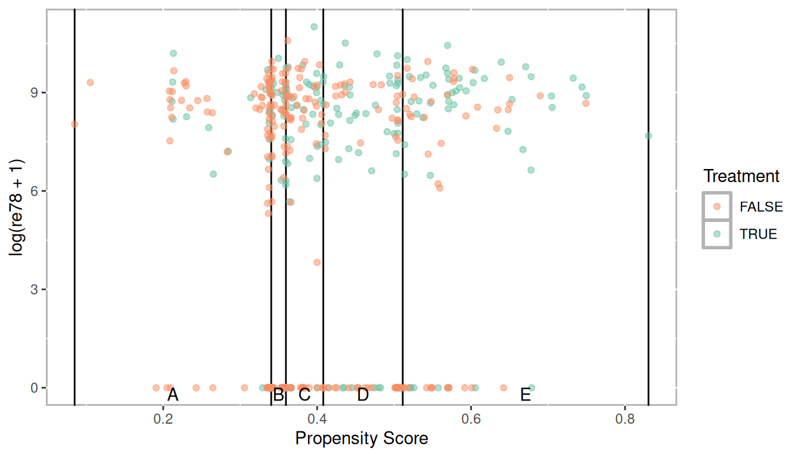
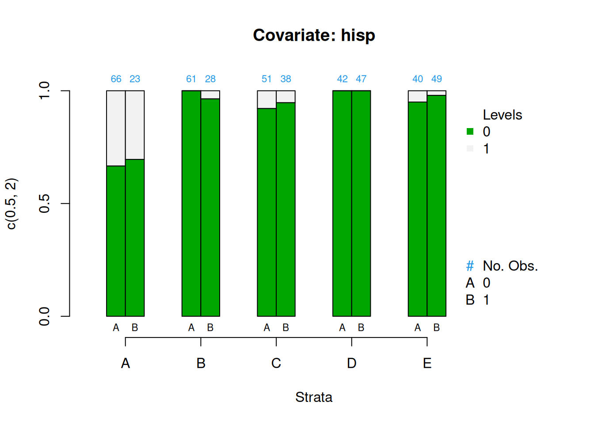
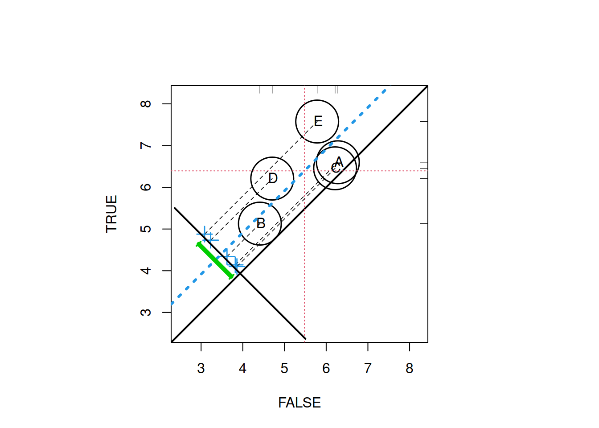

# Stratification {#chapter-stratification}

::: {.rmdtip}
**stratify**  
*verb: stratify; 3rd person present: stratifies; past tense: stratified; past participle: stratified; gerund or present participle: stratifying*  
1. arrange or classify.  
2. form or arrange into strata.
:::


Propensity score stratification leverages propensity scores so we can define strata (or groups) that roughly equivalent on all the observed covariates. Although it is reasonable to start with chapter \@ref(chapter-matching) on matching, stratification is an important method and even if you prefer to use a matching method, stratification will most often be used in order to evaluate balance. 

## Phase I: Estimate Propensity Scores (Logistic regression)

To begin let's estimate propensity scores using logistic regression with the National Supported Work Demonostration (`lalonde`) dataset [@Lalonde1986]. Here, we are using the final model specification used by @DehejiaWahba1999. 


```r
data(lalonde, package = 'Matching')
lalonde_formu <- treat ~ age + I(age^2) + educ + I(educ^2) + black +
	hisp + married + nodegr + re74  + I(re74^2) + re75 + I(re75^2)
lr_out <- glm(formula = lalonde_formu,
			  data = lalonde,
			  family = binomial(link = 'logit'))
```


```r
summary(lr_out)
```

```
## 
## Call:
## glm(formula = lalonde_formu, family = binomial(link = "logit"), 
##     data = lalonde)
## 
## Deviance Residuals: 
##     Min       1Q   Median       3Q      Max  
## -1.6632  -0.9699  -0.9043   1.2406   1.7627  
## 
## Coefficients:
##               Estimate Std. Error z value Pr(>|z|)  
## (Intercept)  4.008e+00  2.155e+00   1.860   0.0629 .
## age          1.372e-02  8.929e-02   0.154   0.8779  
## I(age^2)    -2.535e-04  1.472e-03  -0.172   0.8632  
## educ        -8.612e-01  4.154e-01  -2.073   0.0382 *
## I(educ^2)    4.482e-02  2.334e-02   1.920   0.0549 .
## black       -2.933e-01  3.679e-01  -0.797   0.4253  
## hisp        -9.472e-01  5.127e-01  -1.847   0.0647 .
## married      1.730e-01  2.826e-01   0.612   0.5404  
## nodegr      -4.280e-01  3.917e-01  -1.093   0.2745  
## re74         4.815e-06  5.689e-05   0.085   0.9326  
## I(re74^2)   -1.692e-09  1.999e-09  -0.846   0.3974  
## re75         1.273e-04  8.310e-05   1.532   0.1256  
## I(re75^2)   -4.623e-09  4.384e-09  -1.055   0.2916  
## ---
## Signif. codes:  0 '***' 0.001 '**' 0.01 '*' 0.05 '.' 0.1 ' ' 1
## 
## (Dispersion parameter for binomial family taken to be 1)
## 
##     Null deviance: 604.20  on 444  degrees of freedom
## Residual deviance: 581.07  on 432  degrees of freedom
## AIC: 607.07
## 
## Number of Fisher Scoring iterations: 4
```


```r
lalonde$lr_ps <- fitted(lr_out)
```

Check the distributions of propensity scores to ensure we have good overlap


```r
ggplot(lalonde, aes(x = lr_ps, color = as.logical(treat))) + 
	geom_density() +
	scale_color_manual('Treatment', values = palette2) +
	xlab('Propensity Score')
```


### Stratifying

Stratification using quintiles.


```r
breaks5 <- psa::get_strata_breaks(lalonde$lr_ps)
breaks5
```

```
## $breaks
##         0%        20%        40%        60%        80%       100% 
## 0.08491513 0.34032233 0.35943734 0.40797660 0.51119006 0.83047510 
## 
## $labels
##     strata       xmin      xmax      xmid
## 0%       A 0.08491513 0.3403223 0.2126187
## 20%      B 0.34032233 0.3594373 0.3498798
## 40%      C 0.35943734 0.4079766 0.3837070
## 60%      D 0.40797660 0.5111901 0.4595833
## 80%      E 0.51119006 0.8304751 0.6708326
```

```r
lalonde$lr_strata5 <- cut(x = lalonde$lr_ps, 
						  breaks = breaks5$breaks, 
						  include.lowest = TRUE, 
						  labels = breaks5$labels$strata)
```


```r
table(lalonde$treat, lalonde$lr_strata5)
```

```
##    
##      A  B  C  D  E
##   0 66 61 51 42 40
##   1 23 28 38 47 49
```

<div class="figure" style="text-align: center">

<p class="caption">(\#fig:unnamed-chunk-7)Distribution of propensity scores with strata breaks</p>
</div>


<div class="figure" style="text-align: center">

<p class="caption">(\#fig:unnamed-chunk-8)Scatter plot of propensity scores and log of real earnings 1978 by treatment with strata breaks</p>
</div>


### Checking Balance


```r
covars <- all.vars(lalonde.formu)
covars <- lalonde[,covars[-1]]
PSAgraphics::cv.bal.psa(covariates = covars, 
						treatment = lalonde$treat,
						propensity = lalonde$lr_ps,
						strata = lalonde$lr_strata)
```


```r
PSAgraphics::box.psa(continuous = lalonde$age, 
					 treatment = lalonde$treat, 
					 strata = lalonde$lr_strata,
					 xlab = "Strata", 
					 balance = FALSE)
```


```r
PSAgraphics::cat.psa(categorical = lalonde$nodegr, 
					 treatment = lalonde$treat, 
					 strata = lalonde$lr_strata, 
					 xlab = 'Strata',
					 balance = FALSE)
```


<div class="figure" style="text-align: center">

<p class="caption">(\#fig:unnamed-chunk-12)Covariate balance plots for categorical variables</p>
</div>

<div class="figure" style="text-align: center">

<p class="caption">(\#fig:unnamed-chunk-13)Covariate balance plots for numeric variables</p>
</div>

## PHase II: Estimate Effects


```r
PSAgraphics::loess.psa(response = log(lalonde$re78 + 1),
					   treatment = lalonde$treat,
					   propensity = lalonde$lr_ps)
```


```
## $ATE
## [1] 0.9008386
## 
## $se.wtd
## [1] 0.3913399
## 
## $CI95
## [1] 0.1181588 1.6835185
## 
## $summary.strata
##    counts.0 counts.1  means.0  means.1 diff.means
## 1        34       11 6.268705 6.474912  0.2062076
## 2        32       12 5.491717 5.659280  0.1675631
## 3        31       14 5.467712 5.703584  0.2358722
## 4        30       14 5.425593 5.747613  0.3220194
## 5        27       18 5.397146 5.831117  0.4339703
## 6        24       20 5.302660 6.339721  1.0370619
## 7        21       23 5.125331 6.607936  1.4826043
## 8        21       24 5.036908 6.594808  1.5578999
## 9        22       22 5.182703 6.981383  1.7986801
## 10       18       27 6.047529 7.820786  1.7732573
```


```r
psa::loess.plot(x = lalonde$lr_ps,
				response = log(lalonde$re78 + 1),
				treatment = lalonde$treat == 1,
				responseTitle = 'log(re78)',
				plot.strata = 5,
				points.treat.alpha = 0.5,
				points.control.alpha = 0.5,
				percentPoints.treat = 1,
				percentPoints.control = 1,
				se = FALSE, 
				formula = y ~ x,
				method = 'loess')
```


```r
PSAgraphics::circ.psa(response = log(lalonde$re78 + 1), 
					  treatment = lalonde$treat == 1, 
					  strata = lalonde$lr_strata5)
```



```
## $summary.strata
##   n.FALSE n.TRUE means.FALSE means.TRUE
## A      66     23    6.280406   6.600537
## B      61     28    4.409935   5.129193
## C      51     38    6.212981   6.455034
## D      42     47    4.705981   6.208840
## E      40     49    5.783529   7.576461
## 
## $wtd.Mn.FALSE
## [1] 5.478567
## 
## $wtd.Mn.TRUE
## [1] 6.394013
## 
## $ATE
## [1] 0.9154463
## 
## $se.wtd
## [1] 0.394155
## 
## $approx.t
## [1] 2.322554
## 
## $df
## [1] 435
## 
## $CI.95
## [1] 0.1407612 1.6901314
```

## Phase III: Sensitivity Analysis

Now that we have established there is a statistically significant effect of the intervention after adjusting for the selection bias using propensity scores we will want to evaluate the robustness of that effect. Sensitivity analysis is one approach but it is only well defined for matching methods. In chapter \@ref(chapter-bootstrapping) we will introduce a bootstrapping method that can help test the robustness. But @Rosenbaum2012 suggest another approach to test the sensitivity is to test the null hypothesis twice. We will do that here using a classification tree approach to estimating propensity scores and strata.


```r
library(tree)
tree_out <- tree::tree(lalonde_formu,
					   data = lalonde)
```


```r
plot(tree_out); text(tree_out)
```

<div class="figure" style="text-align: center">

<p class="caption">(\#fig:tree_plot)Classification tree</p>
</div>


```r
lalonde$tree_ps <- predict(tree_out)
table(lalonde$tree_ps, lalonde$treat, useNA = 'ifany')
```

```
##                    
##                       0   1
##   0.332             167  83
##   0.344827586206897  19  10
##   0.351851851851852  35  19
##   0.612903225806452  24  38
##   0.659090909090909  15  29
##   1                   0   6
```

```r
lalonde$tree_strata <- predict(tree_out, type = 'where')
table(lalonde$tree_strata, lalonde$treat, useNA = 'ifany')
```

```
##     
##        0   1
##   3  167  83
##   5   15  29
##   6   35  19
##   9   24  38
##   10  19  10
##   11   0   6
```

