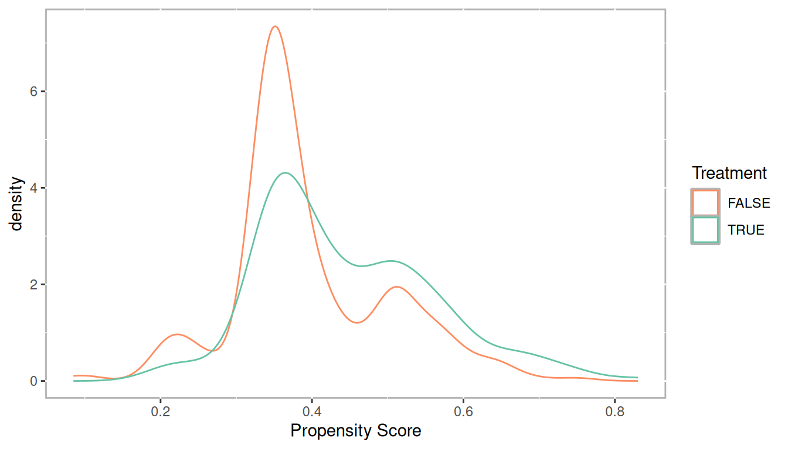
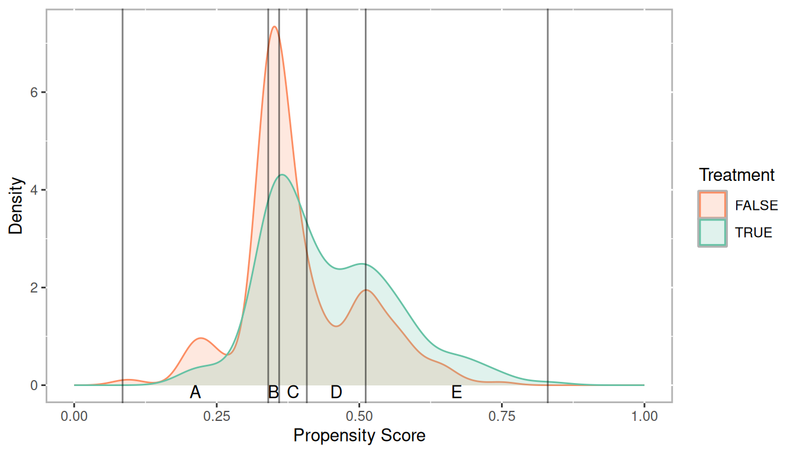

# Stratification {#chapter-stratification}


::: {.rmdtip}
**stratify**  
*verb: stratify; 3rd person present: stratifies; past tense: stratified; past participle: stratified; gerund or present participle: stratifying*  
1. arrange or classify.  
2. form or arrange into strata.
:::


Propensity score stratification leverages propensity scores so we can define strata (or groups) that roughly equivalent on all the observed covariates. Although it is reasonable to start with chapter \@ref(chapter-matching) on matching, stratification is an important method and even if you prefer to use a matching method, stratification will most often be used in order to evaluate balance. 

## Estimate Propensity Scores (Logistic regression)

To begin let's estimate propensity scores using logistic regression with the National Supported Work Demonostration (`lalonde`) dataset [@Lalonde1986]. Here, we are using the final model specification used by @DehejiaWahba1999. 


```r
data(lalonde, package = 'Matching')
lalonde_formu <- treat ~ age + I(age^2) + educ + I(educ^2) + black +
	hisp + married + nodegr + re74  + I(re74^2) + re75 + I(re75^2) +
	u74 + u75
lr_out <- glm(formula = lalonde_formu,
			  data = lalonde,
			  family = binomial(link = 'logit'))
```


```r
summary(lr_out)
```

```
## 
## Call:
## glm(formula = lalonde_formu, family = binomial(link = "logit"), 
##     data = lalonde)
## 
## Deviance Residuals: 
##     Min       1Q   Median       3Q      Max  
## -1.6732  -0.9881  -0.8822   1.2136   1.7730  
## 
## Coefficients:
##               Estimate Std. Error z value Pr(>|z|)  
## (Intercept)  4.269e+00  2.173e+00   1.965   0.0494 *
## age          2.143e-02  9.037e-02   0.237   0.8126  
## I(age^2)    -3.448e-04  1.484e-03  -0.232   0.8163  
## educ        -8.713e-01  4.150e-01  -2.099   0.0358 *
## I(educ^2)    4.499e-02  2.330e-02   1.931   0.0535 .
## black       -2.613e-01  3.708e-01  -0.705   0.4809  
## hisp        -8.974e-01  5.184e-01  -1.731   0.0835 .
## married      1.829e-01  2.831e-01   0.646   0.5183  
## nodegr      -4.285e-01  3.930e-01  -1.090   0.2756  
## re74        -2.168e-05  7.739e-05  -0.280   0.7793  
## I(re74^2)   -8.553e-10  2.424e-09  -0.353   0.7242  
## re75         6.577e-05  1.025e-04   0.642   0.5210  
## I(re75^2)   -1.968e-09  5.042e-09  -0.390   0.6963  
## u74         -8.315e-02  4.521e-01  -0.184   0.8541  
## u75         -3.060e-01  3.591e-01  -0.852   0.3942  
## ---
## Signif. codes:  0 '***' 0.001 '**' 0.01 '*' 0.05 '.' 0.1 ' ' 1
## 
## (Dispersion parameter for binomial family taken to be 1)
## 
##     Null deviance: 604.20  on 444  degrees of freedom
## Residual deviance: 580.02  on 430  degrees of freedom
## AIC: 610.02
## 
## Number of Fisher Scoring iterations: 4
```


```r
lalonde$lr_ps <- fitted(lr_out)
```

Check the distributions of propensity scores to ensure we have good overlap


```r
ggplot(lalonde, aes(x = lr_ps, color = as.logical(treat))) + 
	geom_density() +
	scale_color_manual('Treatment', values = palette2) +
	xlab('Propensity Score')
```




## Stratifying

Stratification using quintiles.


```r
get_strata_breaks <- function(ps, 
							  n_strata = 5,
							  labels = LETTERS[1:n_strata]) {
	breaks <- quantile(ps, seq(0, 1, 1 / n_strata))
	df_breaks <- data.frame(
		label = labels,
		xmin = breaks[1:(length(breaks) - 1)],
		xmax = breaks[2:length(breaks)]
	)
	df_breaks$xmid <- df_breaks$xmin + (df_breaks$xmax - df_breaks$xmin) / 2
	return(list(
		breaks = breaks,
		labels = df_breaks
	))
}

breaks5 <- get_strata_breaks(lalonde$lr_ps)
breaks5
```

```
## $breaks
##        0%       20%       40%       60%       80%      100% 
## 0.1127949 0.3299797 0.3502632 0.4295841 0.5060112 0.8175245 
## 
## $labels
##     label      xmin      xmax      xmid
## 0%      A 0.1127949 0.3299797 0.2213873
## 20%     B 0.3299797 0.3502632 0.3401214
## 40%     C 0.3502632 0.4295841 0.3899236
## 60%     D 0.4295841 0.5060112 0.4677976
## 80%     E 0.5060112 0.8175245 0.6617678
```

```r
lalonde$lr_strata5 <- cut(x = lalonde$lr_ps, 
						  breaks = breaks5$breaks, 
						  include.lowest = TRUE, 
						  labels = breaks5$labels$label)
```


```r
table(lalonde$treat, lalonde$lr_strata5)
```

```
##    
##      A  B  C  D  E
##   0 65 58 56 43 38
##   1 25 30 33 46 51
```


```r
ggplot(lalonde, aes(x = lr_ps, color = as.logical(treat))) + 
	geom_density(aes(fill = as.logical(treat)), alpha = 0.2) +
	geom_vline(xintercept = breaks5$breaks, alpha = 0.5) +
	geom_text(data = breaks5$labels, aes(x = xmid, y = 0, label = label), color = 'black', vjust = 1) +
	scale_fill_manual('Treatment', values = palette2) +
	scale_color_manual('Treatment', values = palette2) +
	xlab('Propensity Score') + ylab('Density') +
	xlim(c(0, 1))
```




## Checking Balance


```r
covars <- all.vars(lalonde.formu)
covars <- lalonde[,covars[-1]]
PSAgraphics::cv.bal.psa(covariates = covars, 
						treatment = lalonde$treat,
						propensity = lalonde$lr_ps,
						strata = lalonde$lr_strata)
```


```r
PSAgraphics::box.psa(continuous = lalonde$age, 
					 treatment = lalonde$treat, 
					 strata = lalonde$lr_strata,
					 xlab = "Strata", 
					 balance = FALSE)
```


```r
PSAgraphics::cat.psa(categorical = lalonde$nodegr, 
					 treatment = lalonde$treat, 
					 strata = lalonde$lr_strata, 
					 xlab = 'Strata',
					 balance = FALSE)
```


## Estimate Effects


```r
psa::loess.plot(x = lalonde$lr_ps,
				response = log(lalonde$re78 + 1),
				treatment = lalonde$treat == 1)
```


```r
PSAgraphics::circ.psa(response = log(lalonde$re78 + 1), 
					  treatment = lalonde$treat == 1, 
					  strata = lalonde$lr_strata5, 
					  revc = TRUE)
```


```
## $summary.strata
##   n.FALSE n.TRUE means.FALSE means.TRUE
## A      65     25    5.965231   5.813530
## B      58     30    5.159507   5.017170
## C      56     33    5.884181   7.170466
## D      43     46    4.831869   6.300722
## E      38     51    5.397140   7.479826
## 
## $wtd.Mn.TRUE
## [1] 6.358132
## 
## $wtd.Mn.FALSE
## [1] 5.449396
## 
## $ATE
## [1] -0.9087362
## 
## $se.wtd
## [1] 0.3965889
## 
## $approx.t
## [1] -2.291381
## 
## $df
## [1] 435
## 
## $CI.95
## [1] -1.6882048 -0.1292676
```
