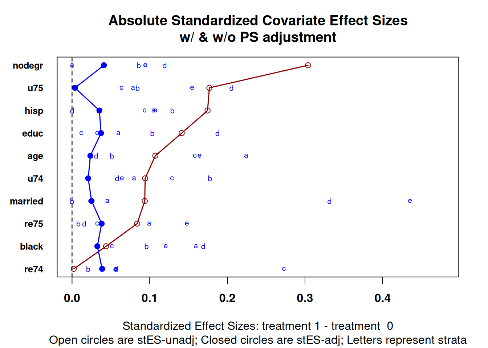
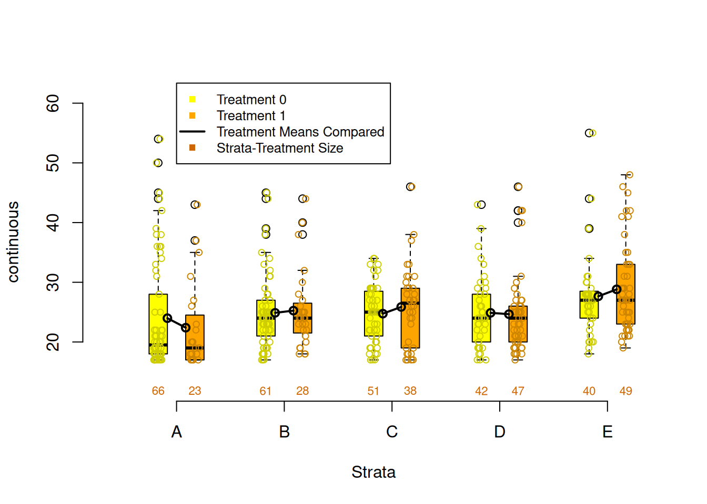
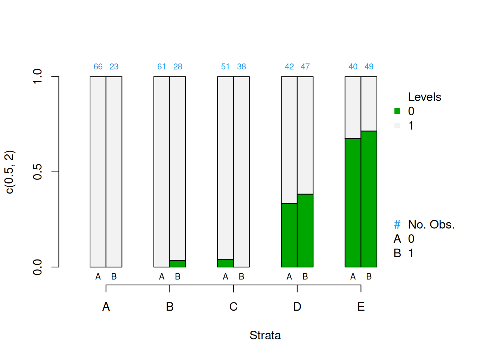

# Stratification


The tutoring example has treatment with three levels: Treat1, Treat2, and Control. We'll convert this to a two level treatment for this example. 


```r
data(lalonde, package = 'Matching')
```

## Estimating Propensity Scores


```r
lalonde.formu <- treat ~ age + educ + black + hisp + married + nodegr + re74 + re75
lalonde.glm <- glm(lalonde.formu, 
				   family = binomial(link = 'logit'), 
				   data = lalonde)
summary(lalonde.glm)
```

```
## 
## Call:
## glm(formula = lalonde.formu, family = binomial(link = "logit"), 
##     data = lalonde)
## 
## Deviance Residuals: 
##     Min       1Q   Median       3Q      Max  
## -1.4358  -0.9904  -0.9071   1.2825   1.6946  
## 
## Coefficients:
##               Estimate Std. Error z value Pr(>|z|)   
## (Intercept)  1.178e+00  1.056e+00   1.115  0.26474   
## age          4.698e-03  1.433e-02   0.328  0.74297   
## educ        -7.124e-02  7.173e-02  -0.993  0.32061   
## black       -2.247e-01  3.655e-01  -0.615  0.53874   
## hisp        -8.528e-01  5.066e-01  -1.683  0.09228 . 
## married      1.636e-01  2.769e-01   0.591  0.55463   
## nodegr      -9.035e-01  3.135e-01  -2.882  0.00395 **
## re74        -3.161e-05  2.584e-05  -1.223  0.22122   
## re75         6.161e-05  4.358e-05   1.414  0.15744   
## ---
## Signif. codes:  0 '***' 0.001 '**' 0.01 '*' 0.05 '.' 0.1 ' ' 1
## 
## (Dispersion parameter for binomial family taken to be 1)
## 
##     Null deviance: 604.20  on 444  degrees of freedom
## Residual deviance: 587.22  on 436  degrees of freedom
## AIC: 605.22
## 
## Number of Fisher Scoring iterations: 4
```


```r
lalonde$ps <- fitted(lalonde.glm)
```

Check the distributions of propensity scores to ensure we have good overlap


```r
ggplot(lalonde, aes(x = ps, color = as.logical(treat))) + 
	geom_density() +
	scale_color_brewer('Treatment', type = 'qual', palette = 6)
```


## Stratifying

Stratification using quintiles.


```r
breaks <- quantile(lalonde$ps, seq(0, 1, 1/5))
lalonde$strata <- cut(x = lalonde$ps, 
					  breaks = breaks, 
					  include.lowest = TRUE, 
					  labels = letters[1:(length(breaks) - 1)])
table(lalonde$strata, useNA = 'ifany')
```

```
## 
##  a  b  c  d  e 
## 89 89 89 89 89
```

```r
table(lalonde$treat, lalonde$strata, useNA = 'ifany')
```

```
##    
##      a  b  c  d  e
##   0 62 59 56 42 41
##   1 27 30 33 47 48
```


## Checking Balance


```r
covars <- all.vars(lalonde.formu)
covars <- lalonde[,covars[2:length(covars)]]
PSAgraphics::cv.bal.psa(covariates = covars, 
						treatment = lalonde$treat,
						propensity = lalonde$ps,
						strata = lalonde$strata)
```


```r
PSAgraphics::box.psa(continuous = lalonde$age, 
					 treatment = lalonde$treat, 
					 strata = lalonde$strata,
					 xlab = "Strata", 
					 balance = FALSE)
```


```r
PSAgraphics::cat.psa(categorical = lalonde$nodegr, 
					 treatment = lalonde$treat, 
					 strata = lalonde$strata, 
					 xlab = 'Strata',
					 balance = FALSE)
```



## Estimate Effects


```r
psa::loess.plot(x = lalonde$ps,
				response = log(lalonde$re78 + 1),
				treatment = lalonde$treat == 1)
```




```r
PSAgraphics::circ.psa(response = log(lalonde$re78 + 1), 
					  treatment = lalonde$treat == 1, 
					  strata = lalonde$strata, 
					  revc = TRUE)
```



```
## $summary.strata
##   n.FALSE n.TRUE means.FALSE means.TRUE
## a      62     27    5.716641   7.254306
## b      59     30    5.049745   5.283601
## c      56     33    5.737915   5.415335
## d      42     47    5.761898   6.525840
## e      41     48    5.211647   7.583088
## 
## $wtd.Mn.TRUE
## [1] 6.412434
## 
## $wtd.Mn.FALSE
## [1] 5.495569
## 
## $ATE
## [1] -0.9168647
## 
## $se.wtd
## [1] 0.3879182
## 
## $approx.t
## [1] -2.363551
## 
## $df
## [1] 435
## 
## $CI.95
## [1] -1.6792917 -0.1544376
```
