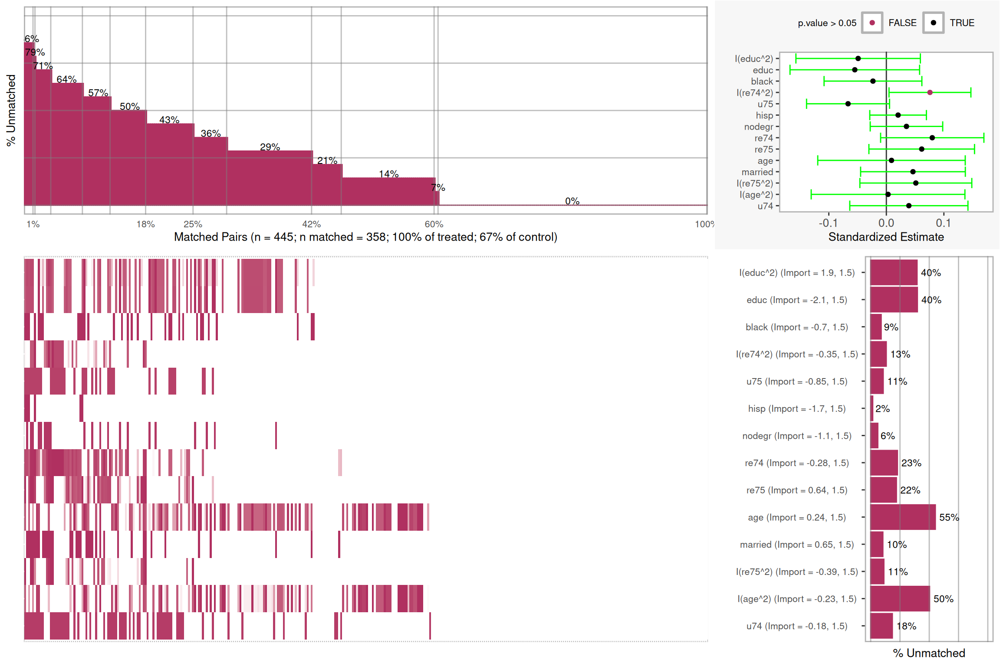

# Matching {#chapter-matching}

::: {.rmdtip}
**match**  
*verb*  
1. correspond or cause to correspond in some essential respect; make or be harmonious.  
2. be equal to (something) in quality or strength.
:::


As the name suggests, propensity score matching is concerned with matching treatment to control observations...


```r
lr_out <- glm(lalonde.formu, 
			  data = lalonde,
			  family = binomial(link = logit))
lalonde$lr_ps <- fitted(lr_out)  # Propensity scores
```


<div class="figure" style="text-align: center">

<p class="caption">(\#fig:introduction-logistic)Propensity Scores from Logistic Regression with Sample of Matched Pairs</p>
</div>
	

## One-to-One Matching

One-to-one matching with replacement (the `M = 1` option). Estimating the treatment effect on the treated (default is ATT).


```r
rr_att <- Match(Y = lalonde$re78, 
				Tr = lalonde$treat, 
				X = lalonde$lr_ps,
				M = 1,
				estimand='ATT')
summary(rr_att) # The default estimate is ATT here
```

```
## 
## Estimate...  2153.3 
## AI SE......  825.4 
## T-stat.....  2.6088 
## p.val......  0.0090858 
## 
## Original number of observations..............  445 
## Original number of treated obs...............  185 
## Matched number of observations...............  185 
## Matched number of observations  (unweighted).  346
```

### Checking Balance


```r
rr_att_mb <- psa::MatchBalance(
	df = lalonde,
	formu = lalonde.formu,
	formu.Y = update.formula(lalonde.formu, re78 ~ .),
	index.treated = rr_att$index.treated,
	index.control = rr_att$index.control,
	tolerance = 0.25,
	M = 1,
	estimand = 'ATT')
plot(rr_att_mb)
```

<div class="figure" style="text-align: center">

<p class="caption">(\#fig:unnamed-chunk-3)Covariate Balance Plot for Matching</p>
</div>

```r
# ls(rr_att_mb)
summary(rr_att_mb)
```

```
## Sample sizes and number of matches:
##    Group   n n.matched n.percent.matched
##  Treated 185       185         1.0000000
##  Control 260       173         0.6653846
##    Total 445       358         0.8044944
## 
## Covariate importance and t-tests for matched pairs:
##           Import.Treat Import.Y Import.Total std.estimate       t p.value
## I(educ^2)        1.931   1.5228        3.453     -0.04903 -0.8916  0.3732
## educ             2.099   1.2121        3.311     -0.05483 -0.9577  0.3389
## black            0.705   1.8424        2.547     -0.02326 -0.5383  0.5907
## I(re74^2)        0.353   1.6415        1.994      0.07581  2.0955  0.0369
## u75              0.852   0.9435        1.796     -0.06655 -1.8144  0.0705
## hisp             1.731   0.0404        1.771      0.02042  0.8161  0.4150
## nodegr           1.090   0.5011        1.591      0.03496  1.0914  0.2759
## re74             0.280   1.1019        1.382      0.07979  1.7483  0.0813
## re75             0.642   0.5903        1.232      0.06147  1.3171  0.1887
## age              0.237   0.6729        0.910      0.00896  0.1374  0.8908
## married          0.646   0.1406        0.787      0.04627  1.0000  0.3180
## I(re75^2)        0.390   0.3817        0.772      0.05125  1.0364  0.3007
## I(age^2)         0.232   0.5096        0.742      0.00297  0.0438  0.9651
## u74              0.184   0.0702        0.254      0.03913  0.7495  0.4541
##             ci.min  ci.max PercentMatched
## I(educ^2) -0.15719 0.05913           60.4
## educ      -0.16744 0.05778           60.1
## black     -0.10826 0.06173           91.0
## I(re74^2)  0.00465 0.14696           86.7
## u75       -0.13870 0.00559           89.3
## hisp      -0.02879 0.06963           98.3
## nodegr    -0.02804 0.09797           93.9
## re74      -0.00998 0.16956           77.2
## re75      -0.03032 0.15326           78.0
## age       -0.11922 0.13713           44.8
## married   -0.04474 0.13728           89.6
## I(re75^2) -0.04602 0.14852           88.7
## I(age^2)  -0.13062 0.13656           49.7
## u74       -0.06356 0.14183           81.5
```


```
## $BeforeMatching
## $BeforeMatching[[1]]
## $sdiff
## [1] 10.65504
## 
## $sdiff.pooled
## [1] 10.72771
## 
## $mean.Tr
## [1] 25.81622
## 
## $mean.Co
## [1] 25.05385
## 
## $var.Tr
## [1] 51.1943
## 
## $var.Co
## [1] 49.81176
## 
## $p.value
## [1] 0.2659443
## 
## $var.ratio
## [1] 1.027755
## 
## $ks
## $ks$ks
## $ks$ks$p.value
## [1] 0.7480986
## 
## $ks$ks$statistic
## [1] 0.06517672
## 
## 
## $ks$ks.boot.pvalue
## [1] 0.598
## 
## 
## $tt
## $tt$statistic
## [1] 1.114036
## 
## $tt$parameter
## [1] Inf
## 
## $tt$p.value
## [1] 0.2659443
## 
## $tt$estimate
## [1] 0.7623701
## 
## 
## $qqsummary
## $qqsummary$meandiff
## [1] 0.02536383
## 
## $qqsummary$mediandiff
## [1] 0.02219335
## 
## $qqsummary$maxdiff
## [1] 0.06517672
## 
## 
## $qqsummary.raw
## $qqsummary.raw$meandiff
## [1] 0.9405405
## 
## $qqsummary.raw$mediandiff
## [1] 1
## 
## $qqsummary.raw$maxdiff
## [1] 7
## 
## 
## attr(,"class")
## [1] "balanceUV"
## 
## $BeforeMatching[[2]]
## $sdiff
## [1] 9.293693
## 
## $sdiff.pooled
## [1] 9.320317
## 
## $mean.Tr
## [1] 717.3946
## 
## $mean.Co
## [1] 677.3154
## 
## $var.Tr
## [1] 185978
## 
## $var.Co
## [1] 183856.1
## 
## $p.value
## [1] 0.3333721
## 
## $var.ratio
## [1] 1.011541
## 
## $ks
## $ks$ks
## $ks$ks$p.value
## [1] 0.7480986
## 
## $ks$ks$statistic
## [1] 0.06517672
## 
## 
## $ks$ks.boot.pvalue
## [1] 0.598
## 
## 
## $tt
## $tt$statistic
## [1] 0.9685305
## 
## $tt$parameter
## [1] Inf
## 
## $tt$p.value
## [1] 0.3333721
## 
## $tt$estimate
## [1] 40.07921
## 
## 
## $qqsummary
## $qqsummary$meandiff
## [1] 0.02536383
## 
## $qqsummary$mediandiff
## [1] 0.02219335
## 
## $qqsummary$maxdiff
## [1] 0.06517672
## 
## 
## $qqsummary.raw
## $qqsummary.raw$meandiff
## [1] 56.07568
## 
## $qqsummary.raw$mediandiff
## [1] 43
## 
## $qqsummary.raw$maxdiff
## [1] 721
## 
## 
## attr(,"class")
## [1] "balanceUV"
## 
## $BeforeMatching[[3]]
## $sdiff
## [1] 12.80603
## 
## $sdiff.pooled
## [1] 14.12198
## 
## $mean.Tr
## [1] 10.34595
## 
## $mean.Co
## [1] 10.08846
## 
## $var.Tr
## [1] 4.042714
## 
## $var.Co
## [1] 2.606044
## 
## $p.value
## [1] 0.1501694
## 
## $var.ratio
## [1] 1.551284
## 
## $ks
## $ks$ks
## $ks$ks$p.value
## [1] 0.06287261
## 
## $ks$ks$statistic
## [1] 0.1265073
## 
## 
## $ks$ks.boot.pvalue
## [1] 0.018
## 
## 
## $tt
## $tt$statistic
## [1] 1.442184
## 
## $tt$parameter
## [1] Inf
## 
## $tt$p.value
## [1] 0.1501694
## 
## $tt$estimate
## [1] 0.2574844
## 
## 
## $qqsummary
## $qqsummary$meandiff
## [1] 0.02869765
## 
## $qqsummary$mediandiff
## [1] 0.01268191
## 
## $qqsummary$maxdiff
## [1] 0.1265073
## 
## 
## $qqsummary.raw
## $qqsummary.raw$meandiff
## [1] 0.4054054
## 
## $qqsummary.raw$mediandiff
## [1] 0
## 
## $qqsummary.raw$maxdiff
## [1] 2
## 
## 
## attr(,"class")
## [1] "balanceUV"
## 
## $BeforeMatching[[4]]
## $sdiff
## [1] 17.01201
## 
## $sdiff.pooled
## [1] 19.01105
## 
## $mean.Tr
## [1] 111.0595
## 
## $mean.Co
## [1] 104.3731
## 
## $var.Tr
## [1] 1544.795
## 
## $var.Co
## [1] 929.2078
## 
## $p.value
## [1] 0.05367647
## 
## $var.ratio
## [1] 1.662486
## 
## $ks
## $ks$ks
## $ks$ks$p.value
## [1] 0.06287261
## 
## $ks$ks$statistic
## [1] 0.1265073
## 
## 
## $ks$ks.boot.pvalue
## [1] 0.018
## 
## 
## $tt
## $tt$statistic
## [1] 1.936324
## 
## $tt$parameter
## [1] Inf
## 
## $tt$p.value
## [1] 0.05367647
## 
## $tt$estimate
## [1] 6.686383
## 
## 
## $qqsummary
## $qqsummary$meandiff
## [1] 0.02869765
## 
## $qqsummary$mediandiff
## [1] 0.01268191
## 
## $qqsummary$maxdiff
## [1] 0.1265073
## 
## 
## $qqsummary.raw
## $qqsummary.raw$meandiff
## [1] 8.718919
## 
## $qqsummary.raw$mediandiff
## [1] 0
## 
## $qqsummary.raw$maxdiff
## [1] 60
## 
## 
## attr(,"class")
## [1] "balanceUV"
## 
## $BeforeMatching[[5]]
## $sdiff
## [1] 4.476701
## 
## $sdiff.pooled
## [1] 4.388661
## 
## $mean.Tr
## [1] 0.8432432
## 
## $mean.Co
## [1] 0.8269231
## 
## $var.Tr
## [1] 0.1329025
## 
## $var.Co
## [1] 0.1436739
## 
## $p.value
## [1] 0.6473574
## 
## $var.ratio
## [1] 0.9250286
## 
## $tt
## $tt$statistic
## [1] 0.4577777
## 
## $tt$parameter
## [1] Inf
## 
## $tt$p.value
## [1] 0.6473574
## 
## $tt$estimate
## [1] 0.01632017
## 
## 
## $qqsummary
## $qqsummary$meandiff
## [1] 0.008160083
## 
## $qqsummary$mediandiff
## [1] 0.008160083
## 
## $qqsummary$maxdiff
## [1] 0.01632017
## 
## 
## $qqsummary.raw
## $qqsummary.raw$meandiff
## [1] 0.01621622
## 
## $qqsummary.raw$mediandiff
## [1] 0
## 
## $qqsummary.raw$maxdiff
## [1] 1
## 
## 
## attr(,"class")
## [1] "balanceUV"
## 
## $BeforeMatching[[6]]
## $sdiff
## [1] -20.34074
## 
## $sdiff.pooled
## [1] -17.45611
## 
## $mean.Tr
## [1] 0.05945946
## 
## $mean.Co
## [1] 0.1076923
## 
## $var.Tr
## [1] 0.05622797
## 
## $var.Co
## [1] 0.0964657
## 
## $p.value
## [1] 0.06404327
## 
## $var.ratio
## [1] 0.5828804
## 
## $tt
## $tt$statistic
## [1] -1.856543
## 
## $tt$parameter
## [1] Inf
## 
## $tt$p.value
## [1] 0.06404327
## 
## $tt$estimate
## [1] -0.04823285
## 
## 
## $qqsummary
## $qqsummary$meandiff
## [1] 0.02411642
## 
## $qqsummary$mediandiff
## [1] 0.02411642
## 
## $qqsummary$maxdiff
## [1] 0.04823285
## 
## 
## $qqsummary.raw
## $qqsummary.raw$meandiff
## [1] 0.04864865
## 
## $qqsummary.raw$mediandiff
## [1] 0
## 
## $qqsummary.raw$maxdiff
## [1] 1
## 
## 
## attr(,"class")
## [1] "balanceUV"
## 
## $BeforeMatching[[7]]
## $sdiff
## [1] 8.999512
## 
## $sdiff.pooled
## [1] 9.36407
## 
## $mean.Tr
## [1] 0.1891892
## 
## $mean.Co
## [1] 0.1538462
## 
## $var.Tr
## [1] 0.1542303
## 
## $var.Co
## [1] 0.1306801
## 
## $p.value
## [1] 0.3342478
## 
## $var.ratio
## [1] 1.180212
## 
## $tt
## $tt$statistic
## [1] 0.9668363
## 
## $tt$parameter
## [1] Inf
## 
## $tt$p.value
## [1] 0.3342478
## 
## $tt$estimate
## [1] 0.03534304
## 
## 
## $qqsummary
## $qqsummary$meandiff
## [1] 0.01767152
## 
## $qqsummary$mediandiff
## [1] 0.01767152
## 
## $qqsummary$maxdiff
## [1] 0.03534304
## 
## 
## $qqsummary.raw
## $qqsummary.raw$meandiff
## [1] 0.03783784
## 
## $qqsummary.raw$mediandiff
## [1] 0
## 
## $qqsummary.raw$maxdiff
## [1] 1
## 
## 
## attr(,"class")
## [1] "balanceUV"
## 
## $BeforeMatching[[8]]
## $sdiff
## [1] -27.75094
## 
## $sdiff.pooled
## [1] -30.39864
## 
## $mean.Tr
## [1] 0.7081081
## 
## $mean.Co
## [1] 0.8346154
## 
## $var.Tr
## [1] 0.2078143
## 
## $var.Co
## [1] 0.1385655
## 
## $p.value
## [1] 0.00203678
## 
## $var.ratio
## [1] 1.499755
## 
## $tt
## $tt$statistic
## [1] -3.108498
## 
## $tt$parameter
## [1] Inf
## 
## $tt$p.value
## [1] 0.00203678
## 
## $tt$estimate
## [1] -0.1265073
## 
## 
## $qqsummary
## $qqsummary$meandiff
## [1] 0.06325364
## 
## $qqsummary$mediandiff
## [1] 0.06325364
## 
## $qqsummary$maxdiff
## [1] 0.1265073
## 
## 
## $qqsummary.raw
## $qqsummary.raw$meandiff
## [1] 0.1243243
## 
## $qqsummary.raw$mediandiff
## [1] 0
## 
## $qqsummary.raw$maxdiff
## [1] 1
## 
## 
## attr(,"class")
## [1] "balanceUV"
## 
## $BeforeMatching[[9]]
## $sdiff
## [1] -0.2343708
## 
## $sdiff.pooled
## [1] -0.2159921
## 
## $mean.Tr
## [1] 2095.574
## 
## $mean.Co
## [1] 2107.027
## 
## $var.Tr
## [1] 23879080
## 
## $var.Co
## [1] 32352283
## 
## $p.value
## [1] 0.981863
## 
## $var.ratio
## [1] 0.7380957
## 
## $ks
## $ks$ks
## $ks$ks$p.value
## [1] 0.9702261
## 
## $ks$ks$statistic
## [1] 0.0470894
## 
## 
## $ks$ks.boot.pvalue
## [1] 0.594
## 
## 
## $tt
## $tt$statistic
## [1] -0.0227466
## 
## $tt$parameter
## [1] Inf
## 
## $tt$p.value
## [1] 0.981863
## 
## $tt$estimate
## [1] -11.45282
## 
## 
## $qqsummary
## $qqsummary$meandiff
## [1] 0.01922341
## 
## $qqsummary$mediandiff
## [1] 0.01580042
## 
## $qqsummary$maxdiff
## [1] 0.0470894
## 
## 
## $qqsummary.raw
## $qqsummary.raw$meandiff
## [1] 487.9801
## 
## $qqsummary.raw$mediandiff
## [1] 0
## 
## $qqsummary.raw$maxdiff
## [1] 8413
## 
## 
## attr(,"class")
## [1] "balanceUV"
## 
## $BeforeMatching[[10]]
## $sdiff
## [1] -7.472148
## 
## $sdiff.pooled
## [1] -6.11645
## 
## $mean.Tr
## [1] 28141434
## 
## $mean.Co
## [1] 36667413
## 
## $var.Tr
## [1] 1.30196e+16
## 
## $var.Co
## [1] 2.584191e+16
## 
## $p.value
## [1] 0.5132201
## 
## $var.ratio
## [1] 0.5038172
## 
## $ks
## $ks$ks
## $ks$ks$p.value
## [1] 0.9702261
## 
## $ks$ks$statistic
## [1] 0.0470894
## 
## 
## $ks$ks.boot.pvalue
## [1] 0.594
## 
## 
## $tt
## $tt$statistic
## [1] -0.6543591
## 
## $tt$parameter
## [1] Inf
## 
## $tt$p.value
## [1] 0.5132201
## 
## $tt$estimate
## [1] -8525979
## 
## 
## $qqsummary
## $qqsummary$meandiff
## [1] 0.01922341
## 
## $qqsummary$mediandiff
## [1] 0.01580042
## 
## $qqsummary$maxdiff
## [1] 0.0470894
## 
## 
## $qqsummary.raw
## $qqsummary.raw$meandiff
## [1] 13311731
## 
## $qqsummary.raw$mediandiff
## [1] 0
## 
## $qqsummary.raw$maxdiff
## [1] 365146387
## 
## 
## attr(,"class")
## [1] "balanceUV"
## 
## $BeforeMatching[[11]]
## $sdiff
## [1] 8.236276
## 
## $sdiff.pooled
## [1] 8.386325
## 
## $mean.Tr
## [1] 1532.056
## 
## $mean.Co
## [1] 1266.909
## 
## $var.Tr
## [1] 10363578
## 
## $var.Co
## [1] 9628504
## 
## $p.value
## [1] 0.3852726
## 
## $var.ratio
## [1] 1.076344
## 
## $ks
## $ks$ks
## $ks$ks$p.value
## [1] 0.1644888
## 
## $ks$ks$statistic
## [1] 0.1074844
## 
## 
## $ks$ks.boot.pvalue
## [1] 0.062
## 
## 
## $tt
## $tt$statistic
## [1] 0.8692061
## 
## $tt$parameter
## [1] Inf
## 
## $tt$p.value
## [1] 0.3852726
## 
## $tt$estimate
## [1] 265.1464
## 
## 
## $qqsummary
## $qqsummary$meandiff
## [1] 0.05083363
## 
## $qqsummary$mediandiff
## [1] 0.06195426
## 
## $qqsummary$maxdiff
## [1] 0.1074844
## 
## 
## $qqsummary.raw
## $qqsummary.raw$meandiff
## [1] 367.6133
## 
## $qqsummary.raw$mediandiff
## [1] 0
## 
## $qqsummary.raw$maxdiff
## [1] 2110.2
## 
## 
## attr(,"class")
## [1] "balanceUV"
## 
## $BeforeMatching[[12]]
## $sdiff
## [1] 2.602408
## 
## $sdiff.pooled
## [1] 2.835659
## 
## $mean.Tr
## [1] 12654753
## 
## $mean.Co
## [1] 11196530
## 
## $var.Tr
## [1] 3.139764e+15
## 
## $var.Co
## [1] 2.149189e+15
## 
## $p.value
## [1] 0.7717846
## 
## $var.ratio
## [1] 1.460906
## 
## $ks
## $ks$ks
## $ks$ks$p.value
## [1] 0.1644888
## 
## $ks$ks$statistic
## [1] 0.1074844
## 
## 
## $ks$ks.boot.pvalue
## [1] 0.062
## 
## 
## $tt
## $tt$statistic
## [1] 0.2902672
## 
## $tt$parameter
## [1] Inf
## 
## $tt$p.value
## [1] 0.7717846
## 
## $tt$estimate
## [1] 1458223
## 
## 
## $qqsummary
## $qqsummary$meandiff
## [1] 0.05083363
## 
## $qqsummary$mediandiff
## [1] 0.06195426
## 
## $qqsummary$maxdiff
## [1] 0.1074844
## 
## 
## $qqsummary.raw
## $qqsummary.raw$meandiff
## [1] 2840830
## 
## $qqsummary.raw$mediandiff
## [1] 0
## 
## $qqsummary.raw$maxdiff
## [1] 101657197
## 
## 
## attr(,"class")
## [1] "balanceUV"
## 
## $BeforeMatching[[13]]
## $sdiff
## [1] -9.189507
## 
## $sdiff.pooled
## [1] -9.414048
## 
## $mean.Tr
## [1] 0.7081081
## 
## $mean.Co
## [1] 0.75
## 
## $var.Tr
## [1] 0.2078143
## 
## $var.Co
## [1] 0.1882239
## 
## $p.value
## [1] 0.3303278
## 
## $var.ratio
## [1] 1.10408
## 
## $tt
## $tt$statistic
## [1] -0.974689
## 
## $tt$parameter
## [1] Inf
## 
## $tt$p.value
## [1] 0.3303278
## 
## $tt$estimate
## [1] -0.04189189
## 
## 
## $qqsummary
## $qqsummary$meandiff
## [1] 0.02094595
## 
## $qqsummary$mediandiff
## [1] 0.02094595
## 
## $qqsummary$maxdiff
## [1] 0.04189189
## 
## 
## $qqsummary.raw
## $qqsummary.raw$meandiff
## [1] 0.03783784
## 
## $qqsummary.raw$mediandiff
## [1] 0
## 
## $qqsummary.raw$maxdiff
## [1] 1
## 
## 
## attr(,"class")
## [1] "balanceUV"
## 
## $BeforeMatching[[14]]
## $sdiff
## [1] -17.2253
## 
## $sdiff.pooled
## [1] -17.68094
## 
## $mean.Tr
## [1] 0.6
## 
## $mean.Co
## [1] 0.6846154
## 
## $var.Tr
## [1] 0.2413043
## 
## $var.Co
## [1] 0.2167508
## 
## $p.value
## [1] 0.06803052
## 
## $var.ratio
## [1] 1.11328
## 
## $tt
## $tt$statistic
## [1] -1.829974
## 
## $tt$parameter
## [1] Inf
## 
## $tt$p.value
## [1] 0.06803052
## 
## $tt$estimate
## [1] -0.08461538
## 
## 
## $qqsummary
## $qqsummary$meandiff
## [1] 0.04230769
## 
## $qqsummary$mediandiff
## [1] 0.04230769
## 
## $qqsummary$maxdiff
## [1] 0.08461538
## 
## 
## $qqsummary.raw
## $qqsummary.raw$meandiff
## [1] 0.08108108
## 
## $qqsummary.raw$mediandiff
## [1] 0
## 
## $qqsummary.raw$maxdiff
## [1] 1
## 
## 
## attr(,"class")
## [1] "balanceUV"
## 
## 
## $AfterMatching
## $AfterMatching[[1]]
## $sdiff
## [1] 11.31677
## 
## $sdiff.pooled
## [1] 11.31677
## 
## $mean.Tr
## [1] 25.81622
## 
## $mean.Co
## [1] 25.0065
## 
## $var.Tr
## [1] 50.91757
## 
## $var.Co
## [1] 47.75686
## 
## $p.value
## [1] 0.2347179
## 
## $var.ratio
## [1] 1.066184
## 
## $ks
## $ks$ks
## $ks$ks$p.value
## [1] 0.7978071
## 
## $ks$ks$statistic
## [1] 0.04913295
## 
## 
## $ks$ks.boot.pvalue
## [1] 0.602
## 
## 
## $tt
## $tt$statistic
## [1] 1.1922
## 
## $tt$parameter
## [1] Inf
## 
## $tt$p.value
## [1] 0.2347179
## 
## $tt$estimate
## [1] 0.8097169
## 
## 
## $qqsummary
## $qqsummary$meandiff
## [1] 0.0105973
## 
## $qqsummary$mediandiff
## [1] 0.00867052
## 
## $qqsummary$maxdiff
## [1] 0.04913295
## 
## 
## $qqsummary.raw
## $qqsummary.raw$meandiff
## [1] 0.416185
## 
## $qqsummary.raw$mediandiff
## [1] 0
## 
## $qqsummary.raw$maxdiff
## [1] 9
## 
## 
## attr(,"class")
## [1] "balanceUV"
## 
## $AfterMatching[[2]]
## $sdiff
## [1] 10.27537
## 
## $sdiff.pooled
## [1] 10.27537
## 
## $mean.Tr
## [1] 717.3946
## 
## $mean.Co
## [1] 673.0819
## 
## $var.Tr
## [1] 184972.7
## 
## $var.Co
## [1] 202120.7
## 
## $p.value
## [1] 0.3181901
## 
## $var.ratio
## [1] 0.9151598
## 
## $ks
## $ks$ks
## $ks$ks$p.value
## [1] 0.7978071
## 
## $ks$ks$statistic
## [1] 0.04913295
## 
## 
## $ks$ks.boot.pvalue
## [1] 0.602
## 
## 
## $tt
## $tt$statistic
## [1] 1.000899
## 
## $tt$parameter
## [1] Inf
## 
## $tt$p.value
## [1] 0.3181901
## 
## $tt$estimate
## [1] 44.31273
## 
## 
## $qqsummary
## $qqsummary$meandiff
## [1] 0.0105973
## 
## $qqsummary$mediandiff
## [1] 0.00867052
## 
## $qqsummary$maxdiff
## [1] 0.04913295
## 
## 
## $qqsummary.raw
## $qqsummary.raw$meandiff
## [1] 28.94798
## 
## $qqsummary.raw$mediandiff
## [1] 0
## 
## $qqsummary.raw$maxdiff
## [1] 909
## 
## 
## attr(,"class")
## [1] "balanceUV"
## 
## $AfterMatching[[3]]
## $sdiff
## [1] -6.67488
## 
## $sdiff.pooled
## [1] -6.67488
## 
## $mean.Tr
## [1] 10.34595
## 
## $mean.Co
## [1] 10.48015
## 
## $var.Tr
## [1] 4.020862
## 
## $var.Co
## [1] 3.374162
## 
## $p.value
## [1] 0.4502108
## 
## $var.ratio
## [1] 1.191662
## 
## $ks
## $ks$ks
## $ks$ks$p.value
## [1] 0.7372575
## 
## $ks$ks$statistic
## [1] 0.05202312
## 
## 
## $ks$ks.boot.pvalue
## [1] 0.356
## 
## 
## $tt
## $tt$statistic
## [1] -0.7566776
## 
## $tt$parameter
## [1] Inf
## 
## $tt$p.value
## [1] 0.4502108
## 
## $tt$estimate
## [1] -0.1342085
## 
## 
## $qqsummary
## $qqsummary$meandiff
## [1] 0.01156069
## 
## $qqsummary$mediandiff
## [1] 0.00867052
## 
## $qqsummary$maxdiff
## [1] 0.05202312
## 
## 
## $qqsummary.raw
## $qqsummary.raw$meandiff
## [1] 0.1618497
## 
## $qqsummary.raw$mediandiff
## [1] 0
## 
## $qqsummary.raw$maxdiff
## [1] 2
## 
## 
## attr(,"class")
## [1] "balanceUV"
## 
## $AfterMatching[[4]]
## $sdiff
## [1] -5.465973
## 
## $sdiff.pooled
## [1] -5.465973
## 
## $mean.Tr
## [1] 111.0595
## 
## $mean.Co
## [1] 113.2078
## 
## $var.Tr
## [1] 1536.445
## 
## $var.Co
## [1] 1208.249
## 
## $p.value
## [1] 0.5104629
## 
## $var.ratio
## [1] 1.271629
## 
## $ks
## $ks$ks
## $ks$ks$p.value
## [1] 0.7372575
## 
## $ks$ks$statistic
## [1] 0.05202312
## 
## 
## $ks$ks.boot.pvalue
## [1] 0.356
## 
## 
## $tt
## $tt$statistic
## [1] -0.6594007
## 
## $tt$parameter
## [1] Inf
## 
## $tt$p.value
## [1] 0.5104629
## 
## $tt$estimate
## [1] -2.14834
## 
## 
## $qqsummary
## $qqsummary$meandiff
## [1] 0.01156069
## 
## $qqsummary$mediandiff
## [1] 0.00867052
## 
## $qqsummary$maxdiff
## [1] 0.05202312
## 
## 
## $qqsummary.raw
## $qqsummary.raw$meandiff
## [1] 3.109827
## 
## $qqsummary.raw$mediandiff
## [1] 0
## 
## $qqsummary.raw$maxdiff
## [1] 60
## 
## 
## attr(,"class")
## [1] "balanceUV"
## 
## $AfterMatching[[5]]
## $sdiff
## [1] -4.448187
## 
## $sdiff.pooled
## [1] -4.448187
## 
## $mean.Tr
## [1] 0.8432432
## 
## $mean.Co
## [1] 0.8594595
## 
## $var.Tr
## [1] 0.1321841
## 
## $var.Co
## [1] 0.1207889
## 
## $p.value
## [1] 0.5778267
## 
## $var.ratio
## [1] 1.09434
## 
## $tt
## $tt$statistic
## [1] -0.5575539
## 
## $tt$parameter
## [1] Inf
## 
## $tt$p.value
## [1] 0.5778267
## 
## $tt$estimate
## [1] -0.01621622
## 
## 
## $qqsummary
## $qqsummary$meandiff
## [1] 0.00433526
## 
## $qqsummary$mediandiff
## [1] 0.00433526
## 
## $qqsummary$maxdiff
## [1] 0.00867052
## 
## 
## $qqsummary.raw
## $qqsummary.raw$meandiff
## [1] 0.00867052
## 
## $qqsummary.raw$mediandiff
## [1] 0
## 
## $qqsummary.raw$maxdiff
## [1] 1
## 
## 
## attr(,"class")
## [1] "balanceUV"
## 
## $AfterMatching[[6]]
## $sdiff
## [1] 4.559131
## 
## $sdiff.pooled
## [1] 4.559131
## 
## $mean.Tr
## [1] 0.05945946
## 
## $mean.Co
## [1] 0.04864865
## 
## $var.Tr
## [1] 0.05592403
## 
## $var.Co
## [1] 0.04628196
## 
## $p.value
## [1] 0.4144313
## 
## $var.ratio
## [1] 1.208333
## 
## $tt
## $tt$statistic
## [1] 0.8179717
## 
## $tt$parameter
## [1] Inf
## 
## $tt$p.value
## [1] 0.4144313
## 
## $tt$estimate
## [1] 0.01081081
## 
## 
## $qqsummary
## $qqsummary$meandiff
## [1] 0.002890173
## 
## $qqsummary$mediandiff
## [1] 0.002890173
## 
## $qqsummary$maxdiff
## [1] 0.005780347
## 
## 
## $qqsummary.raw
## $qqsummary.raw$meandiff
## [1] 0.005780347
## 
## $qqsummary.raw$mediandiff
## [1] 0
## 
## $qqsummary.raw$maxdiff
## [1] 1
## 
## 
## attr(,"class")
## [1] "balanceUV"
## 
## $AfterMatching[[7]]
## $sdiff
## [1] 5.734983
## 
## $sdiff.pooled
## [1] 5.734983
## 
## $mean.Tr
## [1] 0.1891892
## 
## $mean.Co
## [1] 0.1666667
## 
## $var.Tr
## [1] 0.1533966
## 
## $var.Co
## [1] 0.1388889
## 
## $p.value
## [1] 0.4674147
## 
## $var.ratio
## [1] 1.104456
## 
## $tt
## $tt$statistic
## [1] 0.7282036
## 
## $tt$parameter
## [1] Inf
## 
## $tt$p.value
## [1] 0.4674147
## 
## $tt$estimate
## [1] 0.02252252
## 
## 
## $qqsummary
## $qqsummary$meandiff
## [1] 0.00867052
## 
## $qqsummary$mediandiff
## [1] 0.00867052
## 
## $qqsummary$maxdiff
## [1] 0.01734104
## 
## 
## $qqsummary.raw
## $qqsummary.raw$meandiff
## [1] 0.01734104
## 
## $qqsummary.raw$mediandiff
## [1] 0
## 
## $qqsummary.raw$maxdiff
## [1] 1
## 
## 
## attr(,"class")
## [1] "balanceUV"
## 
## $AfterMatching[[8]]
## $sdiff
## [1] 3.557229
## 
## $sdiff.pooled
## [1] 3.557229
## 
## $mean.Tr
## [1] 0.7081081
## 
## $mean.Co
## [1] 0.6918919
## 
## $var.Tr
## [1] 0.206691
## 
## $var.Co
## [1] 0.2131775
## 
## $p.value
## [1] 0.4916095
## 
## $var.ratio
## [1] 0.9695724
## 
## $tt
## $tt$statistic
## [1] 0.68913
## 
## $tt$parameter
## [1] Inf
## 
## $tt$p.value
## [1] 0.4916095
## 
## $tt$estimate
## [1] 0.01621622
## 
## 
## $qqsummary
## $qqsummary$meandiff
## [1] 0.007225434
## 
## $qqsummary$mediandiff
## [1] 0.007225434
## 
## $qqsummary$maxdiff
## [1] 0.01445087
## 
## 
## $qqsummary.raw
## $qqsummary.raw$meandiff
## [1] 0.01445087
## 
## $qqsummary.raw$mediandiff
## [1] 0
## 
## $qqsummary.raw$maxdiff
## [1] 1
## 
## 
## attr(,"class")
## [1] "balanceUV"
## 
## $AfterMatching[[9]]
## $sdiff
## [1] 9.643926
## 
## $sdiff.pooled
## [1] 9.643926
## 
## $mean.Tr
## [1] 2095.574
## 
## $mean.Co
## [1] 1624.312
## 
## $var.Tr
## [1] 23750004
## 
## $var.Co
## [1] 10479463
## 
## $p.value
## [1] 0.2274517
## 
## $var.ratio
## [1] 2.266338
## 
## $ks
## $ks$ks
## $ks$ks$p.value
## [1] 0.8532029
## 
## $ks$ks$statistic
## [1] 0.04624277
## 
## 
## $ks$ks.boot.pvalue
## [1] 0.262
## 
## 
## $tt
## $tt$statistic
## [1] 1.210992
## 
## $tt$parameter
## [1] Inf
## 
## $tt$p.value
## [1] 0.2274517
## 
## $tt$estimate
## [1] 471.2623
## 
## 
## $qqsummary
## $qqsummary$meandiff
## [1] 0.01978163
## 
## $qqsummary$mediandiff
## [1] 0.01878613
## 
## $qqsummary$maxdiff
## [1] 0.04624277
## 
## 
## $qqsummary.raw
## $qqsummary.raw$meandiff
## [1] 467.3267
## 
## $qqsummary.raw$mediandiff
## [1] 0
## 
## $qqsummary.raw$maxdiff
## [1] 12409.7
## 
## 
## attr(,"class")
## [1] "balanceUV"
## 
## $AfterMatching[[10]]
## $sdiff
## [1] 13.16663
## 
## $sdiff.pooled
## [1] 13.16663
## 
## $mean.Tr
## [1] 28141434
## 
## $mean.Co
## [1] 13117852
## 
## $var.Tr
## [1] 1.294922e+16
## 
## $var.Co
## [1] 1.639024e+15
## 
## $p.value
## [1] 0.08603981
## 
## $var.ratio
## [1] 7.900571
## 
## $ks
## $ks$ks
## $ks$ks$p.value
## [1] 0.8532029
## 
## $ks$ks$statistic
## [1] 0.04624277
## 
## 
## $ks$ks.boot.pvalue
## [1] 0.262
## 
## 
## $tt
## $tt$statistic
## [1] 1.725924
## 
## $tt$parameter
## [1] Inf
## 
## $tt$p.value
## [1] 0.08603981
## 
## $tt$estimate
## [1] 15023582
## 
## 
## $qqsummary
## $qqsummary$meandiff
## [1] 0.01978163
## 
## $qqsummary$mediandiff
## [1] 0.01878613
## 
## $qqsummary$maxdiff
## [1] 0.04624277
## 
## 
## $qqsummary.raw
## $qqsummary.raw$meandiff
## [1] 10899373
## 
## $qqsummary.raw$mediandiff
## [1] 0
## 
## $qqsummary.raw$maxdiff
## [1] 616156569
## 
## 
## attr(,"class")
## [1] "balanceUV"
## 
## $AfterMatching[[11]]
## $sdiff
## [1] 7.28274
## 
## $sdiff.pooled
## [1] 7.28274
## 
## $mean.Tr
## [1] 1532.056
## 
## $mean.Co
## [1] 1297.606
## 
## $var.Tr
## [1] 10307558
## 
## $var.Co
## [1] 7212482
## 
## $p.value
## [1] 0.3332413
## 
## $var.ratio
## [1] 1.429128
## 
## $ks
## $ks$ks
## $ks$ks$p.value
## [1] 0.6098807
## 
## $ks$ks$statistic
## [1] 0.05780347
## 
## 
## $ks$ks.boot.pvalue
## [1] 0.182
## 
## 
## $tt
## $tt$statistic
## [1] 0.970158
## 
## $tt$parameter
## [1] Inf
## 
## $tt$p.value
## [1] 0.3332413
## 
## $tt$estimate
## [1] 234.4497
## 
## 
## $qqsummary
## $qqsummary$meandiff
## [1] 0.02304728
## 
## $qqsummary$mediandiff
## [1] 0.02312139
## 
## $qqsummary$maxdiff
## [1] 0.05780347
## 
## 
## $qqsummary.raw
## $qqsummary.raw$meandiff
## [1] 211.4233
## 
## $qqsummary.raw$mediandiff
## [1] 0
## 
## $qqsummary.raw$maxdiff
## [1] 8195.6
## 
## 
## attr(,"class")
## [1] "balanceUV"
## 
## $AfterMatching[[12]]
## $sdiff
## [1] 6.707565
## 
## $sdiff.pooled
## [1] 6.707565
## 
## $mean.Tr
## [1] 12654753
## 
## $mean.Co
## [1] 8896263
## 
## $var.Tr
## [1] 3.122793e+15
## 
## $var.Co
## [1] 8.774376e+14
## 
## $p.value
## [1] 0.3774116
## 
## $var.ratio
## [1] 3.558991
## 
## $ks
## $ks$ks
## $ks$ks$p.value
## [1] 0.6098807
## 
## $ks$ks$statistic
## [1] 0.05780347
## 
## 
## $ks$ks.boot.pvalue
## [1] 0.182
## 
## 
## $tt
## $tt$statistic
## [1] 0.8848143
## 
## $tt$parameter
## [1] Inf
## 
## $tt$p.value
## [1] 0.3774116
## 
## $tt$estimate
## [1] 3758490
## 
## 
## $qqsummary
## $qqsummary$meandiff
## [1] 0.02304728
## 
## $qqsummary$mediandiff
## [1] 0.02312139
## 
## $qqsummary$maxdiff
## [1] 0.05780347
## 
## 
## $qqsummary.raw
## $qqsummary.raw$meandiff
## [1] 2887443
## 
## $qqsummary.raw$mediandiff
## [1] 0
## 
## $qqsummary.raw$maxdiff
## [1] 344942969
## 
## 
## attr(,"class")
## [1] "balanceUV"
## 
## $AfterMatching[[13]]
## $sdiff
## [1] 5.160805
## 
## $sdiff.pooled
## [1] 5.160805
## 
## $mean.Tr
## [1] 0.7081081
## 
## $mean.Co
## [1] 0.6845817
## 
## $var.Tr
## [1] 0.206691
## 
## $var.Co
## [1] 0.2159296
## 
## $p.value
## [1] 0.5229772
## 
## $var.ratio
## [1] 0.9572149
## 
## $tt
## $tt$statistic
## [1] 0.6399869
## 
## $tt$parameter
## [1] Inf
## 
## $tt$p.value
## [1] 0.5229772
## 
## $tt$estimate
## [1] 0.02352638
## 
## 
## $qqsummary
## $qqsummary$meandiff
## [1] 0.00867052
## 
## $qqsummary$mediandiff
## [1] 0.00867052
## 
## $qqsummary$maxdiff
## [1] 0.01734104
## 
## 
## $qqsummary.raw
## $qqsummary.raw$meandiff
## [1] 0.01734104
## 
## $qqsummary.raw$mediandiff
## [1] 0
## 
## $qqsummary.raw$maxdiff
## [1] 1
## 
## 
## attr(,"class")
## [1] "balanceUV"
## 
## $AfterMatching[[14]]
## $sdiff
## [1] -4.218153
## 
## $sdiff.pooled
## [1] -4.218153
## 
## $mean.Tr
## [1] 0.6
## 
## $mean.Co
## [1] 0.6207207
## 
## $var.Tr
## [1] 0.24
## 
## $var.Co
## [1] 0.2354265
## 
## $p.value
## [1] 0.4650719
## 
## $var.ratio
## [1] 1.019426
## 
## $tt
## $tt$statistic
## [1] -0.7320459
## 
## $tt$parameter
## [1] Inf
## 
## $tt$p.value
## [1] 0.4650719
## 
## $tt$estimate
## [1] -0.02072072
## 
## 
## $qqsummary
## $qqsummary$meandiff
## [1] 0.01589595
## 
## $qqsummary$mediandiff
## [1] 0.01589595
## 
## $qqsummary$maxdiff
## [1] 0.03179191
## 
## 
## $qqsummary.raw
## $qqsummary.raw$meandiff
## [1] 0.03179191
## 
## $qqsummary.raw$mediandiff
## [1] 0
## 
## $qqsummary.raw$maxdiff
## [1] 1
## 
## 
## attr(,"class")
## [1] "balanceUV"
## 
## 
## $BMsmallest.p.value
## [1] 0.00203678
## 
## $BMsmallestVarName
## [1] "nodegr"
## 
## $BMsmallestVarNumber
## [1] 8
## 
## $AMsmallest.p.value
## [1] 0.08603981
## 
## $AMsmallestVarName
## [1] "I(re74^2)"
## 
## $AMsmallestVarNumber
## [1] 10
```


```r
rr.ate <- Match(Y = lalonde$re78, 
				Tr = lalonde$treat, 
				X = lalonde$lr_ps,
				M = 1,
				estimand = 'ATE')
summary(rr.ate)
```

```
## 
## Estimate...  2013.3 
## AI SE......  817.76 
## T-stat.....  2.4619 
## p.val......  0.013819 
## 
## Original number of observations..............  445 
## Original number of treated obs...............  185 
## Matched number of observations...............  445 
## Matched number of observations  (unweighted).  756
```

```r
ls(rr.ate)
```

```
##  [1] "caliper"           "ecaliper"          "est"              
##  [4] "est.noadj"         "estimand"          "exact"            
##  [7] "index.control"     "index.dropped"     "index.treated"    
## [10] "MatchLoopC"        "mdata"             "ndrops"           
## [13] "ndrops.matches"    "nobs"              "orig.nobs"        
## [16] "orig.treated.nobs" "orig.wnobs"        "se"               
## [19] "se.cond"           "se.standard"       "version"          
## [22] "weights"           "wnobs"
```


```r
rr2 <- Match(Y = lalonde$re78, 		
			 Tr = lalonde$treat, 
			 X = lalonde$lr_ps,
			 M = 1, 
			 ties = TRUE, 
			 replace = TRUE,
			 estimand = 'ATT')
summary(rr2) # The default estimate is ATT here
```

```
## 
## Estimate...  2153.3 
## AI SE......  825.4 
## T-stat.....  2.6088 
## p.val......  0.0090858 
## 
## Original number of observations..............  445 
## Original number of treated obs...............  185 
## Matched number of observations...............  185 
## Matched number of observations  (unweighted).  346
```

```r
length(unique(rr2$index.control))
```

```
## 173.00
```

```r
ls(rr2)
```

```
##  [1] "caliper"           "ecaliper"          "est"              
##  [4] "est.noadj"         "estimand"          "exact"            
##  [7] "index.control"     "index.dropped"     "index.treated"    
## [10] "MatchLoopC"        "mdata"             "ndrops"           
## [13] "ndrops.matches"    "nobs"              "orig.nobs"        
## [16] "orig.treated.nobs" "orig.wnobs"        "se"               
## [19] "se.cond"           "se.standard"       "version"          
## [22] "weights"           "wnobs"
```


```r
## Using the Matchit package
matchit.out <- matchit(lalonde.formu, data = lalonde)
summary(matchit.out)
```

```
## 
## Call:
## matchit(formula = lalonde.formu, data = lalonde)
## 
## Summary of Balance for All Data:
##           Means Treated Means Control Std. Mean Diff. Var. Ratio eCDF Mean
## distance         0.4468        0.3936          0.4533     1.2101    0.1340
## age             25.8162       25.0538          0.1066     1.0278    0.0254
## I(age^2)       717.3946      677.3154          0.0929     1.0115    0.0254
## educ            10.3459       10.0885          0.1281     1.5513    0.0287
## I(educ^2)      111.0595      104.3731          0.1701     1.6625    0.0287
## black            0.8432        0.8269          0.0449          .    0.0163
## hisp             0.0595        0.1077         -0.2040          .    0.0482
## married          0.1892        0.1538          0.0902          .    0.0353
## nodegr           0.7081        0.8346         -0.2783          .    0.1265
## re74          2095.5740     2107.0268         -0.0023     0.7381    0.0192
## I(re74^2) 28141433.9907 36667413.1577         -0.0747     0.5038    0.0192
## re75          1532.0556     1266.9092          0.0824     1.0763    0.0508
## I(re75^2) 12654752.6909 11196530.0057          0.0260     1.4609    0.0508
## u74              0.7081        0.7500         -0.0921          .    0.0419
## u75              0.6000        0.6846         -0.1727          .    0.0846
##           eCDF Max
## distance    0.2244
## age         0.0652
## I(age^2)    0.0652
## educ        0.1265
## I(educ^2)   0.1265
## black       0.0163
## hisp        0.0482
## married     0.0353
## nodegr      0.1265
## re74        0.0471
## I(re74^2)   0.0471
## re75        0.1075
## I(re75^2)   0.1075
## u74         0.0419
## u75         0.0846
## 
## Summary of Balance for Matched Data:
##           Means Treated Means Control Std. Mean Diff. Var. Ratio eCDF Mean
## distance         0.4468        0.4277          0.1627     1.2887    0.0400
## age             25.8162       25.7514          0.0091     1.0691    0.0151
## I(age^2)       717.3946      710.7568          0.0154     0.9977    0.0151
## educ            10.3459       10.2054          0.0699     1.2231    0.0162
## I(educ^2)      111.0595      107.4378          0.0921     1.3309    0.0162
## black            0.8432        0.8324          0.0297          .    0.0108
## hisp             0.0595        0.0811         -0.0914          .    0.0216
## married          0.1892        0.1946         -0.0138          .    0.0054
## nodegr           0.7081        0.7676         -0.1308          .    0.0595
## re74          2095.5740     2168.6782         -0.0150     1.0398    0.0125
## I(re74^2) 28141433.9907 27544255.1664          0.0052     1.4319    0.0125
## re75          1532.0556     1482.8937          0.0153     1.1270    0.0181
## I(re75^2) 12654752.6909 11344693.3166          0.0234     2.2884    0.0181
## u74              0.7081        0.7027          0.0119          .    0.0054
## u75              0.6000        0.5946          0.0110          .    0.0054
##           eCDF Max Std. Pair Dist.
## distance    0.1189          0.1627
## age         0.0378          0.9912
## I(age^2)    0.0378          0.9340
## educ        0.0595          0.8442
## I(educ^2)   0.0595          0.8353
## black       0.0108          0.6244
## hisp        0.0216          0.2743
## married     0.0054          0.6211
## nodegr      0.0595          0.5588
## re74        0.0324          0.6787
## I(re74^2)   0.0324          0.4400
## re75        0.0486          0.7713
## I(re75^2)   0.0486          0.4068
## u74         0.0054          0.8204
## u75         0.0054          0.7613
## 
## Sample Sizes:
##           Control Treated
## All           260     185
## Matched       185     185
## Unmatched      75       0
## Discarded       0       0
```

```r
# Same as above but calculate average treatment effect
rr.ate <- Match(Y = lalonde$re78, 
				Tr = lalonde$treat, 
				X = lalonde$lr_ps,
				M = 1,
				ties = FALSE, 
				replace = FALSE, 
				estimand='ATE')
summary(rr.ate) # Here the estimate is ATE
```

```
## 
## Estimate...  2125.5 
## SE.........  493.96 
## T-stat.....  4.3029 
## p.val......  1.6859e-05 
## 
## Original number of observations..............  445 
## Original number of treated obs...............  185 
## Matched number of observations...............  370 
## Matched number of observations  (unweighted).  370
```

```r
## Genetic Matching
rr.gen <- GenMatch(Tr = lalonde$treat, 
				   X = lalonde$lr_ps, 
				   BalanceMatrix = lalonde[,all.vars(lalonde.formu)[-1]],
				   estimand = 'ATE', 
				   M = 1, 
				   pop.size = 16)
```

```
## 
## 
## Thu Apr 20 00:00:36 2023
## Domains:
##  0.000000e+00   <=  X1   <=    1.000000e+03 
## 
## Data Type: Floating Point
## Operators (code number, name, population) 
## 	(1) Cloning........................... 	1
## 	(2) Uniform Mutation.................. 	2
## 	(3) Boundary Mutation................. 	2
## 	(4) Non-Uniform Mutation.............. 	2
## 	(5) Polytope Crossover................ 	2
## 	(6) Simple Crossover.................. 	2
## 	(7) Whole Non-Uniform Mutation........ 	2
## 	(8) Heuristic Crossover............... 	2
## 	(9) Local-Minimum Crossover........... 	0
## 
## SOFT Maximum Number of Generations: 100
## Maximum Nonchanging Generations: 4
## Population size       : 16
## Convergence Tolerance: 1.000000e-03
## 
## Not Using the BFGS Derivative Based Optimizer on the Best Individual Each Generation.
## Not Checking Gradients before Stopping.
## Using Out of Bounds Individuals.
## 
## Maximization Problem.
## GENERATION: 0 (initializing the population)
## Lexical Fit..... 9.235231e-02  1.757822e-01  2.857138e-01  2.857138e-01  3.950411e-01  3.950411e-01  4.483849e-01  7.409596e-01  7.643859e-01  7.643859e-01  7.647535e-01  7.691713e-01  7.691713e-01  8.592751e-01  8.592751e-01  9.160976e-01  9.160976e-01  9.681165e-01  9.786492e-01  9.823810e-01  
## #unique......... 16, #Total UniqueCount: 16
## var 1:
## best............ 3.324648e+01
## mean............ 4.638550e+02
## variance........ 8.779735e+04
## 
## GENERATION: 1
## Lexical Fit..... 1.067431e-01  2.553994e-01  2.553994e-01  3.549996e-01  3.913630e-01  3.913630e-01  4.747623e-01  5.084810e-01  6.420853e-01  6.420853e-01  6.665787e-01  7.967582e-01  8.111685e-01  8.111685e-01  8.592751e-01  8.592751e-01  9.160976e-01  9.160976e-01  9.264048e-01  9.941933e-01  
## #unique......... 10, #Total UniqueCount: 26
## var 1:
## best............ 4.206134e+00
## mean............ 2.117860e+02
## variance........ 4.296951e+04
## 
## GENERATION: 2
## Lexical Fit..... 1.134648e-01  2.173453e-01  2.857138e-01  2.857138e-01  3.432276e-01  3.432276e-01  4.939824e-01  5.024479e-01  6.832321e-01  6.832321e-01  7.316137e-01  7.643859e-01  7.643859e-01  8.112194e-01  9.055825e-01  9.055825e-01  9.160976e-01  9.160976e-01  9.794830e-01  9.805886e-01  
## #unique......... 8, #Total UniqueCount: 34
## var 1:
## best............ 2.699388e+00
## mean............ 7.152003e+01
## variance........ 2.503090e+04
## 
## GENERATION: 3
## Lexical Fit..... 1.134648e-01  2.188211e-01  2.857138e-01  2.857138e-01  3.432276e-01  3.432276e-01  4.959769e-01  5.104434e-01  6.832321e-01  6.832321e-01  7.316137e-01  7.643859e-01  7.643859e-01  8.126852e-01  9.055825e-01  9.055825e-01  9.160976e-01  9.160976e-01  9.797994e-01  9.805886e-01  
## #unique......... 9, #Total UniqueCount: 43
## var 1:
## best............ 2.608864e+00
## mean............ 2.299597e+01
## variance........ 2.361439e+03
## 
## GENERATION: 4
## Lexical Fit..... 1.134648e-01  2.188211e-01  2.857138e-01  2.857138e-01  3.432276e-01  3.432276e-01  4.959769e-01  5.104434e-01  6.832321e-01  6.832321e-01  7.316137e-01  7.643859e-01  7.643859e-01  8.126852e-01  9.055825e-01  9.055825e-01  9.160976e-01  9.160976e-01  9.797994e-01  9.805886e-01  
## #unique......... 8, #Total UniqueCount: 51
## var 1:
## best............ 2.608864e+00
## mean............ 9.058378e+01
## variance........ 4.078986e+04
## 
## GENERATION: 5
## Lexical Fit..... 1.134648e-01  2.188211e-01  2.857138e-01  2.857138e-01  3.432276e-01  3.432276e-01  4.959769e-01  5.104434e-01  6.832321e-01  6.832321e-01  7.316137e-01  7.643859e-01  7.643859e-01  8.126852e-01  9.055825e-01  9.055825e-01  9.160976e-01  9.160976e-01  9.797994e-01  9.805886e-01  
## #unique......... 6, #Total UniqueCount: 57
## var 1:
## best............ 2.608864e+00
## mean............ 1.344191e+02
## variance........ 7.663447e+04
## 
## GENERATION: 6
## Lexical Fit..... 1.134648e-01  2.188211e-01  2.857138e-01  2.857138e-01  3.432276e-01  3.432276e-01  4.959769e-01  5.104434e-01  6.832321e-01  6.832321e-01  7.316137e-01  7.643859e-01  7.643859e-01  8.126852e-01  9.055825e-01  9.055825e-01  9.160976e-01  9.160976e-01  9.797994e-01  9.805886e-01  
## #unique......... 6, #Total UniqueCount: 63
## var 1:
## best............ 2.608864e+00
## mean............ 4.415709e+01
## variance........ 1.768958e+04
## 
## GENERATION: 7
## Lexical Fit..... 1.134648e-01  2.188211e-01  2.857138e-01  2.857138e-01  3.432276e-01  3.432276e-01  4.959769e-01  5.104434e-01  6.832321e-01  6.832321e-01  7.316137e-01  7.643859e-01  7.643859e-01  8.126852e-01  9.055825e-01  9.055825e-01  9.160976e-01  9.160976e-01  9.797994e-01  9.805886e-01  
## #unique......... 6, #Total UniqueCount: 69
## var 1:
## best............ 2.608864e+00
## mean............ 4.706867e+01
## variance........ 7.517895e+03
## 
## GENERATION: 8
## Lexical Fit..... 1.134648e-01  2.188211e-01  2.857138e-01  2.857138e-01  3.432276e-01  3.432276e-01  4.959769e-01  5.104434e-01  6.832321e-01  6.832321e-01  7.316137e-01  7.643859e-01  7.643859e-01  8.126852e-01  9.055825e-01  9.055825e-01  9.160976e-01  9.160976e-01  9.797994e-01  9.805886e-01  
## #unique......... 7, #Total UniqueCount: 76
## var 1:
## best............ 2.608864e+00
## mean............ 7.701794e+01
## variance........ 4.010500e+04
## 
## 'wait.generations' limit reached.
## No significant improvement in 4 generations.
## 
## Solution Lexical Fitness Value:
## 1.134648e-01  2.188211e-01  2.857138e-01  2.857138e-01  3.432276e-01  3.432276e-01  4.959769e-01  5.104434e-01  6.832321e-01  6.832321e-01  7.316137e-01  7.643859e-01  7.643859e-01  8.126852e-01  9.055825e-01  9.055825e-01  9.160976e-01  9.160976e-01  9.797994e-01  9.805886e-01  
## 
## Parameters at the Solution:
## 
##  X[ 1] :	2.608864e+00
## 
## Solution Found Generation 3
## Number of Generations Run 8
## 
## Thu Apr 20 00:00:37 2023
## Total run time : 0 hours 0 minutes and 1 seconds
```

```r
rr.gen.mout <- Match(Y = lalonde$re78, 
					 Tr = lalonde$treat, 
					 X = lalonde$lr_ps,
					 estimand = 'ATE',
					 Weight.matrix = rr.gen)
summary(rr.gen.mout)
```

```
## 
## Estimate...  2153.5 
## AI SE......  815.34 
## T-stat.....  2.6412 
## p.val......  0.0082608 
## 
## Original number of observations..............  445 
## Original number of treated obs...............  185 
## Matched number of observations...............  445 
## Matched number of observations  (unweighted).  653
```

```r
## Partial exact matching
rr2 <- Matchby(Y = lalonde$re78, 
			   Tr = lalonde$treat, 
			   X = lalonde$lr_ps, 
			   by = factor(lalonde$nodegr))
```

```
## 1 of 2 groups
## 2 of 2 groups
```

```r
summary(rr2)
```

```
## 
## Estimate...  2332.5 
## SE.........  688.25 
## T-stat.....  3.3891 
## p.val......  0.0007012 
## 
## Original number of observations..............  445 
## Original number of treated obs...............  185 
## Matched number of observations...............  185 
## Matched number of observations  (unweighted).  185
```

```r
## Partial exact matching on two covariates
rr3 <- Matchby(Y = lalonde$re78, 
			   Tr = lalonde$treat, 
			   X = lalonde$lr_ps, 
			   by = lalonde[,c('nodegr','married')])
```

```
## 1 of 4 groups
## 2 of 4 groups
## 3 of 4 groups
## 4 of 4 groups
```

```r
summary(rr3)
```

```
## 
## Estimate...  2017.6 
## SE.........  713.91 
## T-stat.....  2.8262 
## p.val......  0.0047104 
## 
## Original number of observations..............  445 
## Original number of treated obs...............  185 
## Matched number of observations...............  185 
## Matched number of observations  (unweighted).  185
```


