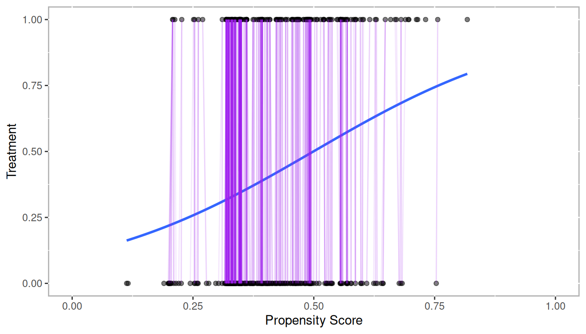

# Matching {#chapter-matching}

::: {.rmdtip}
**match**  
*verb*  
1. correspond or cause to correspond in some essential respect; make or be harmonious.  
2. be equal to (something) in quality or strength.
:::


As the name suggests, propensity score matching is concerned with matching treatment to control observations...


```r
lr_out <- glm(lalonde.formu, 
			  data = lalonde,
			  family = binomial(link = logit))
lalonde$lr_ps <- fitted(lr_out)  # Propensity scores
```


<div class="figure" style="text-align: center">

<p class="caption">(\#fig:introduction-logistic)Propensity Scores from Logistic Regression with Sample of Matched Pairs</p>
</div>
	

## One-to-One Matching

One-to-one matching with replacement (the `M = 1` option). Estimating the treatment effect on the treated (default is ATT).


```r
rr_att <- Match(Y = lalonde$re78, 
				Tr = lalonde$treat, 
				X = lalonde$lr_ps,
				M = 1,
				estimand='ATT')
summary(rr_att) # The default estimate is ATT here
```

```
## 
## Estimate...  2153.3 
## AI SE......  825.4 
## T-stat.....  2.6088 
## p.val......  0.0090858 
## 
## Original number of observations..............  445 
## Original number of treated obs...............  185 
## Matched number of observations...............  185 
## Matched number of observations  (unweighted).  346
```

### Checking Balance


```r
rr.ate <- Match(Y = lalonde$re78, 
				Tr = lalonde$treat, 
				X = lalonde$lr_ps,
				M = 1,
				estimand = 'ATE')
summary(rr.ate)
```

```
## 
## Estimate...  2013.3 
## AI SE......  817.76 
## T-stat.....  2.4619 
## p.val......  0.013819 
## 
## Original number of observations..............  445 
## Original number of treated obs...............  185 
## Matched number of observations...............  445 
## Matched number of observations  (unweighted).  756
```

```r
ls(rr.ate)
```

```
##  [1] "caliper"           "ecaliper"          "est"              
##  [4] "est.noadj"         "estimand"          "exact"            
##  [7] "index.control"     "index.dropped"     "index.treated"    
## [10] "MatchLoopC"        "mdata"             "ndrops"           
## [13] "ndrops.matches"    "nobs"              "orig.nobs"        
## [16] "orig.treated.nobs" "orig.wnobs"        "se"               
## [19] "se.cond"           "se.standard"       "version"          
## [22] "weights"           "wnobs"
```


```r
rr2 <- Match(Y = lalonde$re78, 		
			 Tr = lalonde$treat, 
			 X = lalonde$lr_ps,
			 M = 1, 
			 ties = TRUE, 
			 replace = TRUE,
			 estimand = 'ATT')
summary(rr2) # The default estimate is ATT here
```

```
## 
## Estimate...  2153.3 
## AI SE......  825.4 
## T-stat.....  2.6088 
## p.val......  0.0090858 
## 
## Original number of observations..............  445 
## Original number of treated obs...............  185 
## Matched number of observations...............  185 
## Matched number of observations  (unweighted).  346
```

```r
length(unique(rr2$index.control))
```

```
## 173.00
```

```r
ls(rr2)
```

```
##  [1] "caliper"           "ecaliper"          "est"              
##  [4] "est.noadj"         "estimand"          "exact"            
##  [7] "index.control"     "index.dropped"     "index.treated"    
## [10] "MatchLoopC"        "mdata"             "ndrops"           
## [13] "ndrops.matches"    "nobs"              "orig.nobs"        
## [16] "orig.treated.nobs" "orig.wnobs"        "se"               
## [19] "se.cond"           "se.standard"       "version"          
## [22] "weights"           "wnobs"
```


```r
## Using the Matchit package
matchit.out <- matchit(lalonde.formu, data = lalonde)
summary(matchit.out)
```

```
## 
## Call:
## matchit(formula = lalonde.formu, data = lalonde)
## 
## Summary of Balance for All Data:
##           Means Treated Means Control Std. Mean Diff. Var. Ratio eCDF Mean
## distance         0.4468        0.3936          0.4533     1.2101    0.1340
## age             25.8162       25.0538          0.1066     1.0278    0.0254
## I(age^2)       717.3946      677.3154          0.0929     1.0115    0.0254
## educ            10.3459       10.0885          0.1281     1.5513    0.0287
## I(educ^2)      111.0595      104.3731          0.1701     1.6625    0.0287
## black            0.8432        0.8269          0.0449          .    0.0163
## hisp             0.0595        0.1077         -0.2040          .    0.0482
## married          0.1892        0.1538          0.0902          .    0.0353
## nodegr           0.7081        0.8346         -0.2783          .    0.1265
## re74          2095.5740     2107.0268         -0.0023     0.7381    0.0192
## I(re74^2) 28141433.9907 36667413.1577         -0.0747     0.5038    0.0192
## re75          1532.0556     1266.9092          0.0824     1.0763    0.0508
## I(re75^2) 12654752.6909 11196530.0057          0.0260     1.4609    0.0508
## u74              0.7081        0.7500         -0.0921          .    0.0419
## u75              0.6000        0.6846         -0.1727          .    0.0846
##           eCDF Max
## distance    0.2244
## age         0.0652
## I(age^2)    0.0652
## educ        0.1265
## I(educ^2)   0.1265
## black       0.0163
## hisp        0.0482
## married     0.0353
## nodegr      0.1265
## re74        0.0471
## I(re74^2)   0.0471
## re75        0.1075
## I(re75^2)   0.1075
## u74         0.0419
## u75         0.0846
## 
## Summary of Balance for Matched Data:
##           Means Treated Means Control Std. Mean Diff. Var. Ratio eCDF Mean
## distance         0.4468        0.4277          0.1627     1.2887    0.0400
## age             25.8162       25.7514          0.0091     1.0691    0.0151
## I(age^2)       717.3946      710.7568          0.0154     0.9977    0.0151
## educ            10.3459       10.2054          0.0699     1.2231    0.0162
## I(educ^2)      111.0595      107.4378          0.0921     1.3309    0.0162
## black            0.8432        0.8324          0.0297          .    0.0108
## hisp             0.0595        0.0811         -0.0914          .    0.0216
## married          0.1892        0.1946         -0.0138          .    0.0054
## nodegr           0.7081        0.7676         -0.1308          .    0.0595
## re74          2095.5740     2168.6782         -0.0150     1.0398    0.0125
## I(re74^2) 28141433.9907 27544255.1664          0.0052     1.4319    0.0125
## re75          1532.0556     1482.8937          0.0153     1.1270    0.0181
## I(re75^2) 12654752.6909 11344693.3166          0.0234     2.2884    0.0181
## u74              0.7081        0.7027          0.0119          .    0.0054
## u75              0.6000        0.5946          0.0110          .    0.0054
##           eCDF Max Std. Pair Dist.
## distance    0.1189          0.1627
## age         0.0378          0.9912
## I(age^2)    0.0378          0.9340
## educ        0.0595          0.8442
## I(educ^2)   0.0595          0.8353
## black       0.0108          0.6244
## hisp        0.0216          0.2743
## married     0.0054          0.6211
## nodegr      0.0595          0.5588
## re74        0.0324          0.6787
## I(re74^2)   0.0324          0.4400
## re75        0.0486          0.7713
## I(re75^2)   0.0486          0.4068
## u74         0.0054          0.8204
## u75         0.0054          0.7613
## 
## Sample Sizes:
##           Control Treated
## All           260     185
## Matched       185     185
## Unmatched      75       0
## Discarded       0       0
```

```r
# Same as above but calculate average treatment effect
rr.ate <- Match(Y = lalonde$re78, 
				Tr = lalonde$treat, 
				X = lalonde$lr_ps,
				M = 1,
				ties = FALSE, 
				replace = FALSE, 
				estimand='ATE')
summary(rr.ate) # Here the estimate is ATE
```

```
## 
## Estimate...  2125.5 
## SE.........  493.96 
## T-stat.....  4.3029 
## p.val......  1.6859e-05 
## 
## Original number of observations..............  445 
## Original number of treated obs...............  185 
## Matched number of observations...............  370 
## Matched number of observations  (unweighted).  370
```

```r
## Genetic Matching
rr.gen <- GenMatch(Tr = lalonde$treat, 
				   X = lalonde$lr_ps, 
				   BalanceMatrix = lalonde[,all.vars(lalonde.formu)[-1]],
				   estimand = 'ATE', 
				   M = 1, 
				   pop.size = 16)
```

```
## 
## 
## Mon Apr 10 16:17:13 2023
## Domains:
##  0.000000e+00   <=  X1   <=    1.000000e+03 
## 
## Data Type: Floating Point
## Operators (code number, name, population) 
## 	(1) Cloning........................... 	1
## 	(2) Uniform Mutation.................. 	2
## 	(3) Boundary Mutation................. 	2
## 	(4) Non-Uniform Mutation.............. 	2
## 	(5) Polytope Crossover................ 	2
## 	(6) Simple Crossover.................. 	2
## 	(7) Whole Non-Uniform Mutation........ 	2
## 	(8) Heuristic Crossover............... 	2
## 	(9) Local-Minimum Crossover........... 	0
## 
## SOFT Maximum Number of Generations: 100
## Maximum Nonchanging Generations: 4
## Population size       : 16
## Convergence Tolerance: 1.000000e-03
## 
## Not Using the BFGS Derivative Based Optimizer on the Best Individual Each Generation.
## Not Checking Gradients before Stopping.
## Using Out of Bounds Individuals.
## 
## Maximization Problem.
## GENERATION: 0 (initializing the population)
## Lexical Fit..... 9.235231e-02  1.757822e-01  2.857138e-01  2.857138e-01  3.950411e-01  3.950411e-01  4.483849e-01  7.409596e-01  7.643859e-01  7.643859e-01  7.647535e-01  7.691713e-01  7.691713e-01  8.592751e-01  8.592751e-01  9.160976e-01  9.160976e-01  9.681165e-01  9.786492e-01  9.823810e-01  
## #unique......... 16, #Total UniqueCount: 16
## var 1:
## best............ 3.324648e+01
## mean............ 4.638550e+02
## variance........ 8.779735e+04
## 
## GENERATION: 1
## Lexical Fit..... 1.067431e-01  2.553994e-01  2.553994e-01  3.549996e-01  3.913630e-01  3.913630e-01  4.747623e-01  5.084810e-01  6.420853e-01  6.420853e-01  6.665787e-01  7.967582e-01  8.111685e-01  8.111685e-01  8.592751e-01  8.592751e-01  9.160976e-01  9.160976e-01  9.264048e-01  9.941933e-01  
## #unique......... 10, #Total UniqueCount: 26
## var 1:
## best............ 4.206134e+00
## mean............ 2.117860e+02
## variance........ 4.296951e+04
## 
## GENERATION: 2
## Lexical Fit..... 1.134648e-01  2.173453e-01  2.857138e-01  2.857138e-01  3.432276e-01  3.432276e-01  4.939824e-01  5.024479e-01  6.832321e-01  6.832321e-01  7.316137e-01  7.643859e-01  7.643859e-01  8.112194e-01  9.055825e-01  9.055825e-01  9.160976e-01  9.160976e-01  9.794830e-01  9.805886e-01  
## #unique......... 8, #Total UniqueCount: 34
## var 1:
## best............ 2.699388e+00
## mean............ 7.152003e+01
## variance........ 2.503090e+04
## 
## GENERATION: 3
## Lexical Fit..... 1.134648e-01  2.188211e-01  2.857138e-01  2.857138e-01  3.432276e-01  3.432276e-01  4.959769e-01  5.104434e-01  6.832321e-01  6.832321e-01  7.316137e-01  7.643859e-01  7.643859e-01  8.126852e-01  9.055825e-01  9.055825e-01  9.160976e-01  9.160976e-01  9.797994e-01  9.805886e-01  
## #unique......... 9, #Total UniqueCount: 43
## var 1:
## best............ 2.608864e+00
## mean............ 2.299597e+01
## variance........ 2.361439e+03
## 
## GENERATION: 4
## Lexical Fit..... 1.134648e-01  2.188211e-01  2.857138e-01  2.857138e-01  3.432276e-01  3.432276e-01  4.959769e-01  5.104434e-01  6.832321e-01  6.832321e-01  7.316137e-01  7.643859e-01  7.643859e-01  8.126852e-01  9.055825e-01  9.055825e-01  9.160976e-01  9.160976e-01  9.797994e-01  9.805886e-01  
## #unique......... 8, #Total UniqueCount: 51
## var 1:
## best............ 2.608864e+00
## mean............ 9.058378e+01
## variance........ 4.078986e+04
## 
## GENERATION: 5
## Lexical Fit..... 1.134648e-01  2.188211e-01  2.857138e-01  2.857138e-01  3.432276e-01  3.432276e-01  4.959769e-01  5.104434e-01  6.832321e-01  6.832321e-01  7.316137e-01  7.643859e-01  7.643859e-01  8.126852e-01  9.055825e-01  9.055825e-01  9.160976e-01  9.160976e-01  9.797994e-01  9.805886e-01  
## #unique......... 6, #Total UniqueCount: 57
## var 1:
## best............ 2.608864e+00
## mean............ 1.344191e+02
## variance........ 7.663447e+04
## 
## GENERATION: 6
## Lexical Fit..... 1.134648e-01  2.188211e-01  2.857138e-01  2.857138e-01  3.432276e-01  3.432276e-01  4.959769e-01  5.104434e-01  6.832321e-01  6.832321e-01  7.316137e-01  7.643859e-01  7.643859e-01  8.126852e-01  9.055825e-01  9.055825e-01  9.160976e-01  9.160976e-01  9.797994e-01  9.805886e-01  
## #unique......... 6, #Total UniqueCount: 63
## var 1:
## best............ 2.608864e+00
## mean............ 4.415709e+01
## variance........ 1.768958e+04
## 
## GENERATION: 7
## Lexical Fit..... 1.134648e-01  2.188211e-01  2.857138e-01  2.857138e-01  3.432276e-01  3.432276e-01  4.959769e-01  5.104434e-01  6.832321e-01  6.832321e-01  7.316137e-01  7.643859e-01  7.643859e-01  8.126852e-01  9.055825e-01  9.055825e-01  9.160976e-01  9.160976e-01  9.797994e-01  9.805886e-01  
## #unique......... 6, #Total UniqueCount: 69
## var 1:
## best............ 2.608864e+00
## mean............ 4.706867e+01
## variance........ 7.517895e+03
## 
## GENERATION: 8
## Lexical Fit..... 1.134648e-01  2.188211e-01  2.857138e-01  2.857138e-01  3.432276e-01  3.432276e-01  4.959769e-01  5.104434e-01  6.832321e-01  6.832321e-01  7.316137e-01  7.643859e-01  7.643859e-01  8.126852e-01  9.055825e-01  9.055825e-01  9.160976e-01  9.160976e-01  9.797994e-01  9.805886e-01  
## #unique......... 7, #Total UniqueCount: 76
## var 1:
## best............ 2.608864e+00
## mean............ 7.701794e+01
## variance........ 4.010500e+04
## 
## 'wait.generations' limit reached.
## No significant improvement in 4 generations.
## 
## Solution Lexical Fitness Value:
## 1.134648e-01  2.188211e-01  2.857138e-01  2.857138e-01  3.432276e-01  3.432276e-01  4.959769e-01  5.104434e-01  6.832321e-01  6.832321e-01  7.316137e-01  7.643859e-01  7.643859e-01  8.126852e-01  9.055825e-01  9.055825e-01  9.160976e-01  9.160976e-01  9.797994e-01  9.805886e-01  
## 
## Parameters at the Solution:
## 
##  X[ 1] :	2.608864e+00
## 
## Solution Found Generation 3
## Number of Generations Run 8
## 
## Mon Apr 10 16:17:14 2023
## Total run time : 0 hours 0 minutes and 1 seconds
```

```r
rr.gen.mout <- Match(Y = lalonde$re78, 
					 Tr = lalonde$treat, 
					 X = lalonde$lr_ps,
					 estimand = 'ATE',
					 Weight.matrix = rr.gen)
summary(rr.gen.mout)
```

```
## 
## Estimate...  2153.5 
## AI SE......  815.34 
## T-stat.....  2.6412 
## p.val......  0.0082608 
## 
## Original number of observations..............  445 
## Original number of treated obs...............  185 
## Matched number of observations...............  445 
## Matched number of observations  (unweighted).  653
```

```r
## Partial exact matching
rr2 <- Matchby(Y = lalonde$re78, 
			   Tr = lalonde$treat, 
			   X = lalonde$lr_ps, 
			   by = factor(lalonde$nodegr))
```

```
## 1 of 2 groups
## 2 of 2 groups
```

```r
summary(rr2)
```

```
## 
## Estimate...  2332.5 
## SE.........  688.25 
## T-stat.....  3.3891 
## p.val......  0.0007012 
## 
## Original number of observations..............  445 
## Original number of treated obs...............  185 
## Matched number of observations...............  185 
## Matched number of observations  (unweighted).  185
```

```r
## Partial exact matching on two covariates
rr3 <- Matchby(Y = lalonde$re78, 
			   Tr = lalonde$treat, 
			   X = lalonde$lr_ps, 
			   by = lalonde[,c('nodegr','married')])
```

```
## 1 of 4 groups
## 2 of 4 groups
## 3 of 4 groups
## 4 of 4 groups
```

```r
summary(rr3)
```

```
## 
## Estimate...  2017.6 
## SE.........  713.91 
## T-stat.....  2.8262 
## p.val......  0.0047104 
## 
## Original number of observations..............  445 
## Original number of treated obs...............  185 
## Matched number of observations...............  185 
## Matched number of observations  (unweighted).  185
```


