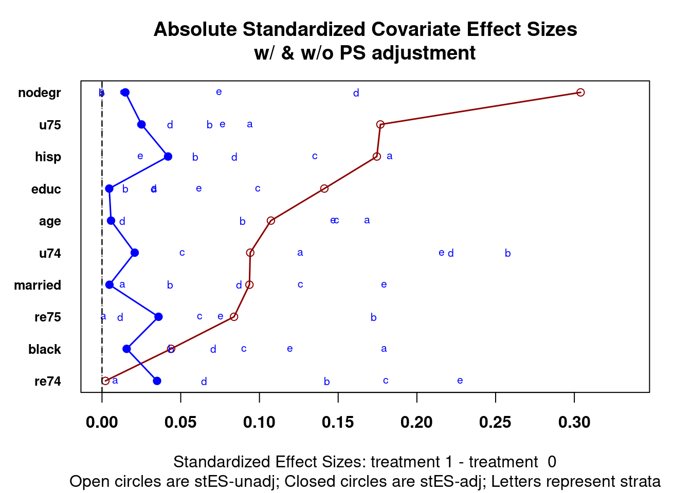

# Weighting {#chapter-weighting}

::: {.rmdtip}
**weight**  
*verb*  
1. hold (something) down by placing a heavy object on top of it.  
2. attach importance or value to.
:::

Propensity score weighting is the approach to using propensity scores as weights in other statistical models such as regression or ANOVA. Like stratification (see Chapter \@ref(chapter-stratification)), propensity score weighting has the advantage of using all observations. In section \@ref(introduction-effects) we introduced four different treatment estimators. The histograms used to conceptually explain what observations are included, or not included, in their calculation used propensity score weights. In this chapter will discuss the mathematical details of how those weights are calculated and applied, include the R code to generate the estimates.

We will present a formula for each of the treatment effects we wish to estimate. These formulas define the weights. Once we have the weights we can use them in a statistical model or using the following formula to estimate the treatment effect.

\begin{equation}
\begin{aligned}
Treatment\ Effect = \frac{\sum Y_{i}Z_{i}w_{i}}{\sum Z_{i} w_{i}} - \frac{\sum Y_{i}(1 - Z_{i}) w_{i}}{\sum (1 - Z_{i}) w_{i} }
\end{aligned}
(\#eq:eqcalcte)
\end{equation}

For equation \@ref(eq:eqcalcte), $w$ is the weight (as defined in the following sections), $Z_i$ is the treatment assignment such that $Z = 1$ is treatment and $Z = 0$ is control, and $Y_i$ is the outcome.

## Estimate Propensity Scores

To begin, we estimate the propensity scores, here using logistic regression.


```r
data("lalonde", package = 'Matching')
lr_out <- glm(formula = lalonde.formu,
			  data = lalonde,
			  family = binomial(link = 'logit'))
lalonde$lr_ps <- fitted(lr_out)
lalonde$lr_weights <- psa::calculate_ps_weights(lalonde$treat,
												ps = lalonde$lr_ps,
												estimand = 'ATE')
```


## Checking Balance


```r
PSAgraphics::cv.bal.psa(covariates = lalonde[,all.vars(lalonde.formu)[-1]],
						treatment = lalonde$treat,
						propensity = lalonde$lr_ps,
						strata = 5)
```

<div class="figure" style="text-align: center">

<p class="caption">(\#fig:unnamed-chunk-2)Multiple covariate balance assessment plot for Lalonde data after estimating propensity scores with logistic regression</p>
</div>


```r
 glm(formula = lalonde.formu,
 	 data = lalonde,
 	 family = quasibinomial(link = 'logit'),
 	 weights = lalonde$lr_weights
) |> summary()
```

```
## 
## Call:
## glm(formula = lalonde.formu, family = quasibinomial(link = "logit"), 
##     data = lalonde, weights = lalonde$lr_weights)
## 
## Deviance Residuals: 
##    Min      1Q  Median      3Q     Max  
## -2.217  -1.498  -1.405   1.720   2.562  
## 
## Coefficients:
##               Estimate Std. Error t value Pr(>|t|)
## (Intercept) -2.000e-01  1.977e+00  -0.101    0.919
## age          2.686e-02  8.513e-02   0.316    0.753
## I(age^2)    -4.695e-04  1.397e-03  -0.336    0.737
## educ        -6.326e-02  4.024e-01  -0.157    0.875
## I(educ^2)    3.510e-03  2.259e-02   0.155    0.877
## black       -3.695e-03  3.714e-01  -0.010    0.992
## hisp         2.232e-02  4.904e-01   0.046    0.964
## married     -8.664e-03  2.784e-01  -0.031    0.975
## nodegr       4.154e-02  3.889e-01   0.107    0.915
## re74         2.291e-05  7.493e-05   0.306    0.760
## I(re74^2)   -9.734e-10  2.337e-09  -0.416    0.677
## re75         5.001e-06  1.015e-04   0.049    0.961
## I(re75^2)   -3.543e-10  5.032e-09  -0.070    0.944
## u74          8.163e-02  4.449e-01   0.183    0.854
## u75         -4.153e-04  3.566e-01  -0.001    0.999
## 
## (Dispersion parameter for quasibinomial family taken to be 2.067727)
## 
##     Null deviance: 1232.6  on 444  degrees of freedom
## Residual deviance: 1231.9  on 430  degrees of freedom
## AIC: NA
## 
## Number of Fisher Scoring iterations: 4
```


## Average Treatment Effect (ATE)

\begin{equation}
\begin{aligned}
w_{ATE} = \frac{Z_i}{\pi_i} + \frac{1 - Z_i}{1 - \pi_i}
\end{aligned}
(\#eq:eqatew)
\end{equation}


```r
ate_weights <- psa::calculate_ps_weights(treatment = lalonde$treat,
										 ps = lalonde$lr_ps, 						  
										 estimand = 'ATE')
lm(formula = re78 ~ treat, 
   data = lalonde,
   weights = ate_weights) |> summary()
```

```
## 
## Call:
## lm(formula = re78 ~ treat, data = lalonde, weights = ate_weights)
## 
## Weighted Residuals:
## 
## Coefficients:
##             Estimate Std. Error t value Pr(>|t|)    
## (Intercept)     4556        450  10.125   <2e-16 ***
## treat           1558        637   2.446   0.0148 *  
## ---
## Signif. codes:  0 '***' 0.001 '**' 0.01 '*' 0.05 '.' 0.1 ' ' 1
## 
## Residual standard error: 9497 on 443 degrees of freedom
## Multiple R-squared:  0.01333,	Adjusted R-squared:  0.0111 
## F-statistic: 5.983 on 1 and 443 DF,  p-value: 0.01483
```

```r
psa::treatment_effect(treatment = lalonde$treat,
					  outcome = lalonde$re78,
					  weights = ate_weights)
```

```
## 1558.09
```

## Average Treatment Effect Among the Treated (ATT)

\begin{equation}
\begin{aligned}
w_{ATT} = \frac{\pi_i Z_i}{\pi_i} + \frac{\pi_i (1 - Z_i)}{1 - \pi_i}
\end{aligned}
(\#eq:eqattw)
\end{equation}


```r
att_weights <- psa::calculate_ps_weights(treatment = lalonde$treat,
										 ps = lalonde$lr_ps, 
										 estimand = 'ATT')
lm(formula = re78 ~ treat, 
   data = lalonde,
   weights = att_weights) |> summary()
```

```
## 
## Call:
## lm(formula = re78 ~ treat, data = lalonde, weights = att_weights)
## 
## Weighted Residuals:
## 
## Coefficients:
##             Estimate Std. Error t value Pr(>|t|)    
## (Intercept)   4557.4      454.2  10.033  < 2e-16 ***
## treat         1791.7      642.8   2.787  0.00554 ** 
## ---
## Signif. codes:  0 '***' 0.001 '**' 0.01 '*' 0.05 '.' 0.1 ' ' 1
## 
## Residual standard error: 6186 on 443 degrees of freedom
## Multiple R-squared:  0.01724,	Adjusted R-squared:  0.01502 
## F-statistic:  7.77 on 1 and 443 DF,  p-value: 0.00554
```

```r
psa::treatment_effect(treatment = lalonde$treat,
					  outcome = lalonde$re78,
					  weights = att_weights)
```

```
## 1791.72
```

## Average Treatment Effect Among the Control (ATC)

\begin{equation}
\begin{aligned}
w_{ATC} = \frac{(1 - \pi_i) Z_i}{\pi_i} + \frac{(1 - e_i)(1 - Z_i)}{1 - \pi_i}
\end{aligned}
(\#eq:eqatcw)
\end{equation}


```r
atc_weights <- psa::calculate_ps_weights(treatment = lalonde$treat,
										 ps = lalonde$lr_ps, 
										 estimand = 'ATC')
lm(formula = re78 ~ treat, 
   data = lalonde,
   weights = atc_weights) |> summary()
```

```
## 
## Call:
## lm(formula = re78 ~ treat, data = lalonde, weights = atc_weights)
## 
## Weighted Residuals:
## 
## Coefficients:
##             Estimate Std. Error t value Pr(>|t|)    
## (Intercept)   4554.8      446.8  10.195   <2e-16 ***
## treat         1391.0      632.6   2.199   0.0284 *  
## ---
## Signif. codes:  0 '***' 0.001 '**' 0.01 '*' 0.05 '.' 0.1 ' ' 1
## 
## Residual standard error: 7204 on 443 degrees of freedom
## Multiple R-squared:  0.0108,	Adjusted R-squared:  0.008564 
## F-statistic: 4.835 on 1 and 443 DF,  p-value: 0.0284
```

```r
psa::treatment_effect(treatment = lalonde$treat,
					  outcome = lalonde$re78,
					  weights = atc_weights)
```

```
## 1391.02
```

#### Average Treatment Effect Among the Evenly Matched (ATM)

\begin{equation}
\begin{aligned}
w_{ATM} = \frac{min{\pi_i, 1 - \pi_i}}{Z_i \pi_i (1 - Z_i)(1 - \pi_i)}
\end{aligned}
(\#eq:eqatmw)
\end{equation}


```r
atm_weights <- psa::calculate_ps_weights(treatment = lalonde$treat,
										 ps = lalonde$lr_ps, 
										 estimand = 'ATM')
lm(formula = re78 ~ treat, 
   data = lalonde,
   weights = atm_weights) |> summary()
```

```
## 
## Call:
## lm(formula = re78 ~ treat, data = lalonde, weights = atm_weights)
## 
## Weighted Residuals:
## 
## Coefficients:
##             Estimate Std. Error t value Pr(>|t|)    
## (Intercept)   4504.6      459.8   9.797  < 2e-16 ***
## treat         1707.7      648.8   2.632  0.00878 ** 
## ---
## Signif. codes:  0 '***' 0.001 '**' 0.01 '*' 0.05 '.' 0.1 ' ' 1
## 
## Residual standard error: 5960 on 443 degrees of freedom
## Multiple R-squared:  0.0154,	Adjusted R-squared:  0.01318 
## F-statistic: 6.928 on 1 and 443 DF,  p-value: 0.008783
```

```r
psa::treatment_effect(treatment = lalonde$treat,
					  outcome = lalonde$re78,
					  weights = atm_weights)
```

```
## 1707.69
```
