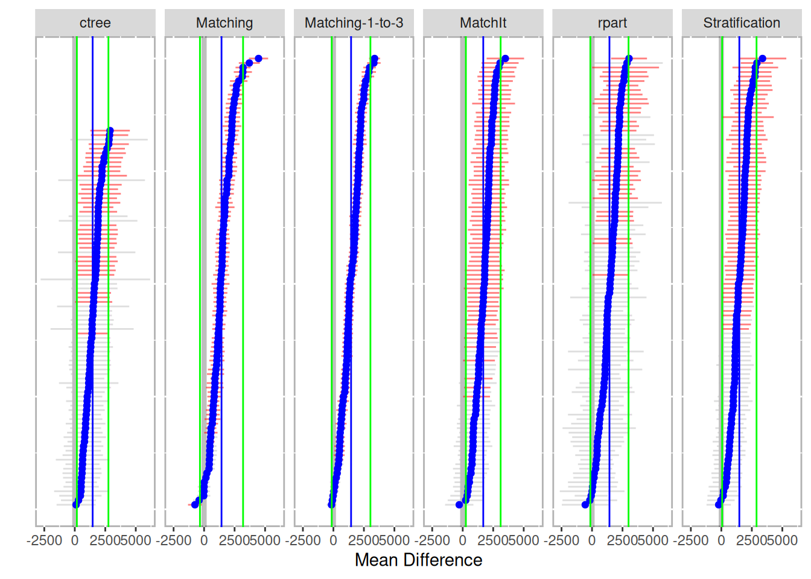
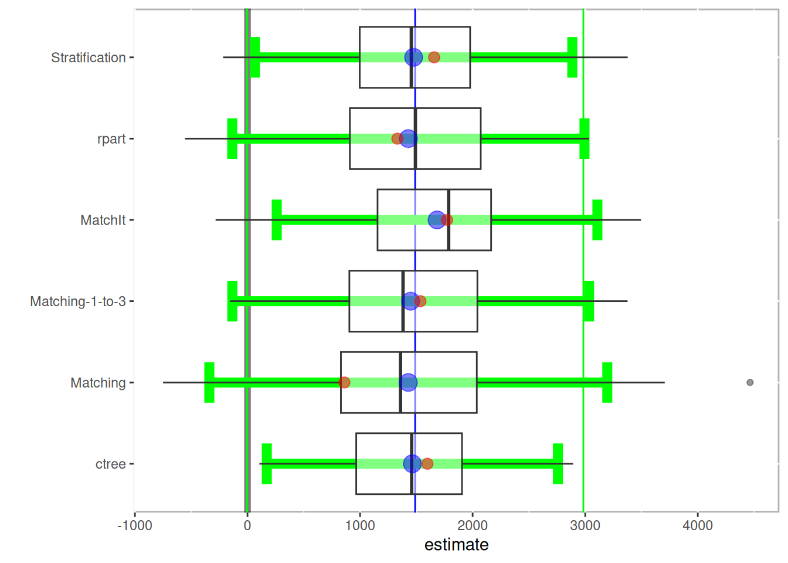

# Bootstrapping {#chapter-bootstrapping}


```r
library(PSAboot)

boot.matching.1to3 <- function(Tr, Y, X, X.trans, formu, ...) {
	return(boot.matching(Tr=Tr, Y=Y, X=X, X.trans=X.trans, formu=formu, M=3, ...))
}


boot_out <- PSAboot(Tr = lalonde$treat == 1, 
					Y = lalonde$re78, 
					X = lalonde[,all.vars(lalonde.formu)[-1]], 
					seed = 2112,
					methods=c('Stratification' = boot.strata,
							  'ctree' = boot.ctree,
							  'rpart' = boot.rpart,
							  'Matching' = boot.matching,
							  'Matching-1-to-3' = boot.matching.1to3,
							  'MatchIt' = boot.matchit) )
```

```r
summary(boot_out)
```

```
## Stratification Results:
##    Complete estimate = 1658
##    Complete CI = [242, 3074]
##    Bootstrap pooled estimate = 1476
##    Bootstrap weighted pooled estimate = 1461
##    Bootstrap pooled CI = [66.5, 2885]
##    59% of bootstrap samples have confidence intervals that do not span zero.
##       59% positive.
##       0% negative.
## ctree Results:
##    Complete estimate = 1598
##    Complete CI = [-6.62, 3203]
##    Bootstrap pooled estimate = 1465
##    Bootstrap weighted pooled estimate = 1472
##    Bootstrap pooled CI = [172, 2758]
##    38.1% of bootstrap samples have confidence intervals that do not span zero.
##       38.1% positive.
##       0% negative.
## rpart Results:
##    Complete estimate = 1332
##    Complete CI = [-295, 2959]
##    Bootstrap pooled estimate = 1429
##    Bootstrap weighted pooled estimate = 1442
##    Bootstrap pooled CI = [-136, 2993]
##    32% of bootstrap samples have confidence intervals that do not span zero.
##       32% positive.
##       0% negative.
## Matching Results:
##    Complete estimate = 861
##    Complete CI = [234, 1487]
##    Bootstrap pooled estimate = 1429
##    Bootstrap weighted pooled estimate = 1396
##    Bootstrap pooled CI = [-339, 3196]
##    86% of bootstrap samples have confidence intervals that do not span zero.
##       85% positive.
##       1% negative.
## Matching-1-to-3 Results:
##    Complete estimate = 1536
##    Complete CI = [1089, 1983]
##    Bootstrap pooled estimate = 1450
##    Bootstrap weighted pooled estimate = 1400
##    Bootstrap pooled CI = [-135, 3034]
##    90% of bootstrap samples have confidence intervals that do not span zero.
##       90% positive.
##       0% negative.
## MatchIt Results:
##    Complete estimate = 2004
##    Complete CI = [701, 3307]
##    Bootstrap pooled estimate = 1653
##    Bootstrap weighted pooled estimate = 1634
##    Bootstrap pooled CI = [180, 3125]
##    68% of bootstrap samples have confidence intervals that do not span zero.
##       68% positive.
##       0% negative.
```


```r
plot(boot_out)
```

<div class="figure" style="text-align: center">

<p class="caption">(\#fig:psaboot-plot)Mean difference across all bootstrap samples by method</p>
</div>


```r
boxplot(boot_out)
```




```r
matrixplot(boot_out)
```


```r
boot_balance <- balance(boot_out)
boot_balance
```

```
## Unadjusted balance: 0.122354110755457
```

```
## 0.04

## 0.08

## 0.05

## 0.06

## 0.01

## 0.05

## 0.04

##  NA

## 0.07

## 0.07

## 0.05

## 0.08
```


```r
plot(boot_balance)
```


```r
boxplot(boot_balance) + geom_hline(yintercept=.1, color='red')
```


Details are available within the returned object


```r
boot_balance$unadjusted
```

```
## 0.11

## 0.14

## 0.04

## 0.17

## 0.09

## 0.31

## 0.00

## 0.08

## 0.09

## 0.18
```

```r
boot_balance$complete
```

```
## 0.04

## 0.00

## 0.00

## 0.09

## 0.01

## 0.02

## 0.03

## 0.16

## 0.05

## 0.04

## 0.00

## 0.05

## 0.09

## 0.15

## 0.14

## 0.02

## 0.05

## 0.01

## 0.04

## 0.05

## 0.08

## 0.04

## 0.01

## 0.02

## 0.02

## 0.08

## 0.10

## 0.06

## 0.00

## 0.04

## 0.03

## 0.08

## 0.02

## 0.01

## 0.00

## 0.19

## 0.00

## 0.09

## 0.05

## 0.10

## 0.00

## 0.05

## 0.03

## 0.09

## 0.01

## 0.07

## 0.01

## 0.05

## 0.06

## 0.06

## 0.06

## 0.09

## 0.02

## 0.04

## 0.03

## 0.03

## 0.01

## 0.04

## 0.02

## 0.07
```

```r
boot_balance$pooled |> head()
```

```
## 0.02

## 0.03

## 0.04

## 0.03

## 0.04

## 0.05

## 0.07

## 0.09

## 0.12

##  NA

## 0.06

## 0.12

## 0.05

## 0.09

## 0.08

## 0.11

## 0.08

## 0.07

## 0.06

## 0.07

## 0.03

## 0.07

## 0.05

## 0.06

## 0.04

## 0.03

## 0.03

## 0.08

## 0.03

## 0.05

## 0.08

## 0.09

## 0.07

## 0.05

## 0.10

## 0.10
```
