# Non-Binary Treatments


```r
require(TriMatch)

data(tutoring)
str(tutoring)
```

```
## 'data.frame':	1142 obs. of  17 variables:
##  $ treat     : Factor w/ 3 levels "Control","Treat1",..: 1 1 1 1 1 2 1 1 1 1 ...
##  $ Course    : chr  "ENG*201" "ENG*201" "ENG*201" "ENG*201" ...
##  $ Grade     : int  4 4 4 4 4 3 4 3 0 4 ...
##  $ Gender    : Factor w/ 2 levels "FEMALE","MALE": 1 1 1 1 1 1 1 1 1 1 ...
##  $ Ethnicity : Factor w/ 3 levels "Black","Other",..: 2 3 3 3 3 3 3 3 1 3 ...
##  $ Military  : logi  FALSE FALSE FALSE FALSE FALSE FALSE ...
##  $ ESL       : logi  FALSE FALSE FALSE FALSE FALSE FALSE ...
##  $ EdMother  : int  3 5 1 3 2 3 4 4 3 6 ...
##  $ EdFather  : int  6 6 1 5 2 3 4 4 2 6 ...
##  $ Age       : num  48 49 53 52 47 53 54 54 59 40 ...
##  $ Employment: int  3 3 1 3 1 3 3 3 1 3 ...
##  $ Income    : num  9 9 5 5 5 9 6 6 1 8 ...
##  $ Transfer  : num  24 25 39 48 23 ...
##  $ GPA       : num  3 2.72 2.71 4 3.5 3.55 3.57 3.57 3.43 2.81 ...
##  $ GradeCode : chr  "A" "A" "A" "A" ...
##  $ Level     : Factor w/ 2 levels "Lower","Upper": 1 1 1 1 1 2 1 1 1 1 ...
##  $ ID        : int  377 882 292 215 252 265 1016 282 39 911 ...
```

```r
table(tutoring$treat)
```

```
## 
## Control  Treat1  Treat2 
##     918     134      90
```


```r
# Histogram of unadjusted grades
tmp <- as.data.frame(prop.table(table(tutoring$treat, tutoring$Grade), 1))
ggplot(tmp, aes(x=Var2, y=Freq, fill=Var1)) + 
	geom_bar(position='dodge', stat='identity') +
	scale_y_continuous(labels = percent_format()) +
	xlab('Grade') + ylab('Percent') + scale_colour_hue('Treatment')
```

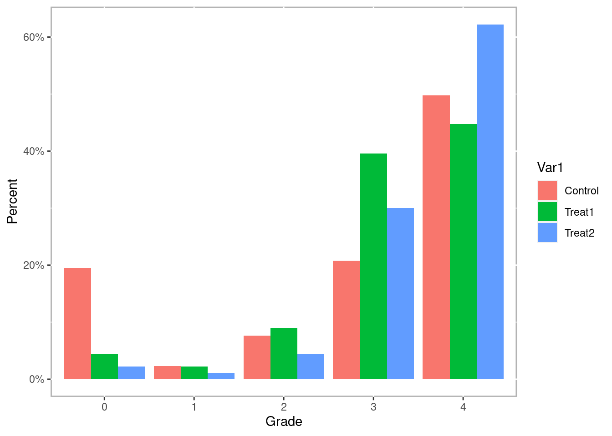


```r
## Phase I

# Note that the dependent variable is not included in the formula. The TriMatch
# functions will replace the dependent variable depending on which pair is
# being modeled.
tutoring.formu <- ~ Gender + Ethnicity + Military + ESL + EdMother + EdFather + 
	Age + Employment + Income + Transfer + GPA

# trips will estimate the propensity scores for each pairing of groups
tutoring.tpsa <- trips(tutoring, tutoring$treat, tutoring.formu)

plot(tutoring.tpsa, sample=c(200))
```

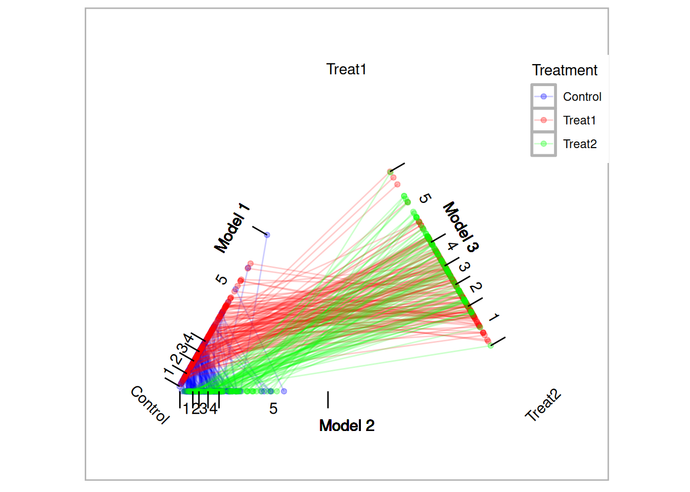

```r
# trimatch finds matched triplets.
tutoring.matched <- trimatch(tutoring.tpsa)

# Partial exact matching
tutoring.matched2 <- trimatch(tutoring.tpsa, exact=tutoring$Level)

# Plotting the results of trimatch is a subset of the triangle plot with only
# points that were matched. There is also an additional parameter, rows, that
# will overlay matched triplets.
plot(tutoring.matched, rows=1, line.alpha=1, draw.segments=TRUE)
```

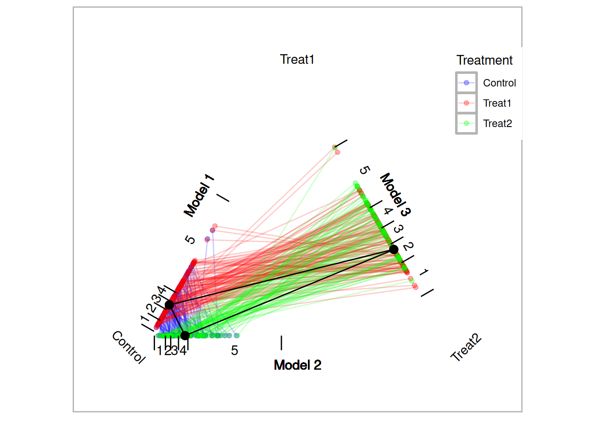

```r
## Examine the unmatched students
unmatched <- unmatched(tutoring.matched)
summary(unmatched)
```

```
## 819 (71.7%) of 1142 total data points were not matched.
## Unmatched by treatment:
##     Control      Treat1      Treat2 
## 795 (86.6%)  17 (12.7%)   7 (7.78%)
```

```r
plot(unmatched)
```

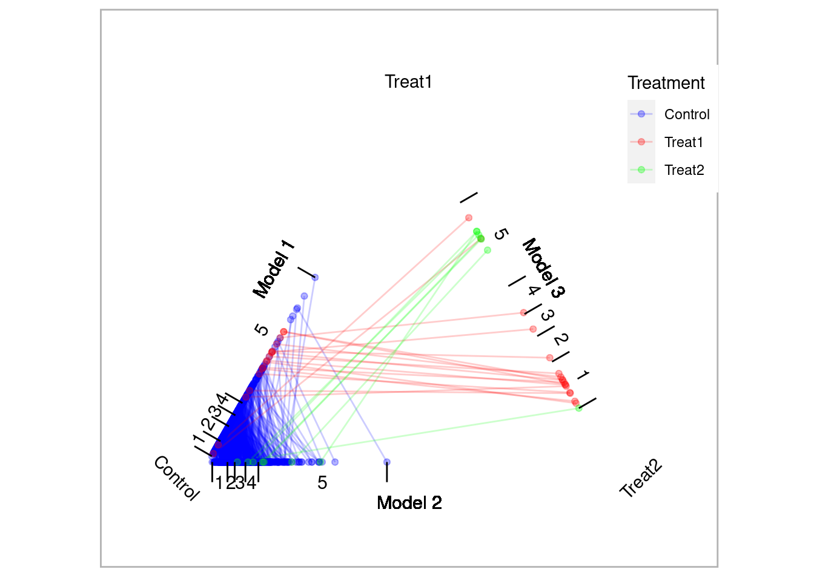

```r
## Check balance
multibalance.plot(tutoring.tpsa)
```

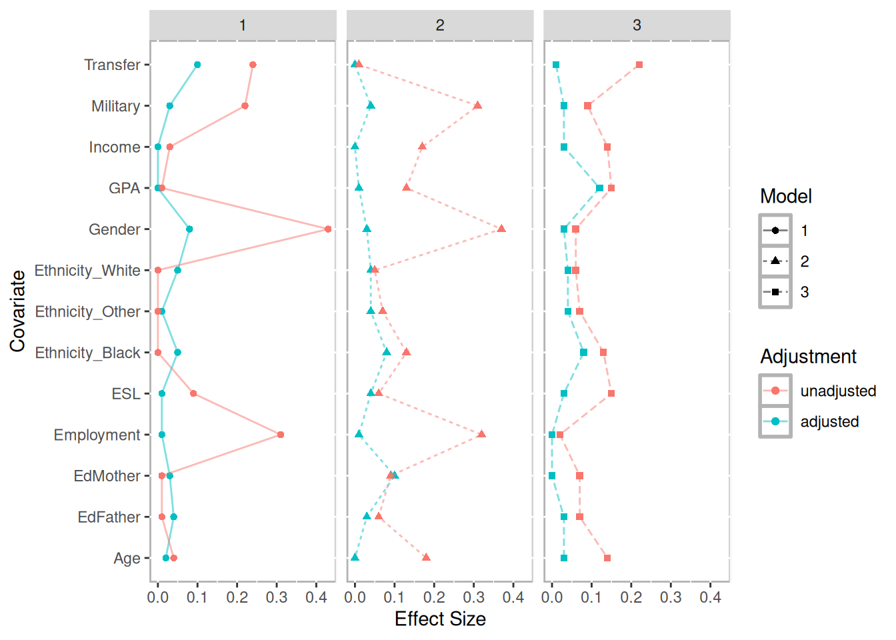

```r
balance.plot(tutoring.matched, tutoring$Age, label='Age')
```

```
## 
## 	Friedman rank sum test
## 
## data:  Covariate and Treatment and ID
## Friedman chi-squared = 4.1498, df = 2, p-value = 0.1256
## 
##  Repeated measures ANOVA
## 
##      Effect DFn DFd        F         p p<.05         ges
## 2 Treatment   2 294 1.707234 0.1831598       0.006613137
```

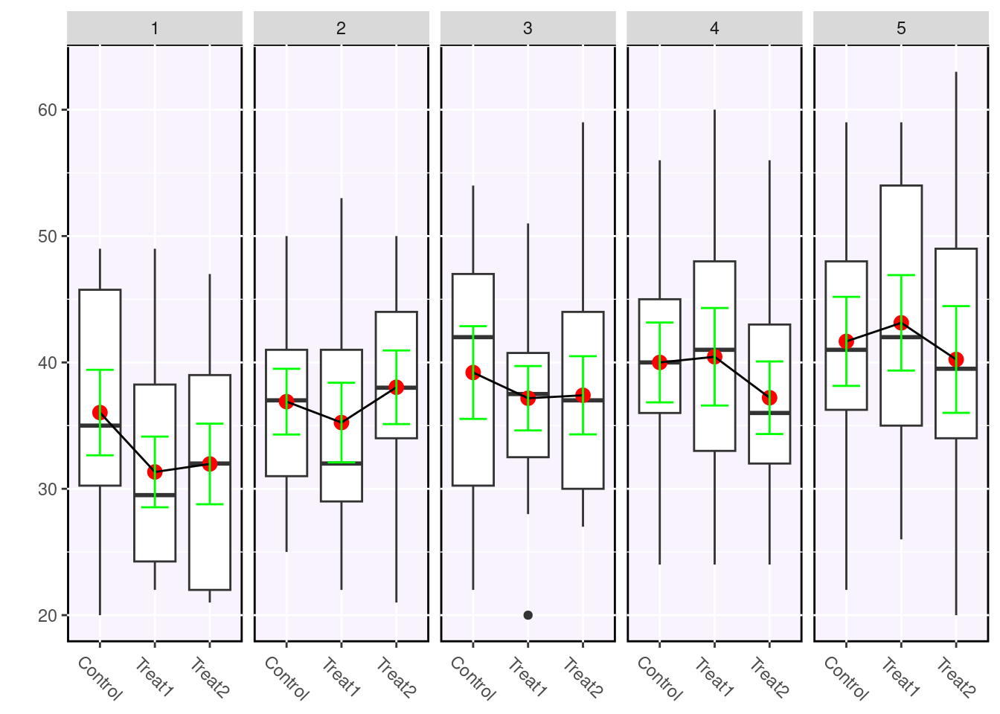

```r
balance.plot(tutoring.matched, tutoring$Military, label='Military')
```

```
## 
## 	Friedman rank sum test
## 
## data:  Covariate and Treatment and ID
## Friedman chi-squared = 0.4, df = 2, p-value = 0.8187
```

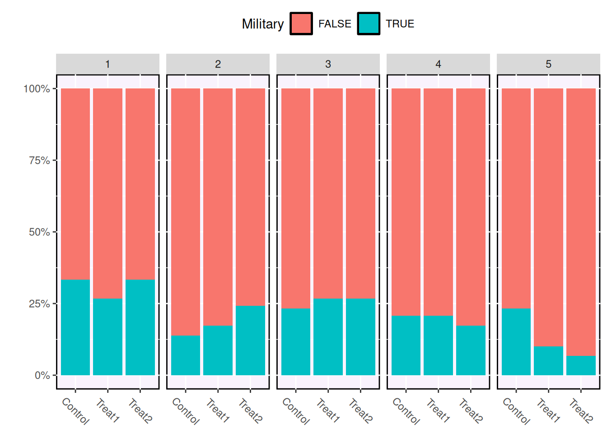

```r
# Create a grid of figures.
bplots <- balance.plot(tutoring.matched, tutoring[,all.vars(tutoring.formu)], 
					   legend.position='none', 
					   x.axis.labels=c('C','T1','T1'), x.axis.angle=0)
bplots[['Military']] # We can plot one at at time.
```

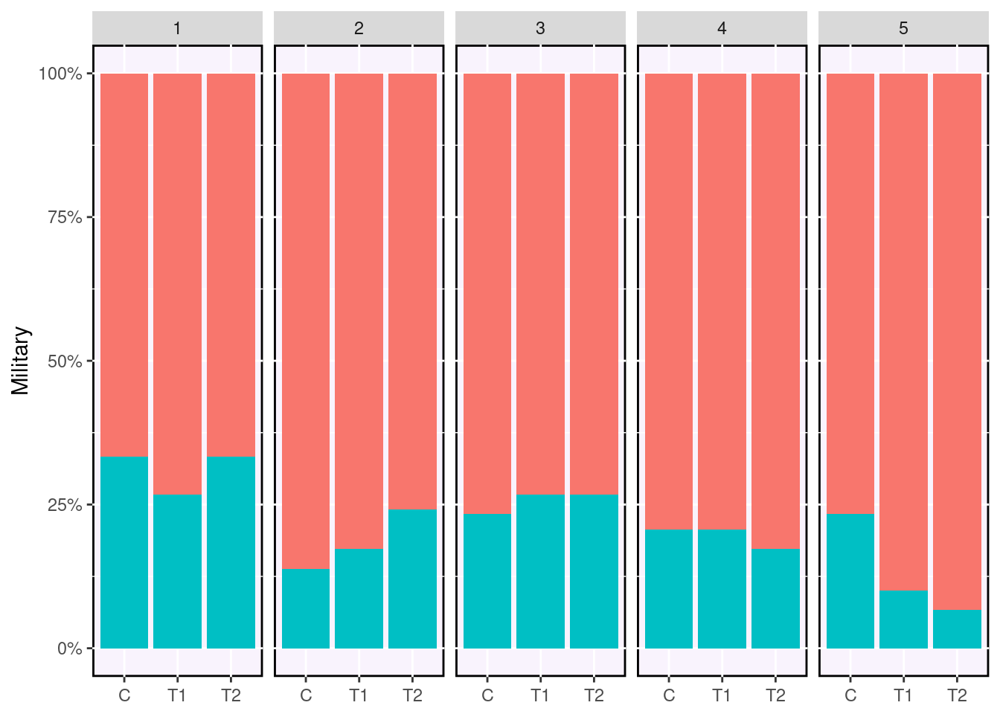

```r
summary(bplots) # Create a data frame with the statistical results
```

```
##     Covariate   Friedman Friedman.p Friedman.sig    rmANOVA rmANOVA.p
## 1      Gender 2.16666667 0.33846543                      NA        NA
## 2   Ethnicity 0.05678233 0.97200807                      NA        NA
## 3    Military 0.40000000 0.81873075                      NA        NA
## 4         ESL 4.78571429 0.09136826            .         NA        NA
## 5    EdMother 1.55974843 0.45846368              0.76509335 0.4662146
## 6    EdFather 0.02794411 0.98612510              0.06102055 0.9408158
## 7         Age 4.14982578 0.12556736              1.70723419 0.1831598
## 8  Employment 2.04048583 0.36050736              1.27194067 0.2818249
## 9      Income 0.59582543 0.74236614              0.39251642 0.6757086
## 10   Transfer 3.08717949 0.21361291              0.55080160 0.5770812
## 11        GPA 1.37542662 0.50272433              0.49589373 0.6095348
##    rmANOVA.sig
## 1         <NA>
## 2         <NA>
## 3         <NA>
## 4         <NA>
## 5             
## 6             
## 7             
## 8             
## 9             
## 10            
## 11
```

```r
plot(bplots, cols=3, byrow=FALSE)
```

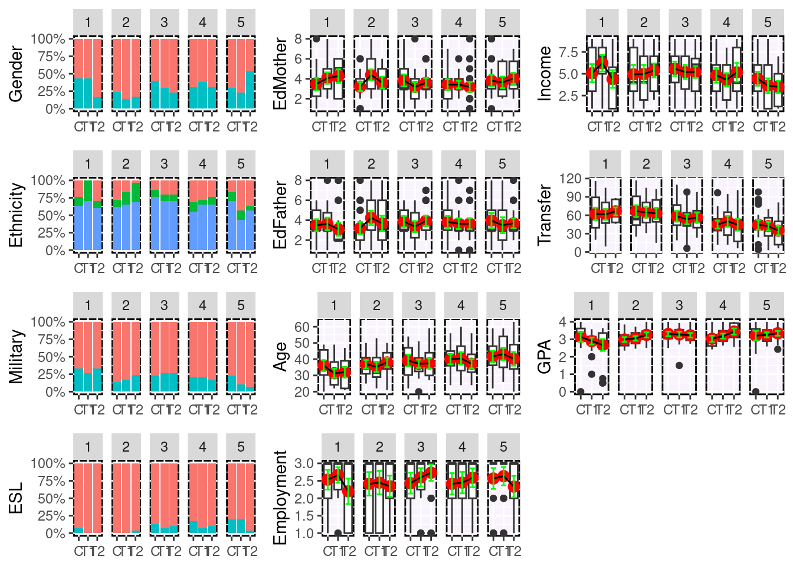

```r
## Phase II
# The summary function performs a number of statistical tests including Friedman
# rank sum test, repeated measures ANOVA, and if one or both of those tests have
# p values less than 0.5 (the default, but configurable), then a pairwise Wilcox
# test and three paired t-tests will also be performed.
(sout <- summary(tutoring.matched, tutoring$Grade))
```

```
## $PercentMatched
##   Control    Treat1    Treat2 
## 0.1339869 0.8731343 0.9222222 
## 
## $friedman.test
## 
## 	Friedman rank sum test
## 
## data:  Outcome and Treatment and ID
## Friedman chi-squared = 17.404, df = 2, p-value = 0.0001663
## 
## 
## $rmanova
## $rmanova$ANOVA
##      Effect DFn DFd        F            p p<.05        ges
## 2 Treatment   2 294 16.66293 1.396209e-07     * 0.06818487
## 
## $rmanova$`Mauchly's Test for Sphericity`
##      Effect         W            p p<.05
## 2 Treatment 0.8668353 2.946934e-05     *
## 
## $rmanova$`Sphericity Corrections`
##      Effect       GGe        p[GG] p[GG]<.05       HFe        p[HF] p[HF]<.05
## 2 Treatment 0.8824842 6.035469e-07         * 0.8923995 5.333417e-07         *
## 
## 
## $pairwise.wilcox.test
## 
## 	Pairwise comparisons using Wilcoxon signed rank test with continuity correction 
## 
## data:  out$Outcome and out$Treatment 
## 
##             Treat1.out Treat2.out
## Treat2.out  0.0046     -         
## Control.out 0.0165     1.9e-06   
## 
## P value adjustment method: bonferroni 
## 
## $t.tests
##               Treatments         t  df      p.value sig  mean.diff     ci.min
## 1  Treat1.out-Treat2.out -3.095689 147 2.351743e-03  ** -0.3378378 -0.5535076
## 2 Treat1.out-Control.out  2.939953 147 3.813865e-03  **  0.4459459  0.1461816
## 3 Treat2.out-Control.out  5.443253 147 2.140672e-07 ***  0.7837838  0.4992224
##       ci.max
## 1 -0.1221681
## 2  0.7457103
## 3  1.0683452
## 
## attr(,"class")
## [1] "trimatch.summary" "list"
```

```r
ls(sout)
```

```
## [1] "friedman.test"        "pairwise.wilcox.test" "PercentMatched"      
## [4] "rmanova"              "t.tests"
```

```r
# TODO: boxdiff.plot(tutoring.matched, tutoring$Grade, ordering=c('Treatment2','Treatment1','Control'))
parallel.plot(tutoring.matched, tutoring$Grade)
```

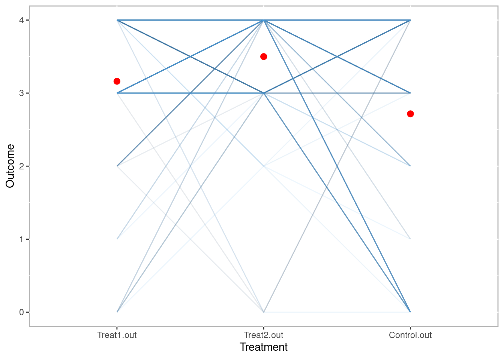

```r
# The Loess plot is imperfect with three sets of propensity scores. There is a
# model parameter to specify which model to use. Once we a model is selected
# we have propensity scores for two of the three groups. We impute a propensity
# score on that model's scale for the third group as the midpoint between
# the other two propensity scores that unit was matched to.
loess3.plot(tutoring.matched, tutoring$Grade, se=FALSE, method='loess')
```

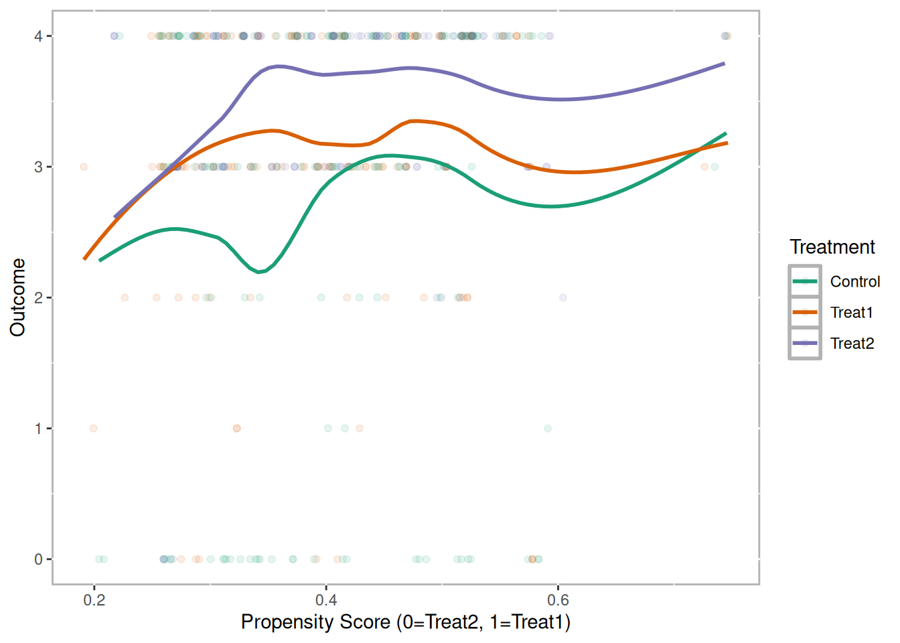

```r
# Turn on 95% confidence interval (see also the level parameter)
loess3.plot(tutoring.matched, tutoring$Grade, se=TRUE, method='loess')
```

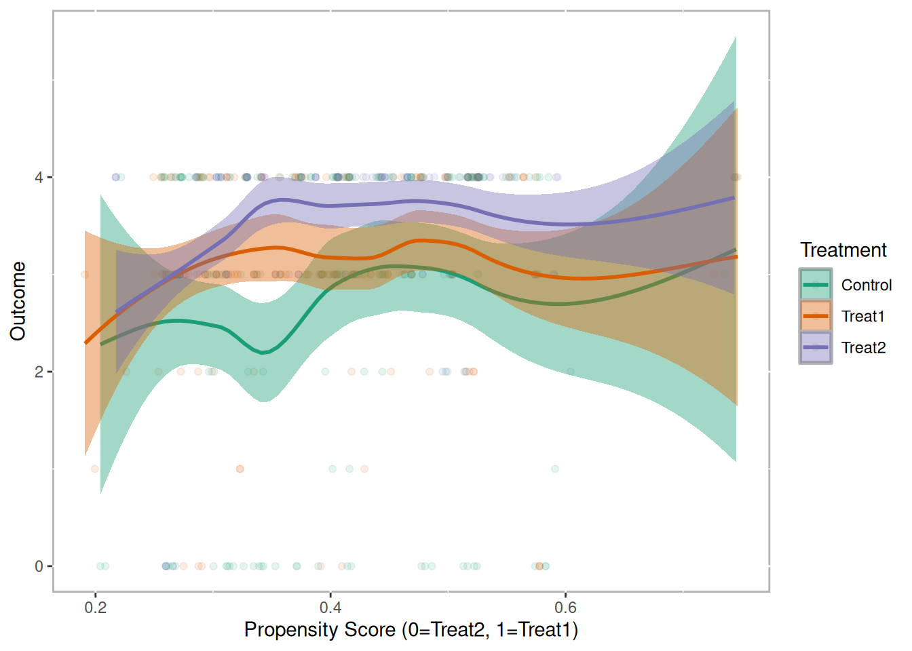

```r
# We can also pass other parameters to the loess function.
loess3.plot(tutoring.matched, tutoring$Grade, se=TRUE, method='loess', span=1)
```

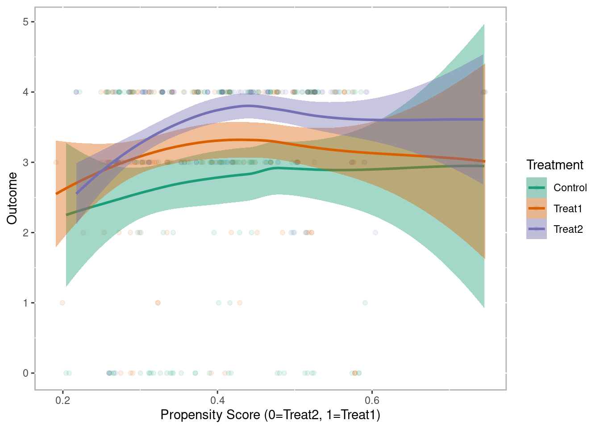

```r
# This is a busy plot, but since all the lines are practically vertical, the
# distance between each pair of propensity scores is minimal.
loess3.plot(tutoring.matched, tutoring$Grade, se=FALSE, method='loess', 
			plot.connections=TRUE)
```

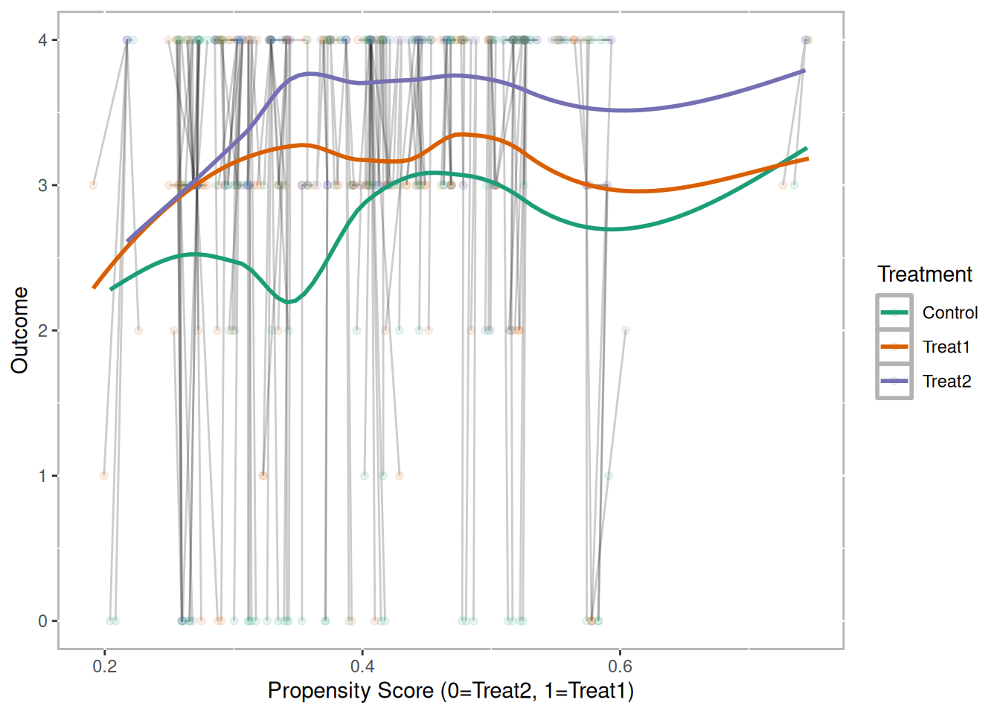

```r
# The merge function will add the outcome to the matched triplet data frame.
# This is useful for other approaches to analyzing the matched triplets.
tmatch.out <- merge(tutoring.matched, tutoring$Grade)
head(tmatch.out)
```

```
##   Treat1 Treat2 Control        D.m3        D.m2         D.m1     Dtotal
## 1    368     39     331 0.007053754 0.001788577 0.0103932229 0.01923555
## 2    800   1088    1105 0.018477707 0.000736057 0.0001821526 0.01939592
## 3    286    655     853 0.016859948 0.004237243 0.0019476652 0.02304486
## 4    158    279     365 0.003373585 0.009530680 0.0107118774 0.02361614
## 5    899    209     100 0.001929173 0.013633300 0.0091835718 0.02474604
## 6   1034    791     484 0.010538949 0.008541671 0.0092350273 0.02831565
##   Treat1.out Treat2.out Control.out
## 1          4          4           0
## 2          4          4           3
## 3          2          4           4
## 4          4          4           4
## 5          4          3           4
## 6          4          4           4
```
