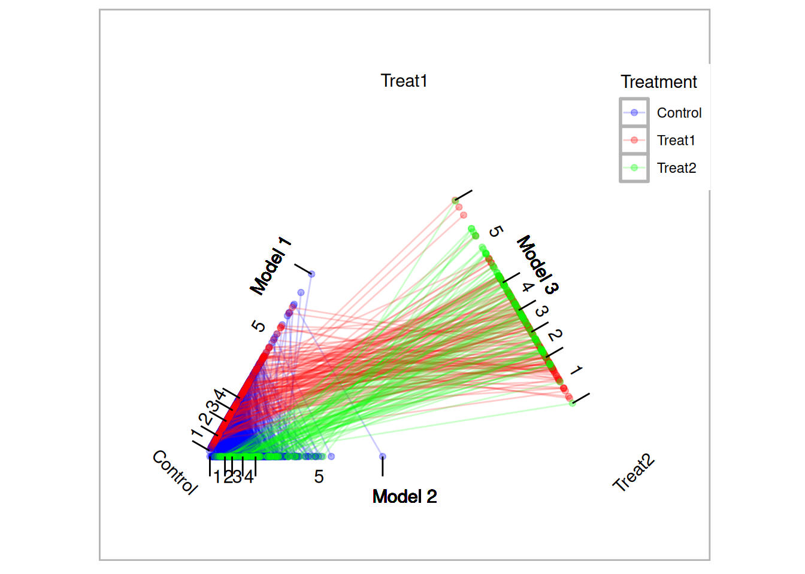
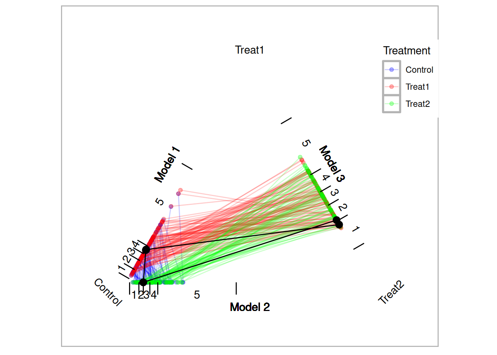
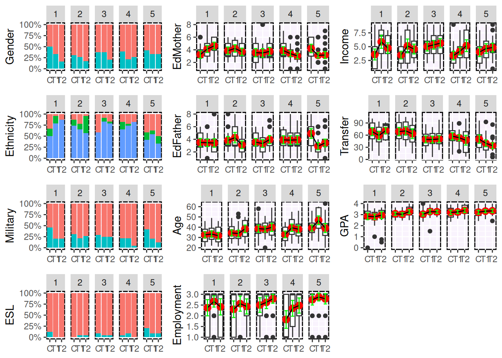
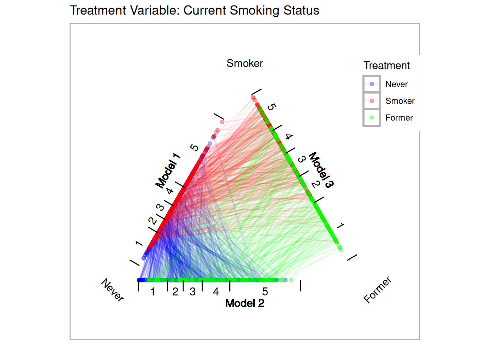

# Non-Binary Treatments {#chapter-non-binary}


# Introduction

Consider two treatments, $Tr_1$ and $Tr_2$, and a control, $C$. We estimate propensity scores with three separate logistic regression models where model one predicts $Tr_1$ with $C$, model two predicts $Tr_2$ with $C$, and model three predicts $Tr_1$ with $Tr_2$. The triangle plot in Figure \@ref(fig:triangleplot) depicts the fitted values (i.e. propensity scores) from the three models on each edge of the triangle. Since each unit has a propensity score in two of the three models, their scores are connected. We can then calculate three distances between propensity scores for each possible matched triplet using the three models. Given those distances, the matched triplets with the smallest standardized distance (i.e. $D_{x,y} = \frac{| PS_{x} - PS_{y} |}{sd(PS)}$) are retained. Several methods for determining which matched triplets to retain are provided with the possibility of the researcher to implement their own. The black lines in Figure \@ref(fig:triangleplot) represent one matched triplet (i.e. one row in the returned data frame).

Propensity score analysis of two groups typically use dependent sample *t*-tests [@Austin2010]. The analogue for matched triplets include repeated measures ANOVA and the Freidman Rank Sum Test. The `TriMatch` package provides utility functions for conducting and visualizing these statistical tests. Moreover, a set of functions extending `PSAgraphics` [@HelmreichPruzek2008] for matched triplets to check covariate balance are provided.

## The `TriMatch` Algorithm

The `trips` and `trimatch` functions are used to estimate the propensity scores and find the best matched triplets, respectively. 


A. Propensity scores are estimated for three models using logistic regression.
$${ PS }_{ 1 }=e({ x }_{ { T }_{ 1 }C })=Pr(z=1|{ X }_{ { T }_{ 1 }C })$$
$${ PS }_{ 2 }=e({ x }_{ { T }_{ 2 }C })=Pr(z=1|{ X}_{ { T }_{ 2 }C })$$
$${ PS }_{ 3 }=e({ x }_{ { T }_{ 2 }{ T }_{ 1 } })=Pr(z=1|{ X }_{ { T }_{ 2 }{ T }_{ 1 } })$$

B. Match order is determined. The default is to start with the larger of the two treatments, followed the second treatment, and lastly the control group. However, the match order is configurable vis-a-vis the `match.order` parameter.

C. Three distance matrices are calculated, $D_1$, $D_2$, and $D_3$ corresponding to the propensity scores estimated in step \@ref(item:ps). That is, $D_1$ is a $n_{Tr_1}$ x $n_{Tr_2}$  matrix where $D_1[x,y]$ is the standardized distance between $PS_1[x]$ and $PS_1[y]$.

D. Distances greater than the caliper, 0.25 by default as recommended by [@RosenbaumRubin1985], are eliminated. The caliper is specified in standard units so 0.25 corresponds to one-quarter of one standard deviation.

E. If partial exact matching is desired, three logical matrices are created with the same dimensions as the distance matrices calculated in step \@ref(item:distance). That is, position $x,y$ in the matrix is true if the covariate(s) to match exactly on between unit $x$ and $y$ match exactly. Distances where exact there are not exact matches are eliminated.

F. For the remaining units, all possible combinations of matched triplets are formed and a total standardized distance is calculated.


The result of the above procedure is the equivalent of caliper matching in the two group case. That is, all possible matches within a specified caliper are retained. This can be achieved by specifying `method = NULL` parameter to the `trimatch` function. Two additional methods are provided to reduce the number of matched triplets. The `maximumTreat` method attempts to reduce the number of duplicate treatment units. This is analogous to matching without replacement in the two group case. However, treatment 1 units may be matched to two different treatment 2 units if that treatment 2 unit would otherwise not be matched. The `OneToN` method will allow the user to specify exactly how many times each treatment 1 and treatment 2 may be reused. 

# Effects of Tutoring on Course Grades

In the first example we will utilize observational data obtained to evaluate the effectiveness of tutoring services on course grades. Treatment students consisted of those students who used tutoring services while enrolled in a online writing course between 2008 and 2011. A comparison group was identified as students enrolled in a course section with a student who used tutoring services. The treatment group was then divided into two based upon the number of times they utilized tutoring services. "Novice" users are those who used the services once and "regular" users are those who used services two or more times. Covariates available for estimating propensity scores are gender, ethnicity, military status, English second language learner, educational level for mother and father, age at the beginning of the course, employment level at college enrollment, income level at college enrollment, number of transfer credits, and GPA at the start of the course.


``` r
names(tutoring)
```

```
##  [1] "treat"      "Course"     "Grade"      "Gender"     "Ethnicity" 
##  [6] "Military"   "ESL"        "EdMother"   "EdFather"   "Age"       
## [11] "Employment" "Income"     "Transfer"   "GPA"        "GradeCode" 
## [16] "Level"      "ID"         "treat2"
```

The courses represented here are structured such that the variation from section-to-section is minimal. However, the differences between courses is substantial and therefore we will utilize partial exact matching so that all matched students will have taken the same course.


``` r
table(tutoring$treat, tutoring$Course, useNA="ifany")
```

```
##          
##           ENG*101 ENG*201 HSC*310
##   Control     349     518      51
##   Treat1       22      36      76
##   Treat2       31      32      27
```

The first step of analysis is to estimate the propensity scores. The `trips` function will estimate three propensity score models, $PS_1$, $PS_2$, and $PS_3$ as described above. Note that when specifying the formula the dependent variable, or treatment indicator, is not included. The `trips` function will replace the dependent variable as it estimates the three logistic regression models.


``` r
formu <- ~ Gender + Ethnicity + Military + ESL + EdMother + EdFather + 
Age + Employment + Income + Transfer + GPA
tutoring.tpsa <- trips(tutoring, tutoring$treat, formu)
```

Figure \@ref(fig:triangleplot) is a triangle plot that depicts the propensity scores from the three models. Since each student has two propensity scores, their scores are connected with a line. The black line in Figure \@ref(fig:triangleplot) represents one matched triplet estimated below.


``` r
plot(tutoring.tpsa)
```



The default for `trimatch` is to use the `maximumTreat` method retaining each treatment unit once with treatment one units matched more than once only if the corresponding treatment two unit would not be matched otherwise.


``` r
tutoring.matched <- trimatch(tutoring.tpsa, exact=tutoring[,c("Course")])
```

Setting the `method` parameter to `NULL` will result in caliper matching. All matched triplets within the specified caliper are retained. This will result in the largest number of matched triplets.


``` r
tutoring.matched.caliper <- trimatch(tutoring.tpsa, 
exact=tutoring[,c("Course")], method=NULL)
```

Lastly, we will use the `OneToN` method to retain a 2-to-1-to-n and 3-to-2-n matches.


``` r
tutoring.matched.2to1 <- trimatch(tutoring.tpsa, 
exact=tutoring[,c("Course")], method=OneToN, M1=2, M2=1)
tutoring.matched.3to2 <- trimatch(tutoring.tpsa, 
exact=tutoring[,c("Course")], 
method=OneToN, M1=3, M2=2)
```


``` r
print(plot(tutoring.matched, rows=c(50), line.alpha=1, draw.segments=TRUE))
```

<div class="figure" style="text-align: center">

<p class="caption">(\#fig:triangleplot)Traingle Plot</p>
</div>

## Examining Unmatched Students

The different methods for retaining matched triplets address the issue of overrepresentation of treatment units. In this example there four times as many control units as treatment units (the ratio is larger when considering the treatments separately). These methods fall on a spectrum where each treatment unit is used minimally (`maximumTreat` method) or all units are used (caliper matching). [@Rosenbaum2012] suggests testing hypothesis more than once and it is our general recommendation to utilize multiple methods. Functions to help present and compare the results from multiple methods are provided and discussed below.

The `unmatched` function will return the rows of students who were not matched. The `summary` function will provide information about how many students within each group were not matched. As shown below, the caliper matching will match the most students. In this particular example, in fact, the only substantial difference in the unmatched students is with the control group. All methods fail to match 37 treatment one students. This is due to the fact that there is not another student within the specified caliper that match exactly on the course.


``` r
summary(unmatched(tutoring.matched))
```

```
## 892 (78.1%) of 1142 total data points were not matched.
## Unmatched by treatment:
##     Control      Treat1      Treat2 
## 834 (90.8%)  39 (29.1%)  19 (21.1%)
```


``` r
summary(unmatched(tutoring.matched.caliper))
```

```
## 638 (55.9%) of 1142 total data points were not matched.
## Unmatched by treatment:
##     Control      Treat1      Treat2 
## 580 (63.2%)  39 (29.1%)  19 (21.1%)
```


``` r
summary(unmatched(tutoring.matched.2to1))
```

```
## 1000 (87.6%) of 1142 total data points were not matched.
## Unmatched by treatment:
##     Control      Treat1      Treat2 
## 870 (94.8%)  97 (72.4%)  33 (36.7%)
```


``` r
summary(unmatched(tutoring.matched.3to2))
```

```
## 928 (81.3%) of 1142 total data points were not matched.
## Unmatched by treatment:
##     Control      Treat1      Treat2 
## 831 (90.5%)    75 (56%)  22 (24.4%)
```


## Checking Balance

The eventual strength of propensity score methods is dependent on how well balance is achieved. [@HelmreichPruzek2008] introduced graphical approaches to evaluating balance. We provide functions that extend that framework to matching of three groups. Figure \@ref(fig:multibalance) is a multiple covariate balance plot that plots the absolute effect size of each covariate before and after adjustment. In this example, the figure suggests that reasonable balance has been achieved across all covariates and across all three models since effect sizes are smaller than the unadjusted in most cases and relatively small.


``` r
print(multibalance.plot(tutoring.tpsa) + ggtitle("Covariate Balance Plot"))
```

<div class="figure" style="text-align: center">

<p class="caption">(\#fig:multibalance)Multiple Covariate Balance Plot of Absolute Standardized Effect Sizes Before and After Propensity Score Adjustment</p>
</div>

Figure \@ref(fig:balance) is the results of the `balance.plot` function. This function will provide a bar chart for categorical covariates and box plots for quantitative covariates, individually or in a grid.


``` r
bplots <- balance.plot(tutoring.matched, tutoring[,all.vars(formu)], 
		legend.position="none", x.axis.labels=c("C","T1","T1"), x.axis.angle=0)
print(plot(bplots, cols=3, byrow=FALSE))
```

<div class="figure" style="text-align: center">

<p class="caption">(\#fig:balance)Covariate Balance Plots</p>
</div>

```
## NULL
```


## Phase II: Estimating Effects of Tutoring on Course Grades

In phase two of propensity score analysis we wish to compare our outcome of interest, course grade in this example, across the matches. A custom `merge` function is provided to merge an outcome from the original data frame to the results of `trimatch`. This merge function will add three columns with the outcome for each of the three groups.


``` r
matched.out <- merge(tutoring.matched, tutoring$Grade)
names(matched.out)
```

```
##  [1] "Treat1"      "Treat2"      "Control"     "D.m3"        "D.m2"       
##  [6] "D.m1"        "Dtotal"      "Treat1.out"  "Treat2.out"  "Control.out"
```

``` r
head(matched.out)
```

```
##   Treat1 Treat2 Control        D.m3        D.m2         D.m1     Dtotal
## 1    368     39     331 0.007053754 0.001788577 1.039322e-02 0.01923555
## 2    158    279     365 0.003373585 0.009530680 1.071188e-02 0.02361614
## 3    899    209     100 0.001929173 0.013633300 9.183572e-03 0.02474604
## 4    692    596    1055 0.023785086 0.010292177 1.862058e-03 0.03593932
## 5    616    209     208 0.020203398 0.016562521 3.168865e-05 0.03679761
## 6     28    852     154 0.007501996 0.014214100 1.776640e-02 0.03948249
##   Treat1.out Treat2.out Control.out
## 1          4          4           0
## 2          4          4           4
## 3          4          3           4
## 4          4          3           4
## 5          4          3           0
## 6          4          4           2
```

Although the `merge` function is convenient for conducting your own analysis, the `summary` function will perform the most common analyses including Friedman Rank Sum test and repeated measures ANOVA. If either of those tests produce a *p* value less than the specified threshold (0.05 by default), then the `summary` function will also perform and return Wilcoxon signed rank test and three separate dependent sample *t*-tests see [@Austin2010] for discussion of dependent versus independent *t*-tests.


``` r
s1 <- summary(tutoring.matched, tutoring$Grade)
names(s1)
```

```
## [1] "PercentMatched"       "friedman.test"        "rmanova"             
## [4] "pairwise.wilcox.test" "t.tests"
```

``` r
s1$friedman.test
```

```
## 
## 	Friedman rank sum test
## 
## data:  Outcome and Treatment and ID
## Friedman chi-squared = 27.904, df = 2, p-value = 8.726e-07
```

``` r
s1$t.tests
```

```
##               Treatments         t  df      p.value sig  mean.diff     ci.min
## 1  Treat1.out-Treat2.out -2.791302 117 6.132601e-03  ** -0.3220339 -0.5505191
## 2 Treat1.out-Control.out  3.817862 117 2.168534e-04 ***  0.7033898  0.3385190
## 3 Treat2.out-Control.out  6.922623 117 2.539540e-10 ***  1.0254237  0.7320670
##        ci.max
## 1 -0.09354868
## 2  1.06826071
## 3  1.31878047
```

The `print` method will accept multiple object returned by `summary` so to combine them into a single table output. Note that each parameter must be named and that name will be used to identify the row containing those results.


``` r
s2 <- summary(tutoring.matched.caliper, tutoring$Grade)
s3 <- summary(tutoring.matched.2to1, tutoring$Grade)
s4 <- summary(tutoring.matched.3to2, tutoring$Grade)

print("Max Treat"=s1, "Caliper"=s2, "2-to-1"=s3, "3-to-2"=s4)
```

```
##      Method Friedman.chi2   Friedman.p     rmANOVA.F    rmANOVA.p    
## 1 Max Treat      27.90354 8.726175e-07 ***  23.84506 3.758176e-10 ***
## 2   Caliper     112.99646 2.904890e-25 *** 108.21057 2.374092e-45 ***
## 3    2-to-1      18.95541 7.653924e-05 ***  15.54945 1.097932e-06 ***
## 4    3-to-2      32.27083 9.828281e-08 ***  25.03567 1.538341e-10 ***
```


``` r
boxdiff.plot(tutoring.matched, tutoring$Grade, 
			 ordering=c("Treat2","Treat1","Control")) + 
	ggtitle("Maximum Treatment Matching")
boxdiff.plot(tutoring.matched.caliper, tutoring$Grade, 
			 ordering=c("Treat2","Treat1","Control")) +
	ggtitle("Caliper Matching")
boxdiff.plot(tutoring.matched.2to1, tutoring$Grade, 
			 ordering=c("Treat2","Treat1","Control")) +
	ggtitle("2-to-1-to-n Matching")
```

<div class="figure" style="text-align: center">

<p class="caption">(\#fig:boxplots)Boxplot of Differences</p>
</div>


Another useful visualization for presenting the results is the Loess plot. In Figure \@ref(fig:loess) we plot the propensity scores on the *x*-axis and the outcome (grade in this example) on the *y*-axis. A Loess regression line is then overlaid.^[We utilize the `geom_smooth` geometry in the `ggplot2` package that provides other smoothing functions including linear modeling (`lm`), generalized linear modeling (`glm`), and robust generalized additive models (`gam`). See the documentation for the `stat_smooth` function in `ggplot2`.] Since there are three propensity score scales, the `plot.loess3` function will use the propensity scores from the model predicting treatment one from treatment two. Propensity scores for the control group are then imputed by taking the mean of the propensity scores of the two treatment units that control was matched to. It should be noted that if a control unit is matched to two different sets of treatment units, then that control unit will have two propensity scores. Which propensity score scale is utilized can be explicitly specified using the `model` parameter.


``` r
loess3.plot(tutoring.matched.caliper, tutoring$Grade, ylab="Grade", 
			points.alpha=.1, method="loess")
```

<div class="figure" style="text-align: center">

<p class="caption">(\#fig:loess)Loess Plot for Caliper Matching</p>
</div>

# Effects of Smoking on Medical Expenditures

In this example^[This example is included as a demo in the package. Type `demo(nmes)` in R to start the demo.]  we will utilize the National Medical Expenditure Study [@nmes] to estimate the effects of smoking on medical expenditures. This dataset was first used by [@Johnson2003] to estimate the effects of smoking on diseases, and then the effect of diseases on medical expenditures. [@ImaiVanDyk2004] developed an a method to generalize the propensity score, called a p-score, to directly estimate the effects of smoking on medical expenditures. More specifically, they defined a quantitative treatment variable, pack year, defined as:

$$packyear = \frac{\text{number of cigarettes per day}}{20} \times \text{number of years smoked}$$

Our approach is designed to match three separate groups and not a continuous treatment. We will address two research questions: (1) What are the effects of smoking status (i.e. never smoked, former smoker, and current smoker) on medical expenditures? and (2) What are the effects of lifetime smoking on medical expenditures? Figure \@ref(fig:packyearsAndTotalExp) represent the relationship between these two different treatments^[Note that the control group in both instances are people who never smoked and is omitted from this figure.]. This figure reveals several, perhaps counterintuitive, facts. First, the unadjusted total medical expenditures for former smokers is higher than current smokers. Secondly, the distribution of $log(packyear)$ overlap substantial between former and current smokers. To dichotomize the pack year smoking variable, we will split on the median of pack year, labeled moderate smokers (i.e. $packyear \le median(packyear)$) and heavy smokers (i.e. $packyear > median(packyear)$).


``` r
data(nmes)
nmes <- subset(nmes, select = c(packyears, smoke, LASTAGE, MALE, RACE3, beltuse, educate, marital, SREGION, POVSTALB, HSQACCWT, TOTALEXP))
```

Both [@Johnson2003] and [@ImaiVanDyk2004] conducted a complete-case analysis and Johnson et al. reported that multiple imputation did not substantially affect their results.


``` r
nmes <- na.omit(nmes)
```

Since many participants had zero medical expenditures, we will add one to the total expenditures before log transforming the variable. We will then calculate the median of pack year and create a new treatment variable, `smoke2`, for moderate and heavy smokers with non-smokers.


``` r
nmes$smoke <- factor(nmes$smoke, levels=c(0,1,2), labels=c("Never","Smoker","Former"))
nmes$LogTotalExp <- log(nmes$TOTALEXP + 1)
(medPY <- median(nmes[nmes$smoke != "Never",]$packyears))
```

```
## 17.00
```

``` r
table(nmes$smoke, nmes$packyears > medPY)
```

```
##         
##          FALSE TRUE
##   Never   9802    0
##   Smoker  2571 2901
##   Former  2209 1869
```

``` r
nmes$smoke2 <- ifelse(nmes$smoke == "Never", "Never", 
ifelse(nmes$packyears > 17, "Heavy", "Moderate"))
table(nmes$smoke, nmes$smoke2, useNA="ifany")
```

```
##         
##          Heavy Moderate Never
##   Never      0        0  9802
##   Smoker  2901     2571     0
##   Former  1869     2209     0
```


``` r
ggplot(nmes[nmes$smoke != "Never",], aes(x=log(packyears+1), color=smoke, fill=smoke)) +
	  	geom_density(alpha=.1) + 
	  	theme(legend.position="none", plot.margin=rep(unit(0, "cm"), 4)) +
	  	xlab("") + ylab("Density")
ggplot(nmes[nmes$smoke != "Never",], aes(x=log(packyears+1), y=LogTotalExp, color=smoke, fill=smoke)) + 
	  	geom_point(alpha=.2) + 
	  	geom_smooth(method="loess", formula = y ~ x) +
	  	scale_color_hue("") + scale_fill_hue("") +
	  	theme(legend.position=c(.9,1), plot.margin=rep(unit(0, "cm"), 4)) + 
	  	xlab("log(Pack Year)") + ylab("log(Total Expenditures)")
```

<div class="figure" style="text-align: center">

<p class="caption">(\#fig:packyearsAndTotalExp)Relationship Between Pack Year and Total Expenditures by Current Smoking Status</p>
</div>

Imai and van Dyk observed that there appeared to be a relationship between age and medical expenditures. We will create a new categorical age variable using quintiles to use for partial exact matching. This serves two purposes, first it ensures balance on this critical covariate (note that we will also exactly match on gender and ethnicity) and two, decrease the search space for matched triplets therefore increasing the efficiency of the matching algorithm. The possible disadvantage of exact matching is that too many treated units will not be matched. We will examine unmatched treatment units below.


``` r
nmes$LastAge5 <- cut(nmes$LASTAGE, 
breaks=quantile(nmes$LASTAGE, probs=seq(0,1,1/5)),
include.lowest=TRUE, orderd_result=TRUE)
```

Define our model to estimate the propensity scores.


``` r
formu <- ~ LASTAGE + MALE + RACE3 + beltuse + educate + marital + 
SREGION + POVSTALB
```

Estimate propensity scores for our two different treatments. Figure \@ref(fig:nmestriangleplot) provides triangle plots for both models.


``` r
tpsa.smoke <- trips(nmes, nmes$smoke, formu)
tpsa.packyears <- trips(nmes, nmes$smoke2, formu)
```


``` r
p.smoke <- plot(tpsa.smoke, sample=c(.05), edge.alpha=.1) + ggtitle("Treatment Variable: Current Smoking Status")
p.packyears <- plot(tpsa.packyears, sample=c(.05), edge.alpha=.1) + ggtitle("Treatment Variable: Lifetime Smoking Frequency")
p.smoke
p.packyears
```

<div class="figure" style="text-align: center">

<p class="caption">(\#fig:nmestriangleplot)Triangle Plots for NMES</p>
</div>

Create two sets of matched triplets for our two treatments.


``` r
tmatch.smoke <- trimatch(tpsa.smoke, 
exact=nmes[,c("LastAge5","MALE","RACE3")])
tmatch.packyears <- trimatch(tpsa.packyears, 
exact=nmes[,c("LastAge5","MALE","RACE3")])
```

The following summary of the unmatched rows show that more than 96% of the treatment units were matched in both models.


``` r
summary(unmatched(tmatch.smoke))
```

```
## 7048 (36.4%) of 19352 total data points were not matched.
## Unmatched by treatment:
##        Never       Smoker       Former 
## 6804 (69.4%)   142 (2.6%)   102 (2.5%)
```

``` r
summary(unmatched(tmatch.packyears))
```

```
## 7532 (38.9%) of 19352 total data points were not matched.
## Unmatched by treatment:
##        Heavy     Moderate        Never 
##  181 (3.79%)  323 (6.76%) 7028 (71.7%)
```

Figure \@ref(fig:nmesbalance) is a multiple covariate balance plot for the two treatments. It shows that the absolute effect sizes after adjustment is better for all covariates. The demo included in the `TriMatch` package provides functions to create individual balance plots for each covaraite.


``` r
p.smoke <- multibalance.plot(tpsa.smoke) + ggtitle("Treatment Variable: Current Smoking Status")
p.packyears <- multibalance.plot(tpsa.packyears) + ggtitle("Treatment Variable: Lifetime Smoking Frequency")
p.smoke
p.packyears
```

<div class="figure" style="text-align: center">

<p class="caption">(\#fig:nmesbalance)Multiple Covariate Balance Plots for NMES</p>
</div>

## Phase II: Estimating Effects of Smoking on Medical Expenditures

For both treatment regimes we used the `maximumTreat` method for finding matched triplets that will retain each treatment unit once with the possibility of using treatment units twice in cases where a treatment unit would not otherwise be matched. The Friedman Rank Sum Test and repeated measures ANOVA indicate there a statistically significant difference in both treatment regimes. Figure \@ref(fig:nmesboxplots) provides box plots of the differences for the two treatment regimes. For the current smoking status treatment, the results indicate that smoker's actually spend less than former and non-smokers. However, as [@ImaiVanDyk2004] explain, the sample of smokers includes only survivors and should be considered when interpreting these results. 

Imai and van Dyk's analysis used pack year as treatment indicator. Our dichotomizing of pack year into moderate and heavy smokers more closely adheres to their approach. The results with this treatment regime indicate that smokers, both moderate and heavy, have higher medical expenditures than non-smokers. However, there is no statistically significant difference between heavy and moderate smokers in medical expenditures. 


``` r
boxdiff.plot(tmatch.smoke, nmes$LogTotalExp, ordering=c("Smoker","Former","Never")) + 
	ggtitle("Treatment Variable: Current Smoking Status")
boxdiff.plot(tmatch.packyears, nmes$LogTotalExp, ordering=c("Heavy","Moderate","Never")) +
	ggtitle("Treatment Variable: Lifetime Smoking Frequency")
```

<div class="figure" style="text-align: center">

<p class="caption">(\#fig:nmesboxplots)Boxplot of Differences for NMES</p>
</div>


``` r
sum.smoke <- summary(tmatch.smoke, nmes$LogTotalExp, 
ordering=c("Smoker","Former","Never"))
sum.packyears <- summary(tmatch.packyears, nmes$LogTotalExp, 
ordering=c("Heavy","Moderate","Never"))
print("Current Smoking Status" = sum.smoke, "Smoking Frequency" = sum.packyears)
```

```
##                   Method Friedman.chi2   Friedman.p     rmANOVA.F    rmANOVA.p
## 1 Current Smoking Status      88.92973 4.888274e-20 ***  74.75344 4.985672e-33
## 2      Smoking Frequency      33.73246 4.732484e-08 ***  13.72351 1.110186e-06
##      
## 1 ***
## 2 ***
```


``` r
sum.smoke$t.tests
```

```
##              Treatments          t   df      p.value sig  mean.diff     ci.min
## 1 Smoker.out-Former.out -11.606558 7407 7.053664e-31 *** -0.4777939 -0.5584907
## 2  Smoker.out-Never.out  -2.644559 7407 8.196991e-03  ** -0.1114564 -0.1940737
## 3  Former.out-Never.out   9.321687 7407 1.483073e-20 ***  0.3663375  0.2892994
##        ci.max
## 1 -0.39709714
## 2 -0.02883914
## 3  0.44337570
```

``` r
sum.packyears$t.test
```

```
##               Treatments          t   df      p.value sig   mean.diff
## 1 Heavy.out-Moderate.out -0.3063659 7507 7.593345e-01     -0.01251173
## 2    Heavy.out-Never.out  4.3264245 7507 1.535124e-05 ***  0.17925216
## 3 Moderate.out-Never.out  4.7239231 7507 2.355422e-06 ***  0.19176389
##        ci.min     ci.max
## 1 -0.09256793 0.06754447
## 2  0.09803395 0.26047036
## 3  0.11218788 0.27133989
```


