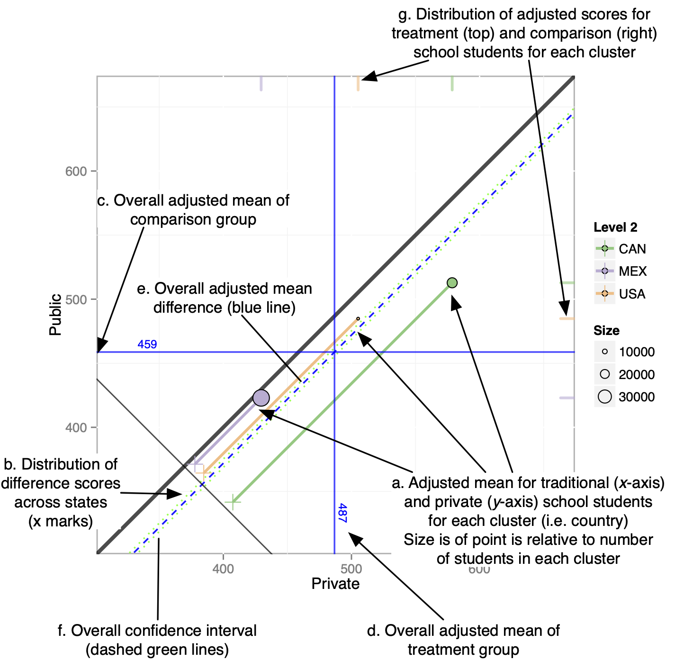
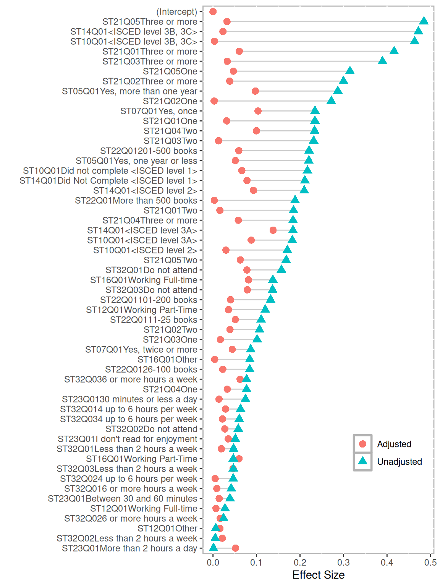
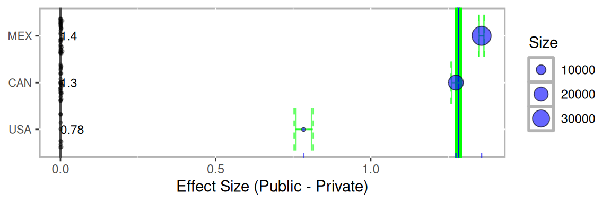

# Multilevel PSA {#chapter-multilevelpsa}

## Introduction

Given the large amount of data to be summarized, the use of graphics are an integral component of representing the results. Pruzek and Helmreich (2009) introduced a class of graphics for visualizing dependent sample tests (see also Pruzek & Helmreich, 2010; Danielak, Pruzek, Doane, Helmreich, & Bryer, 2011). This framework was then extended for propensity score methods using stratification (Helmreich & Pruzek, 2009). In particular, the representation of confidence intervals relative to the unit line (i.e. the line y=x) provided a new way of determining whether there is a statistically significant difference between two groups. The `multilevelPSA` package provides a number of graphing functions that extend these frameworks for multilevel PSA. The figure below represents a multilevel PSA assessment plot with annotations. This graphic represents the results of comparing private and public schools in North America using the Programme of International Student Assessment (PISA; Organisation for Economic Co-Operation and Development, 2009). The PISA data to create this graphic are included in the `multilevelPSA` package and a more detailed description of how to create this graphic are discussed in the next section. Additionally, the use of PISA makes more visible certain features of the graphics used. As discussed in chapters four and five, the differences between charter and traditional public schools is minimal and therefore some features of the figures are less apparent. The following section focuses on the features of this graphic.

In the figure below, the *x*-axis corresponds to math scores for private schools and the y-axis corresponds to public school maths cores. Each colored circle (a) is a country with its size corresponding to the number of students sampled within each country. Each country is projected to the lower left, parallel to the unit line, such that a tick mark is placed on the line with slope -1 (b). These tick marks represent the distribution of differences between private and public schools across countries. Differences are aggregated (and weighted by size) across countries. For math, the overall adjusted mean for private schools is 487, and the overall adjusted mean for public schools is 459 and represented by the horizontal (c) and vertical (d) blue lines, respectively. The dashed blue line parallel to the unit line (e) corresponds to the overall adjusted mean difference and likewise, the dashed green lines (f) correspond to the confidence interval. Lastly, rug plots along the right and top edges of the graphic (g) correspond to the distribution of each country’s overall mean private and public school math scores, respectively.

The figure represents a large amount of data and provides insight into the data and results. The figure provides overall results that would be present in a traditional table, for instance the fact that the green dashed lines do not span the unit line (i.e. y = x) indicates that there is a statistically significant difference between the two groups. However additional information is difficult to convey in tabular format. For example, the rug plots indicate that the spread in the performance of both private and public schools across countries is large. Also observe that Canada, which has the largest PISA scores for both groups, also has the largest difference (in favor of private schools) as represented by the larger distance from the unit line.

<div class="figure" style="text-align: center">

<p class="caption">(\#fig:unnamed-chunk-1)Annotated multilevel PSA assessment plot. This plot compares private schools (x- axis) against public schools (y-axis) for North America from the Programme of International Student Assessment.</p>
</div>

## Working Example

The `multilevelPSA` package includes North American data from the Programme of International Student Assessment (PISA; Organisation for Economic Co-Operation and Development, 2009). This data is made freely available for research and is utilized here so that the R code is reproducible9. This example compares the performance of private and public schools clustered by country. Note that PISA provide five plausible values for the academic scores since students complete a subset of the total assessment. For simplicity, the math score used for analysis is the average of these five plausible scores.


``` r
library(multilevelPSA)
library(party)
```


``` r
data(pisana)
data(pisa.psa.cols)
pisana$MathScore <- apply(pisana[,paste0('PV', 1:5, 'MATH')], 1, sum) / 5
```

The `mlpsa.ctree` function performs phase I of the propensity score analysis using classification trees, specifically using the `ctree` function in the party package. The getStrata function returns a data frame with a number of rows equivalent to the original data frame indicating the stratum for each student.


``` r
mlpsa <- mlpsa.ctree(pisana[,c('CNT', 'PUBPRIV', pisa.psa.cols)], 
                     formula = PUBPRIV ~ ., 
                     level2 = 'CNT')
mlpsa.df <- getStrata(mlpsa, pisana, level2 = 'CNT')
```

Similarly, the `mlpsa.logistic` estimates propensity scores using logistic regression. The `getPropensityScores` function returns a data frame with a number of rows equivalent to the original data frame.


``` r
mlpsa.lr <- mlpsa.logistic(pisana[,c('CNT', 'PUBPRIV', pisa.psa.cols)], 
                           formula = PUBPRIV ~ ., 
                           level2 = 'CNT')
mlpsa.lr.df <- getPropensityScores(mlpsa.lr, nStrata = 5)
```


``` r
head(mlpsa.lr.df)
```

```
##   level2        ps strata
## 1    CAN 0.9171885      2
## 2    CAN 0.9410543      3
## 3    CAN 0.9694831      4
## 4    CAN 0.9300448      2
## 5    CAN 0.8362229      1
## 6    CAN 0.9734376      4
```

The `covariate.balance` function calculates balance statistics for each covariate by estimating the effect of each covariate before and after adjustment. The results can be converted to a data frame to view numeric results or the `plot` function provides a balance plot. This figure depicts the effect size of each covariate before (blue triangle) and after (red circle) propensity score adjustment. As shown here, the effect size for nearly all covariates is smaller than the unadjusted effect size. The few exceptions are for covariates where the unadjusted effect size was already small. There is no established threshold for what is considered a sufficiently small effect size. In general, I recommend adjusted effect sizes less than 0.1 which reflect less than 1% of variance explained.


``` r
cv.bal <- covariate.balance(covariates = pisana[,pisa.psa.cols],
                            treatment = pisana$PUBPRIV,
                            level2 = pisana$CNT,
                            strata = mlpsa.df$strata)
head(as.data.frame(cv.bal))
```

```
##                        covariate     es.adj    es.adj.wtd   es.unadj
## 1                    (Intercept) 0.00000000  0.000000e+00        NaN
## 2 ST05Q01Yes, more than one year 0.09720705  2.335610e-04 0.28695986
## 3   ST05Q01Yes, one year or less 0.05131164  6.622276e-05 0.22032056
## 4               ST07Q01Yes, once 0.10349619 -1.123270e-03 0.23453956
## 5      ST07Q01Yes, twice or more 0.04447145 -3.720711e-04 0.08655983
## 6         ST10Q01<ISCED level 2> 0.02969316 -1.733254e-04 0.17085288
```

``` r
plot(cv.bal)
```

<div class="figure" style="text-align: center">

<p class="caption">(\#fig:covariate-balance)Multilevel PSA balance plot for PISA. The effect sizes (standardized mean differences) for each covariate are provided before PSA adjustment (blue triangles) and after PSA adjustment (red circles).</p>
</div>

The `mlpsa` function performs phase II of propensity score analysis and requires four parameters: the response variable, treatment indicator, stratum, and clustering indicator. The `minN` parameter (which defaults to five) indicates what the minimum stratum size is to be included in the analysis. For this example, 463, or less than one percent of students were removed because the stratum (or leaf node for classification trees) did not contain at least five students from both the treatment and control groups.


``` r
results.psa.math <- mlpsa(response = mlpsa.df$MathScore,
                          treatment = mlpsa.df$PUBPRIV,
                          strata = mlpsa.df$strata,
                          level2 = mlpsa.df$CNT)
```

The `summary` function provides the overall treatment estimates as well as level one and two summaries.


``` r
summary(results.psa.math)
```

```
##    level2  strata     Treat Treat.n    Control Control.n   ci.min   ci.max
## 1     CAN Overall  38.82989    1625  626.72066     21093 581.6370 594.1446
## 2    <NA>       1  14.50000      28  531.84840      1128       NA       NA
## 3    <NA>       2   5.00000       9  616.31146      1326       NA       NA
## 4    <NA>       3   6.00000      11  296.99683       630       NA       NA
## 5    <NA>       4  69.96429     140  982.43080      2240       NA       NA
## 6    <NA>       5   4.50000       8   89.64246       179       NA       NA
## 7    <NA>       6  10.00000      19  151.75484       310       NA       NA
## 8    <NA>       7  42.00000      83 1342.03571      3276       NA       NA
## 9    <NA>       8   3.00000       5   60.50000       120       NA       NA
## 10   <NA>       9  21.00000      41   94.14737       190       NA       NA
## 11   <NA>      10  10.50000      20   46.00000        91       NA       NA
## 12   <NA>      11  22.50000      44  360.42533       750       NA       NA
## 13   <NA>      12  17.50000      34  144.37671       292       NA       NA
## 14   <NA>      13   4.50000       8  232.05263       475       NA       NA
## 15   <NA>      14  11.00000      21   75.70199       151       NA       NA
## 16   <NA>      15  62.83333     126  943.64902      2134       NA       NA
## 17   <NA>      16  13.00000      25  122.71837       245       NA       NA
## 18   <NA>      17  25.00000      49   68.48905       137       NA       NA
## 19   <NA>      18  29.00000      57  317.34901       659       NA       NA
## 20   <NA>      19  56.88496     113  155.76730       318       NA       NA
## 21   <NA>      20   8.00000      15   72.00000       143       NA       NA
## 22   <NA>      21  23.50000      46  194.97236       398       NA       NA
## 23   <NA>      22  49.26263      99   97.50000       194       NA       NA
## 24   <NA>      23  20.50000      40   91.49727       183       NA       NA
## 25   <NA>      24  25.90385      52  168.19591       342       NA       NA
## 26   <NA>      25  51.29126     103  580.64643      1219       NA       NA
## 27   <NA>      26   6.00000      11   57.00000       113       NA       NA
## 28   <NA>      27  18.00000      35  384.02861       804       NA       NA
## 29   <NA>      28   3.00000       5    8.00000        15       NA       NA
## 30   <NA>      29   6.50000      12  169.93391       348       NA       NA
## 31   <NA>      30  73.00000     145  562.38661      1195       NA       NA
## 32   <NA>      31  73.74150     147  392.91241       822       NA       NA
## 33   <NA>      32  14.00000      27    4.00000         7       NA       NA
## 34   <NA>      33  24.00000      47  319.53111       659       NA       NA
## 35    MEX Overall  57.81239    4044  683.78533     34090 622.4796 629.4663
## 36   <NA>       1  41.72289      83    7.00000        13       NA       NA
## 37   <NA>       2  71.68966     145   44.38202        89       NA       NA
## 38   <NA>       3  74.54305     151   88.87640       178       NA       NA
## 39   <NA>       4   7.50000      14   75.83117       154       NA       NA
## 40   <NA>       5  63.25984     127  225.50000       484       NA       NA
## 41   <NA>       6  29.00000      58  298.53228       635       NA       NA
## 42   <NA>       7 121.19433     247  140.26280       293       NA       NA
## 43   <NA>       8 209.76334     431  397.31688       871       NA       NA
## 44   <NA>       9   3.50000       6   55.50000       110       NA       NA
## 45   <NA>      10   8.50000      16   59.59504       121       NA       NA
## 46   <NA>      11 138.54737     285  328.04167       696       NA       NA
## 47   <NA>      12   8.50000      16   56.17857       112       NA       NA
## 48   <NA>      13  17.00000      33  434.16013       943       NA       NA
## 49   <NA>      14  69.50000     138  649.05997      1484       NA       NA
## 50   <NA>      15  49.54545      99  288.23102       619       NA       NA
## 51   <NA>      16  38.83333      78  407.44543       898       NA       NA
## 52   <NA>      17  17.50000      34  127.07252       262       NA       NA
## 53   <NA>      18  57.00000     113  176.61580       367       NA       NA
## 54   <NA>      19  27.00000      53  216.41850       454       NA       NA
## 55   <NA>      20  34.31884      69  177.90736       367       NA       NA
## 56   <NA>      21  37.36842      76  105.10138       217       NA       NA
## 57   <NA>      22  46.54839      93   74.58000       150       NA       NA
## 58   <NA>      23  91.76344     186  260.15539       547       NA       NA
## 59   <NA>      24   5.50000      10   64.78462       130       NA       NA
## 60   <NA>      25  39.17500      80   78.58491       159       NA       NA
## 61   <NA>      26  81.43114     167  465.36442      1040       NA       NA
## 62   <NA>      27  71.41096     146  525.40170      1175       NA       NA
## 63   <NA>      28  23.00000      45  196.59852       406       NA       NA
## 64   <NA>      29  40.50000      80  825.43454      1963       NA       NA
## 65   <NA>      30  31.00000      61  366.45997       787       NA       NA
## 66   <NA>      31  24.50000      48  299.31628       645       NA       NA
## 67   <NA>      32 112.05195     231 1429.14418      4314       NA       NA
## 68   <NA>      33  14.50000      28  135.84946       279       NA       NA
## 69   <NA>      34  17.50000      34  451.56762      1013       NA       NA
## 70   <NA>      35  32.00000      63  925.81218      2364       NA       NA
## 71   <NA>      36   9.50000      18  115.25641       234       NA       NA
## 72   <NA>      37  52.56075     107 1282.64124      3632       NA       NA
## 73   <NA>      38  13.00000      25  956.40222      2434       NA       NA
## 74   <NA>      39   8.00000      15  170.04971       342       NA       NA
## 75   <NA>      40   4.00000       7  792.55896      1959       NA       NA
## 76   <NA>      41   8.00000      15  440.16833      1004       NA       NA
## 77   <NA>      42 152.62620     313   71.74658       146       NA       NA
## 78    USA Overall  18.01128     345  379.63696      4888 349.9843 373.2671
## 79   <NA>       1  25.50000      50  569.57260      1219       NA       NA
## 80   <NA>       2   8.50000      16  599.69690      1323       NA       NA
## 81   <NA>       3  17.00000      34  224.27706       462       NA       NA
## 82   <NA>       4  21.50000      42  130.95817       263       NA       NA
## 83   <NA>       5  20.73810      42  162.84776       335       NA       NA
## 84   <NA>       6  10.76190      21  254.84030       526       NA       NA
## 85   <NA>       7  40.50000      80  136.61511       278       NA       NA
## 86   <NA>       8  21.00000      41  101.38164       207       NA       NA
## 87   <NA>       9   7.50000      14  126.93822       259       NA       NA
## 88   <NA>      10   3.00000       5    8.50000        16       NA       NA
```

The `plot` function creates the multilevel assessment plot. Here it is depicted with side panels showing the distribution of math scores for all strata for public school students to the left and private school students below. These panels can be plotted separately using the `mlpsa.circ.plot` and mlpsa.distribution.plot functions.


``` r
plot(results.psa.math)
```

<div class="figure" style="text-align: center">

<p class="caption">(\#fig:psa-circ-plot)Multilevel PSA assessment plot for PISA. The main panel provides the adjusted mean for private (x-axis) and public (y-axis) for each country. The left and lower panels provide the mean for each stratum for the public and private students, respectively. The overall adjusted mean difference is represented by the dashed blue line and the 95% confidence interval by the dashed green lines. There is a statistically significant difference between private and public school student performance as evidenced by the confidence interval not spanning zero (i.e. not crossing the unit line y=x.</p>
</div>

Lastly, the `mlpsa.difference.plot` function plots the overall differences. The `sd` parameter is optional, but if specified, the x-axis can be interpreted as standardized effect sizes.


``` r
mlpsa.difference.plot(results.psa.math, 
                      sd = mean(mlpsa.df$MathScore, na.rm=TRUE))
```

<div class="figure" style="text-align: center">

<p class="caption">(\#fig:difference-plot)Multilevel PSA difference plot for PISA. Each blue dot corresponds to the effect size (standardized mean difference) for each country. The vertical blue line corresponds to the overall effect size for all countries. The green lines correspond to the 95% confidence intervals. The dashed green lines Bonferroni-Sidak (c.f. Abdi, 2007) adjusted confidence intervals. The size of each dot is proportional to the sample size within each country.</p>
</div>
