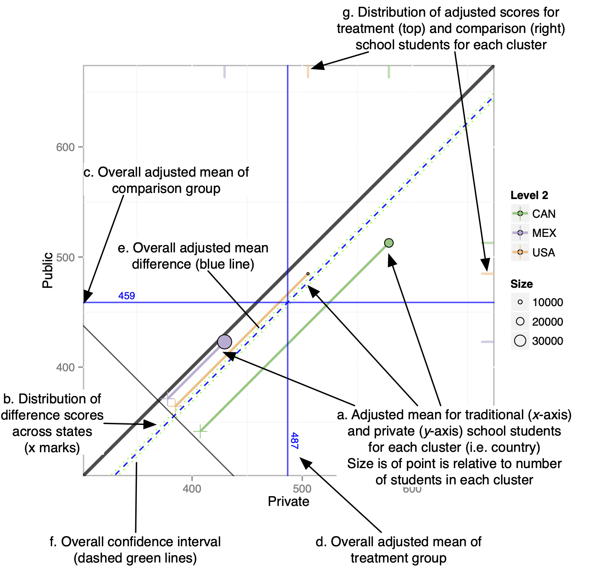

# Multilevel PSA {#chapter-multilevelpsa}

## Introduction

Given the large amount of data to be summarized, the use of graphics are an integral component of representing the results. Pruzek and Helmreich (2009) introduced a class of graphics for visualizing dependent sample tests (see also Pruzek & Helmreich, 2010; Danielak, Pruzek, Doane, Helmreich, & Bryer, 2011). This framework was then extended for propensity score methods using stratification (Helmreich & Pruzek, 2009). In particular, the representation of confidence intervals relative to the unit line (i.e. the line y=x) provided a new way of determining whether there is a statistically significant difference between two groups. The `multilevelPSA` package provides a number of graphing functions that extend these frameworks for multilevel PSA. The figure below represents a multilevel PSA assessment plot with annotations. This graphic represents the results of comparing private and public schools in North America using the Programme of International Student Assessment (PISA; Organisation for Economic Co-Operation and Development, 2009). The PISA data to create this graphic are included in the `multilevelPSA` package and a more detailed description of how to create this graphic are discussed in the next section. Additionally, the use of PISA makes more visible certain features of the graphics used. As discussed in chapters four and five, the differences between charter and traditional public schools is minimal and therefore some features of the figures are less apparent. The following section focuses on the features of this graphic.

In the figure below, the *x*-axis corresponds to math scores for private schools and the y-axis corresponds to public school maths cores. Each colored circle (a) is a country with its size corresponding to the number of students sampled within each country. Each country is projected to the lower left, parallel to the unit line, such that a tick mark is placed on the line with slope -1 (b). These tick marks represent the distribution of differences between private and public schools across countries. Differences are aggregated (and weighted by size) across countries. For math, the overall adjusted mean for private schools is 487, and the overall adjusted mean for public schools is 459 and represented by the horizontal (c) and vertical (d) blue lines, respectively. The dashed blue line parallel to the unit line (e) corresponds to the overall adjusted mean difference and likewise, the dashed green lines (f) correspond to the confidence interval. Lastly, rug plots along the right and top edges of the graphic (g) correspond to the distribution of each country’s overall mean private and public school math scores, respectively.

The figure represents a large amount of data and provides insight into the data and results. The figure provides overall results that would be present in a traditional table, for instance the fact that the green dashed lines do not span the unit line (i.e. y = x) indicates that there is a statistically significant difference between the two groups. However additional information is difficult to convey in tabular format. For example, the rug plots indicate that the spread in the performance of both private and public schools across countries is large. Also observe that Canada, which has the largest PISA scores for both groups, also has the largest difference (in favor of private schools) as represented by the larger distance from the unit line.

<div class="figure" style="text-align: center">

<p class="caption">(\#fig:unnamed-chunk-1)Annotated multilevel PSA assessment plot. This plot compares private schools (x- axis) against public schools (y-axis) for North America from the Programme of International Student Assessment.</p>
</div>

## Working Example

The `multilevelPSA` package includes North American data from the Programme of International Student Assessment (PISA; Organisation for Economic Co-Operation and Development, 2009). This data is made freely available for research and is utilized here so that the R code is reproducible9. This example compares the performance of private and public schools clustered by country. Note that PISA provide five plausible values for the academic scores since students complete a subset of the total assessment. For simplicity, the math score used for analysis is the average of these five plausible scores.


``` r
library(multilevelPSA)
library(party)
```


``` r
data(pisana)
data(pisa.psa.cols)
pisana$MathScore <- apply(pisana[,paste0('PV', 1:5, 'MATH')], 1, sum) / 5
```

The `mlpsa.ctree` function performs phase I of the propensity score analysis using classification trees, specifically using the `ctree` function in the party package. The getStrata function returns a data frame with a number of rows equivalent to the original data frame indicating the stratum for each student.


``` r
mlpsa <- mlpsa.ctree(pisana[,c('CNT', 'PUBPRIV', pisa.psa.cols)], 
                     formula = PUBPRIV ~ ., 
                     level2 = 'CNT')
mlpsa.df <- getStrata(mlpsa, pisana, level2 = 'CNT')
```

Similarly, the `mlpsa.logistic` estimates propensity scores using logistic regression. The `getPropensityScores` function returns a data frame with a number of rows equivalent to the original data frame.


``` r
mlpsa.lr <- mlpsa.logistic(pisana[,c('CNT', 'PUBPRIV', pisa.psa.cols)], 
                           formula = PUBPRIV ~ ., 
                           level2 = 'CNT')
mlpsa.lr.df <- getPropensityScores(mlpsa.lr, nStrata = 5)
```


``` r
head(mlpsa.lr.df)
```

```
##   level2        ps strata
## 1    CAN 0.9171885      2
## 2    CAN 0.9410543      3
## 3    CAN 0.9694831      4
## 4    CAN 0.9300448      2
## 5    CAN 0.8362229      1
## 6    CAN 0.9734376      4
```

The `covariate.balance` function calculates balance statistics for each covariate by estimating the effect of each covariate before and after adjustment. The results can be converted to a data frame to view numeric results or the `plot` function provides a balance plot. This figure depicts the effect size of each covariate before (blue triangle) and after (red circle) propensity score adjustment. As shown here, the effect size for nearly all covariates is smaller than the unadjusted effect size. The few exceptions are for covariates where the unadjusted effect size was already small. There is no established threshold for what is considered a sufficiently small effect size. In general, I recommend adjusted effect sizes less than 0.1 which reflect less than 1% of variance explained.


``` r
cv.bal <- covariate.balance(covariates = pisana[,pisa.psa.cols],
                            treatment = pisana$PUBPRIV,
                            level2 = pisana$CNT,
                            strata = mlpsa.df$strata)
head(as.data.frame(cv.bal))
```

```
##                        covariate     es.adj    es.adj.wtd   es.unadj
## 1                    (Intercept) 0.00000000  0.000000e+00        NaN
## 2 ST05Q01Yes, more than one year 0.09720705  2.335610e-04 0.28695986
## 3   ST05Q01Yes, one year or less 0.05131164  6.622276e-05 0.22032056
## 4               ST07Q01Yes, once 0.10349619 -1.123270e-03 0.23453956
## 5      ST07Q01Yes, twice or more 0.04447145 -3.720711e-04 0.08655983
## 6         ST10Q01<ISCED level 2> 0.02969316 -1.733254e-04 0.17085288
```

``` r
plot(cv.bal)
```

<div class="figure" style="text-align: center">

<p class="caption">(\#fig:covariate-balance)Multilevel PSA balance plot for PISA. The effect sizes (standardized mean differences) for each covariate are provided before PSA adjustment (blue triangles) and after PSA adjustment (red circles).</p>
</div>

The `mlpsa` function performs phase II of propensity score analysis and requires four parameters: the response variable, treatment indicator, stratum, and clustering indicator. The `minN` parameter (which defaults to five) indicates what the minimum stratum size is to be included in the analysis. For this example, 463, or less than one percent of students were removed because the stratum (or leaf node for classification trees) did not contain at least five students from both the treatment and control groups.


``` r
results.psa.math <- mlpsa(response = mlpsa.df$MathScore,
                          treatment = mlpsa.df$PUBPRIV,
                          strata = mlpsa.df$strata,
                          level2 = mlpsa.df$CNT)
```

The `summary` function provides the overall treatment estimates as well as level one and two summaries.


``` r
summary(results.psa.math)
```

```
##    level2  strata    Treat Treat.n  Control Control.n    ci.min     ci.max
## 1     CAN Overall 578.6262    1625 512.7997     21093 -72.08031 -59.572751
## 2    <NA>       1 580.0069      28 491.6351      1128        NA         NA
## 3    <NA>       2 599.9024       9 476.2717      1326        NA         NA
## 4    <NA>       3 585.2667      11 512.7478       630        NA         NA
## 5    <NA>       4 570.6395     140 508.2071      2240        NA         NA
## 6    <NA>       5 578.2330       8 470.1353       179        NA         NA
## 7    <NA>       6 499.9746      19 447.4332       310        NA         NA
## 8    <NA>       7 584.4352      83 503.0039      3276        NA         NA
## 9    <NA>       8 471.0636       5 464.1163       120        NA         NA
## 10   <NA>       9 559.6253      41 525.9859       190        NA         NA
## 11   <NA>      10 501.7639      20 463.2017        91        NA         NA
## 12   <NA>      11 556.9058      44 516.6588       750        NA         NA
## 13   <NA>      12 559.2598      34 520.6171       292        NA         NA
## 14   <NA>      13 561.9538       8 489.0613       475        NA         NA
## 15   <NA>      14 533.6619      21 463.1110       151        NA         NA
## 16   <NA>      15 584.6585     126 519.8063      2134        NA         NA
## 17   <NA>      16 565.9650      25 532.7037       245        NA         NA
## 18   <NA>      17 613.4358      49 576.0543       137        NA         NA
## 19   <NA>      18 563.2071      57 526.8732       659        NA         NA
## 20   <NA>      19 598.0457     113 541.9625       318        NA         NA
## 21   <NA>      20 629.1768      15 561.7597       143        NA         NA
## 22   <NA>      21 588.7047      46 522.5698       398        NA         NA
## 23   <NA>      22 594.4176      99 548.0534       194        NA         NA
## 24   <NA>      23 579.9481      40 542.2590       183        NA         NA
## 25   <NA>      24 581.4634      52 539.2326       342        NA         NA
## 26   <NA>      25 582.1617     103 525.7403      1219        NA         NA
## 27   <NA>      26 625.7713      11 525.2688       113        NA         NA
## 28   <NA>      27 589.4497      35 516.2204       804        NA         NA
## 29   <NA>      28 524.1864       5 482.3364        15        NA         NA
## 30   <NA>      29 551.1838      12 526.8786       348        NA         NA
## 31   <NA>      30 588.0390     145 526.4254      1195        NA         NA
## 32   <NA>      31 602.9849     147 545.2503       822        NA         NA
## 33   <NA>      32 528.0377      27 528.4283         7        NA         NA
## 34   <NA>      33 552.0727      47 510.3964       659        NA         NA
## 35    MEX Overall 429.5247    4044 422.9746     34090 -10.04346  -3.056743
## 36   <NA>       1 516.4931      83 485.4115        13        NA         NA
## 37   <NA>       2 491.4609     145 447.6702        89        NA         NA
## 38   <NA>       3 494.1497     151 475.4165       178        NA         NA
## 39   <NA>       4 417.9966      14 415.7178       154        NA         NA
## 40   <NA>       5 453.8781     127 438.1276       484        NA         NA
## 41   <NA>       6 452.5168      58 431.0051       635        NA         NA
## 42   <NA>       7 496.4715     247 486.7400       293        NA         NA
## 43   <NA>       8 483.2088     431 461.4194       871        NA         NA
## 44   <NA>       9 472.3820       6 466.6849       110        NA         NA
## 45   <NA>      10 460.6080      16 449.7257       121        NA         NA
## 46   <NA>      11 481.4797     285 470.4227       696        NA         NA
## 47   <NA>      12 474.0785      16 442.7985       112        NA         NA
## 48   <NA>      13 405.3955      33 413.0509       943        NA         NA
## 49   <NA>      14 431.6230     138 429.0045      1484        NA         NA
## 50   <NA>      15 472.3767      99 459.7159       619        NA         NA
## 51   <NA>      16 445.3934      78 437.8734       898        NA         NA
## 52   <NA>      17 460.4928      34 461.1886       262        NA         NA
## 53   <NA>      18 460.1316     113 454.8656       367        NA         NA
## 54   <NA>      19 433.8334      53 444.9685       454        NA         NA
## 55   <NA>      20 457.9868      69 445.7740       367        NA         NA
## 56   <NA>      21 461.7578      76 457.0506       217        NA         NA
## 57   <NA>      22 477.1849      93 452.3768       150        NA         NA
## 58   <NA>      23 475.5367     186 459.6453       547        NA         NA
## 59   <NA>      24 476.8898      10 437.3241       130        NA         NA
## 60   <NA>      25 475.5922      80 441.7604       159        NA         NA
## 61   <NA>      26 436.7231     167 427.7595      1040        NA         NA
## 62   <NA>      27 436.3677     146 434.9281      1175        NA         NA
## 63   <NA>      28 441.9648      45 428.9776       406        NA         NA
## 64   <NA>      29 424.4490      80 428.0604      1963        NA         NA
## 65   <NA>      30 436.0249      61 426.6096       787        NA         NA
## 66   <NA>      31 426.2893      48 427.6944       645        NA         NA
## 67   <NA>      32 400.6292     231 409.2472      4314        NA         NA
## 68   <NA>      33 442.1996      28 437.6917       279        NA         NA
## 69   <NA>      34 423.5202      34 426.4274      1013        NA         NA
## 70   <NA>      35 419.9079      63 427.3862      2364        NA         NA
## 71   <NA>      36 408.3097      18 400.4286       234        NA         NA
## 72   <NA>      37 406.4552     107 397.2436      3632        NA         NA
## 73   <NA>      38 424.5754      25 411.6970      2434        NA         NA
## 74   <NA>      39 448.6755      15 431.5050       342        NA         NA
## 75   <NA>      40 362.4143       7 348.4556      1959        NA         NA
## 76   <NA>      41 381.2044      15 346.2349      1004        NA         NA
## 77   <NA>      42 510.2599     313 487.5493       146        NA         NA
## 78    USA Overall 505.2189     345 484.8212      4888 -32.03916  -8.756334
## 79   <NA>       1 479.2228      50 475.0463      1219        NA         NA
## 80   <NA>       2 490.3678      16 447.5507      1323        NA         NA
## 81   <NA>       3 501.7149      34 487.6484       462        NA         NA
## 82   <NA>       4 528.1903      42 506.7805       263        NA         NA
## 83   <NA>       5 511.8919      42 502.8831       335        NA         NA
## 84   <NA>       6 519.6260      21 476.6840       526        NA         NA
## 85   <NA>       7 565.4985      80 558.6464       278        NA         NA
## 86   <NA>       8 560.4173      41 541.0285       207        NA         NA
## 87   <NA>       9 511.0133      14 528.7377       259        NA         NA
## 88   <NA>      10 522.3160       5 460.6910        16        NA         NA
```

The `plot` function creates the multilevel assessment plot. Here it is depicted with side panels showing the distribution of math scores for all strata for public school students to the left and private school students below. These panels can be plotted separately using the `mlpsa.circ.plot` and mlpsa.distribution.plot functions.


``` r
plot(results.psa.math)
```

<div class="figure" style="text-align: center">

<p class="caption">(\#fig:psa-circ-plot)Multilevel PSA assessment plot for PISA. The main panel provides the adjusted mean for private (x-axis) and public (y-axis) for each country. The left and lower panels provide the mean for each stratum for the public and private students, respectively. The overall adjusted mean difference is represented by the dashed blue line and the 95% confidence interval by the dashed green lines. There is a statistically significant difference between private and public school student performance as evidenced by the confidence interval not spanning zero (i.e. not crossing the unit line y=x.</p>
</div>

Lastly, the `mlpsa.difference.plot` function plots the overall differences. The `sd` parameter is optional, but if specified, the x-axis can be interpreted as standardized effect sizes.


``` r
mlpsa.difference.plot(results.psa.math, 
                      sd = mean(mlpsa.df$MathScore, na.rm=TRUE))
```

<div class="figure" style="text-align: center">

<p class="caption">(\#fig:difference-plot)Multilevel PSA difference plot for PISA. Each blue dot corresponds to the effect size (standardized mean difference) for each country. The vertical blue line corresponds to the overall effect size for all countries. The green lines correspond to the 95% confidence intervals. The dashed green lines Bonferroni-Sidak (c.f. Abdi, 2007) adjusted confidence intervals. The size of each dot is proportional to the sample size within each country.</p>
</div>
