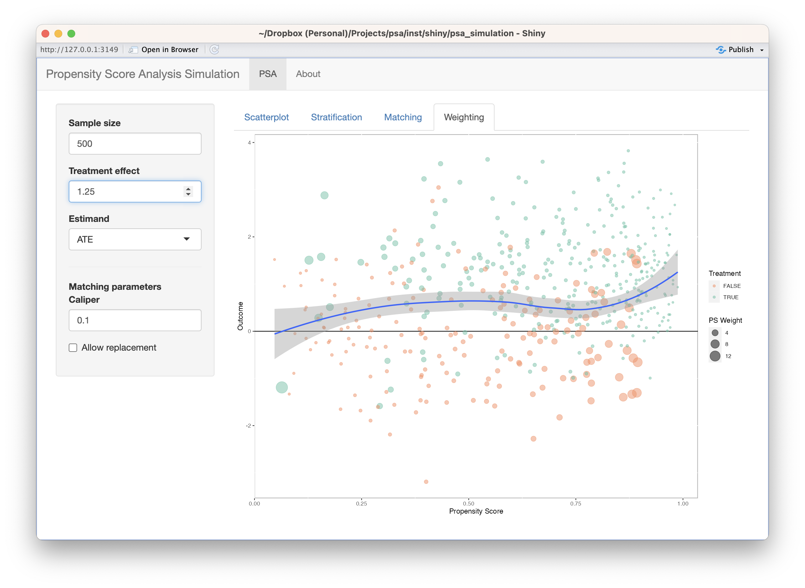

# Shiny Application {#appendix-shiny}

The `psa` R package includes Shiny applications designed to conduct and explore propensity score analysis.

## Propensity Score Analysis Shiny Application

The main PSA Shiny application allows you to conduct all phases of PSA. The application contains several of the datasets discussed in section \@ref(intro-datasets) but you can also upload your own dataset.


```r
psa::psa_shiny()
```

<div class="figure" style="text-align: center">

<p class="caption">(\#fig:shiny-screenshot)PSA Shiny Application</p>
</div>

## Propensity Score Analysis Simulation Shiny Application

The PSA Simulation Shiny application is designed to explore the figures introduced in chapter \@ref(chapter-introduction) for stratification, matching, and weighting. Using the same data simulation procedure used in that chapter, you can control a number of the parameters including treatment effect to explore how the visualizations change and how you can use them to make decisions about treatment effects.


```r
psa::psa_simulation_shiny()
```

<div class="figure" style="text-align: center">

<p class="caption">(\#fig:shiny-screenshot2)PSA Simulation Shiny Application</p>
</div>
