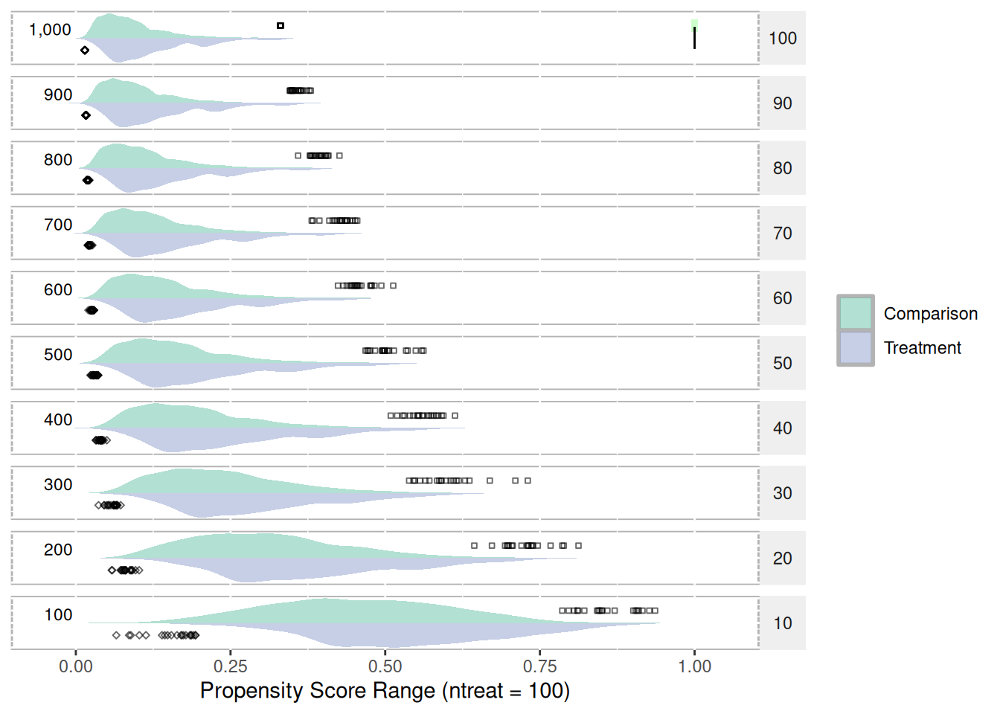
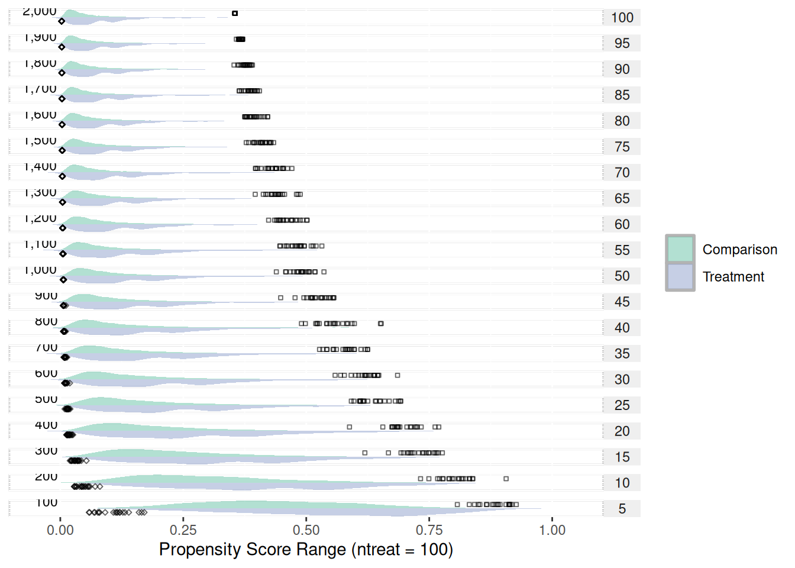
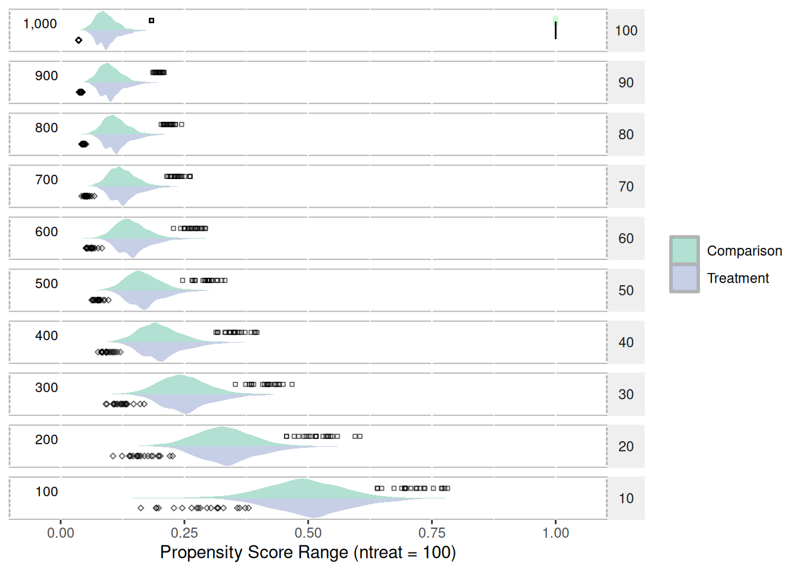
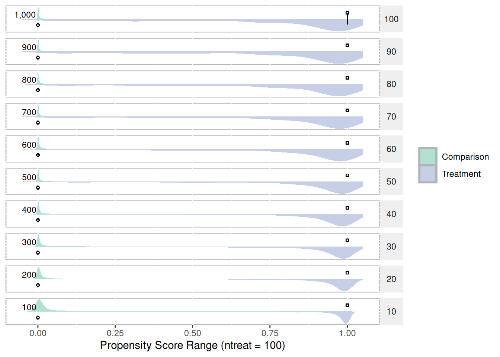
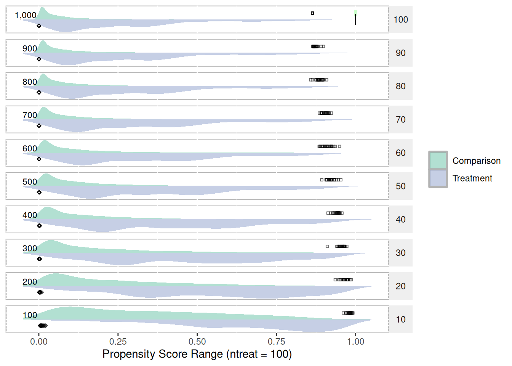

# Propensity Score Ranges {#appendix-psranges}

<!-- TODO: Copied directly from my dissertation. Need to edit -->

With regard to propensity score ranges, the range tends to shrink as the ratio of treatment-to-control increases. Figure 20 depicts the range and distribution of propensity scores (using logistic regression) with varying treatment-to-control ratios. The data used to create this figure is simulated and available in Appendix K. The `psrange` and `plot.psrange` functions are included in the `multilevelPSA` R package. Propensity scores are estimated with a single covariate where the mean for the treatment and control are 0.6 and 0.4, respectively. The standard deviation for both is 0.4. There are 100 treatment units and 1,000 control units simulated. The goal in choosing these means and standard deviations is to have some separation between treatment and control. Each row in the figure represents the percentage of control units sampled before estimating the propensity scores, starting with 100% (i.e. all 1,000 control units) to 10% (100 of the control units). As the figure shows, as the ratio decreases to where there are equal treatment and control units, the range of the propensity scores becomes more normal. To calculate the ranges, each sampling step is bootstrapped so the green bar and black points represent each of the 20 bootstrap samples taken. The bars then represent the mean of the minimum and mean of the maximum for each step.

The "shrinking" of propensity score ranges as the ratio of treatment-to-control increases has implications for the interpretation of propensity scores. Typically, propensity scores are interpreted as the probability of being in the treatment. For studies where the number of treatment and control units are roughly equal, this interpretation is valid. However, in cases where the ratio of treatment-to-control is large, it best to simply interpret the propensity scores as adjustment scores and not probabilities. Since the matching and stratification procedures utilize standard scores (i.e. the propensity score divided by the standard deviation of the propensity scores), should only impact interpretation of the propensity scores and should not impact on the estimated treatment e↵ects. It appears this issue has not been explored in either the PSA or logistic regression literature and additional exploration of the topic appears to be warranted.


``` r
library(multilevelPSA)
getSimulatedData <- function(nvars = 3, ntreat = 100, treat.mean = 0.6, treat.sd = 0.5, 
    ncontrol = 1000, control.mean = 0.4, control.sd = 0.5) {
    if (length(treat.mean) == 1) {
        treat.mean = rep(treat.mean, nvars)
    }
    if (length(treat.sd) == 1) {
        treat.sd = rep(treat.sd, nvars)
    }
    if (length(control.mean) == 1) {
        control.mean = rep(control.mean, nvars)
    }
    if (length(control.sd) == 1) {
        control.sd = rep(control.sd, nvars)
    }
    
    df <- c(rep(0, ncontrol), rep(1, ntreat))
    for (i in 1:nvars) {
        df <- cbind(df, c(rnorm(ncontrol, mean = control.mean[1], sd = control.sd[1]), 
            rnorm(ntreat, mean = treat.mean[1], sd = treat.sd[1])))
    }
    df <- as.data.frame(df)
    names(df) <- c("treat", letters[1:nvars])
    return(df)
}
```

1:10 (100 treatments, 1000 control units)


``` r
test.df1 <- getSimulatedData(ntreat = 100, ncontrol = 1000)
psranges1 <- psrange(test.df1, test.df1$treat, treat ~ ., samples = seq(100, 
    1000, by = 100), nboot = 20)
plot(psranges1)
```




``` r
summary(psranges1)
```

```
##       p ntreat ncontrol ratio min.mean    min.sd min.median    min.se min.min
## 1    10    100      100     1     10.5 5.9160798       10.5 1.3228757       1
## 21   20    100      200     2     10.5 5.9160798       10.5 1.3228757       1
## 41   30    100      300     3     10.5 5.9160798       10.5 1.3228757       1
## 61   40    100      400     4     10.5 5.9160798       10.5 1.3228757       1
## 81   50    100      500     5     10.5 5.9160798       10.5 1.3228757       1
## 101  60    100      600     6     10.5 5.9160798       10.5 1.3228757       1
## 121  70    100      700     7     10.5 5.9160798       10.5 1.3228757       1
## 141  80    100      800     8     10.5 5.9160798       10.5 1.3228757       1
## 161  90    100      900     9     10.5 5.9160798       10.5 1.3228757       1
## 181 100    100     1000    10      1.6 0.5026247        2.0 0.1123903       1
##     min.max max.mean  max.sd max.median   max.se max.min max.max
## 1        20     10.5 5.91608       10.5 1.322876       1      20
## 21       20     10.5 5.91608       10.5 1.322876       1      20
## 41       20     10.5 5.91608       10.5 1.322876       1      20
## 61       20     10.5 5.91608       10.5 1.322876       1      20
## 81       20     10.5 5.91608       10.5 1.322876       1      20
## 101      20     10.5 5.91608       10.5 1.322876       1      20
## 121      20     10.5 5.91608       10.5 1.322876       1      20
## 141      20     10.5 5.91608       10.5 1.322876       1      20
## 161      20     10.5 5.91608       10.5 1.322876       1      20
## 181       2      1.0 0.00000        1.0 0.000000       1       1
```

1:20 (100 treatments, 2000 control units)


``` r
test.df2 <- getSimulatedData(ncontrol = 2000)
psranges2 <- psrange(test.df2, test.df2$treat, treat ~ ., samples = seq(100, 
    2000, by = 100), nboot = 20)
plot(psranges2)
```




``` r
summary(psranges2)
```

```
##       p ntreat ncontrol ratio min.mean    min.sd min.median    min.se min.min
## 1     5    100      100     1    10.50 5.9160798       10.5 1.3228757       1
## 21   10    100      200     2    10.50 5.9160798       10.5 1.3228757       1
## 41   15    100      300     3    10.50 5.9160798       10.5 1.3228757       1
## 61   20    100      400     4    10.50 5.9160798       10.5 1.3228757       1
## 81   25    100      500     5    10.50 5.9160798       10.5 1.3228757       1
## 101  30    100      600     6    10.50 5.9160798       10.5 1.3228757       1
## 121  35    100      700     7    10.50 5.9160798       10.5 1.3228757       1
## 141  40    100      800     8    10.50 5.9160798       10.5 1.3228757       1
## 161  45    100      900     9    10.50 5.9160798       10.5 1.3228757       1
## 181  50    100     1000    10    10.50 5.9160798       10.5 1.3228757       1
## 201  55    100     1100    11    10.50 5.9160798       10.5 1.3228757       1
## 221  60    100     1200    12    10.50 5.9160798       10.5 1.3228757       1
## 241  65    100     1300    13    10.50 5.9160798       10.5 1.3228757       1
## 261  70    100     1400    14    10.50 5.9160798       10.5 1.3228757       1
## 281  75    100     1500    15    10.50 5.9160798       10.5 1.3228757       1
## 301  80    100     1600    16    10.50 5.9160798       10.5 1.3228757       1
## 321  85    100     1700    17    10.50 5.9160798       10.5 1.3228757       1
## 341  90    100     1800    18    10.50 5.9160798       10.5 1.3228757       1
## 361  95    100     1900    19    10.50 5.9160798       10.5 1.3228757       1
## 381 100    100     2000    20     2.55 0.8255779        3.0 0.1846048       1
##     min.max max.mean    max.sd max.median    max.se max.min max.max
## 1        20    10.50 5.9160798       10.5 1.3228757       1      20
## 21       20    10.50 5.9160798       10.5 1.3228757       1      20
## 41       20    10.50 5.9160798       10.5 1.3228757       1      20
## 61       20    10.50 5.9160798       10.5 1.3228757       1      20
## 81       20    10.50 5.9160798       10.5 1.3228757       1      20
## 101      20    10.50 5.9160798       10.5 1.3228757       1      20
## 121      20    10.50 5.9160798       10.5 1.3228757       1      20
## 141      20    10.50 5.9160798       10.5 1.3228757       1      20
## 161      20    10.50 5.9160798       10.5 1.3228757       1      20
## 181      20    10.50 5.9160798       10.5 1.3228757       1      20
## 201      20    10.50 5.9160798       10.5 1.3228757       1      20
## 221      20    10.50 5.9160798       10.5 1.3228757       1      20
## 241      20    10.50 5.9160798       10.5 1.3228757       1      20
## 261      20    10.50 5.9160798       10.5 1.3228757       1      20
## 281      20    10.50 5.9160798       10.5 1.3228757       1      20
## 301      20    10.50 5.9160798       10.5 1.3228757       1      20
## 321      20    10.50 5.9160798       10.5 1.3228757       1      20
## 341      20    10.50 5.9160798       10.5 1.3228757       1      20
## 361      20    10.50 5.9160798       10.5 1.3228757       1      20
## 381       4     1.35 0.4893605        1.0 0.1094243       1       2
```

100 treatments, 1000 control units, equal means and standard deviations


``` r
test.df3 <- getSimulatedData(ncontrol = 1000, treat.mean = 0.5, control.mean = 0.5)
psranges3 <- psrange(test.df3, test.df3$treat, treat ~ ., samples = seq(100, 
    1000, by = 100), nboot = 20)
plot(psranges3)
```




``` r
summary(psranges3)
```

```
##       p ntreat ncontrol ratio min.mean    min.sd min.median    min.se min.min
## 1    10    100      100     1     10.5 5.9160798       10.5 1.3228757       1
## 21   20    100      200     2     10.5 5.9160798       10.5 1.3228757       1
## 41   30    100      300     3     10.5 5.9160798       10.5 1.3228757       1
## 61   40    100      400     4     10.5 5.9160798       10.5 1.3228757       1
## 81   50    100      500     5     10.5 5.9160798       10.5 1.3228757       1
## 101  60    100      600     6     10.5 5.9160798       10.5 1.3228757       1
## 121  70    100      700     7     10.5 5.9160798       10.5 1.3228757       1
## 141  80    100      800     8     10.5 5.9160798       10.5 1.3228757       1
## 161  90    100      900     9     10.5 5.9160798       10.5 1.3228757       1
## 181 100    100     1000    10      1.3 0.4701623        1.0 0.1051315       1
##     min.max max.mean  max.sd max.median   max.se max.min max.max
## 1        20     10.5 5.91608       10.5 1.322876       1      20
## 21       20     10.5 5.91608       10.5 1.322876       1      20
## 41       20     10.5 5.91608       10.5 1.322876       1      20
## 61       20     10.5 5.91608       10.5 1.322876       1      20
## 81       20     10.5 5.91608       10.5 1.322876       1      20
## 101      20     10.5 5.91608       10.5 1.322876       1      20
## 121      20     10.5 5.91608       10.5 1.322876       1      20
## 141      20     10.5 5.91608       10.5 1.322876       1      20
## 161      20     10.5 5.91608       10.5 1.322876       1      20
## 181       2      1.0 0.00000        1.0 0.000000       1       1
```

100 treatments, 1000 control units, very little overlap


``` r
test.df4 <- getSimulatedData(ncontrol = 1000, treat.mean = 0.25, treat.sd = 0.3, 
    control.mean = 0.75, control.sd = 0.3)
psranges4 <- psrange(test.df4, test.df4$treat, treat ~ ., samples = seq(100, 
    1000, by = 100), nboot = 20)
plot(psranges4)
```




``` r
summary(psranges4)
```

```
##       p ntreat ncontrol ratio min.mean    min.sd min.median   min.se min.min
## 1    10    100      100     1    10.50 5.9160798       10.5 1.322876       1
## 21   20    100      200     2    10.50 5.9160798       10.5 1.322876       1
## 41   30    100      300     3    10.50 5.9160798       10.5 1.322876       1
## 61   40    100      400     4    10.50 5.9160798       10.5 1.322876       1
## 81   50    100      500     5    10.50 5.9160798       10.5 1.322876       1
## 101  60    100      600     6    10.50 5.9160798       10.5 1.322876       1
## 121  70    100      700     7    10.50 5.9160798       10.5 1.322876       1
## 141  80    100      800     8    10.50 5.9160798       10.5 1.322876       1
## 161  90    100      900     9    10.50 5.9160798       10.5 1.322876       1
## 181 100    100     1000    10     2.65 0.9880869        2.5 0.220943       1
##     min.max max.mean  max.sd max.median   max.se max.min max.max
## 1        20     10.5 5.91608       10.5 1.322876       1      20
## 21       20     10.5 5.91608       10.5 1.322876       1      20
## 41       20     10.5 5.91608       10.5 1.322876       1      20
## 61       20     10.5 5.91608       10.5 1.322876       1      20
## 81       20     10.5 5.91608       10.5 1.322876       1      20
## 101      20     10.5 5.91608       10.5 1.322876       1      20
## 121      20     10.5 5.91608       10.5 1.322876       1      20
## 141      20     10.5 5.91608       10.5 1.322876       1      20
## 161      20     10.5 5.91608       10.5 1.322876       1      20
## 181       4      1.0 0.00000        1.0 0.000000       1       1
```

100 treat, 1000 control, 10 covariates


``` r
test.df5 <- getSimulatedData(nvars = 10, ntreat = 100, ncontrol = 1000)
psranges5 <- psrange(test.df5, test.df5$treat, treat ~ ., samples = seq(100, 
    1000, by = 100), nboot = 20)
plot(psranges5)
```




``` r
summary(psranges5)
```

```
##       p ntreat ncontrol ratio min.mean   min.sd min.median    min.se min.min
## 1    10    100      100     1    10.50 5.916080       10.5 1.3228757       1
## 21   20    100      200     2    10.50 5.916080       10.5 1.3228757       1
## 41   30    100      300     3    10.50 5.916080       10.5 1.3228757       1
## 61   40    100      400     4    10.50 5.916080       10.5 1.3228757       1
## 81   50    100      500     5    10.50 5.916080       10.5 1.3228757       1
## 101  60    100      600     6    10.50 5.916080       10.5 1.3228757       1
## 121  70    100      700     7    10.50 5.916080       10.5 1.3228757       1
## 141  80    100      800     8    10.50 5.916080       10.5 1.3228757       1
## 161  90    100      900     9    10.50 5.916080       10.5 1.3228757       1
## 181 100    100     1000    10     3.55 1.276302        4.0 0.2853899       1
##     min.max max.mean  max.sd max.median   max.se max.min max.max
## 1        20     10.5 5.91608       10.5 1.322876       1      20
## 21       20     10.5 5.91608       10.5 1.322876       1      20
## 41       20     10.5 5.91608       10.5 1.322876       1      20
## 61       20     10.5 5.91608       10.5 1.322876       1      20
## 81       20     10.5 5.91608       10.5 1.322876       1      20
## 101      20     10.5 5.91608       10.5 1.322876       1      20
## 121      20     10.5 5.91608       10.5 1.322876       1      20
## 141      20     10.5 5.91608       10.5 1.322876       1      20
## 161      20     10.5 5.91608       10.5 1.322876       1      20
## 181       5      1.0 0.00000        1.0 0.000000       1       1
```

