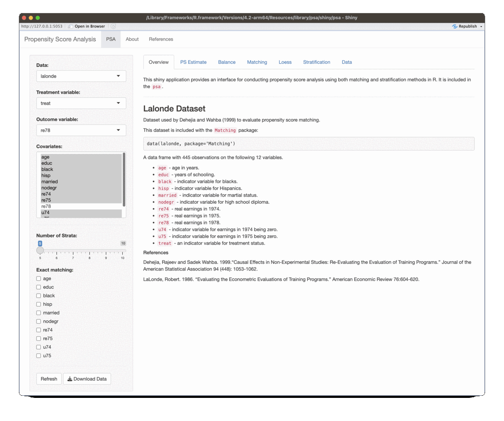

```{r, echo=FALSE, results='hide', message=FALSE, warning=FALSE, error=FALSE}
knitr::opts_chunk$set(
  collapse = TRUE,
  comment = "#>",
  fig.path = "man/figures/README-",
  out.width = "100%"
)
```

#  Propensity Score Analysis with R

<!-- badges: start -->
[](https://github.com/jbryer/psa/actions/workflows/R-CMD-check.yaml)
[](https://github.com/jbryer/psa/actions/workflows/bookdown.yaml)
`r badger::badge_devel("jbryer/psa", "blue")`
`r badger::badge_repostatus("WIP")`
<!-- badges: end -->


Contact: [Jason Bryer](https://www.bryer.org/) ([jason@bryer.org](mailto:jason@bryer.org))  
Bookdown Site: https://psa.bryer.org

## Overview

The use of propensity score methods (Rosenbaum & Rubin, 1983) for estimating causal effects in observational studies or certain kinds of quasi-experiments has been increasing in the social sciences (Thoemmes & Kim, 2011) and in medical research (Austin, 2008) in the last decade. Propensity score analysis (PSA) attempts to adjust selection bias that occurs due to the lack of randomization. Analysis is typically conducted in two phases where in phase I, the probability of placement in the treatment is estimated to identify matched pairs or clusters so that in phase II, comparisons on the dependent variable can be made between matched pairs or within clusters. R (R Core Team, 2012) is ideal for conducting PSA given its wide availability of the most current statistical methods vis-à-vis add-on packages as well as its superior graphics capabilities.

This workshop will provide participants with a theoretical overview of propensity score methods as well as illustrations and discussion of PSA applications. Methods used in phase I of PSA (i.e. models or methods for estimating propensity scores) include logistic regression, classification trees, and matching. Discussions on appropriate comparisons and estimations of effect size and confidence intervals in phase II will also be covered. The use of graphics for diagnosing covariate balance as well as summarizing overall results will be emphasized. 

```{r psa_citations_by_year, echo=FALSE, fig.width=10, fig.height=4}
data('psa_citations', package = 'psa')
library(ggplot2)
ggplot(psa_citations, aes(x = Year, y = Citations, color = Search_Term)) +
	geom_path() +
	scale_color_brewer('Search Teram', type = 'qual', palette = 2) +
	ggtitle('Number of Citations for Propensity Score Analysis',
			subtitle = 'Source: Web of Science and Google Scholar') +
	theme_minimal()
```

## Slides

[Click here](Slides/Intro_PSA.pdf) for slides.

## CUNY MSDS Talk

This is a recording of a talk I gave at CUNY School of Professional Studies on April 24, 2023.

<iframe width="560" height="315" src="https://www.youtube.com/embed/Rq_od5KwqEA" title="YouTube video player" frameborder="0" allow="accelerometer; autoplay; clipboard-write; encrypted-media; gyroscope; picture-in-picture; web-share" allowfullscreen></iframe>


## Getting Started

You can install the `psa` package using the `remotes` package. I recommend setting the `dependencies = 'Enhances'` as many this will install all the packages that are used in the examples.

```{r, eval = FALSE}
remotes::install_github('jbryer/psa', build_vignettes = TRUE, dependencies = 'Enhances')
```

Run the PSA Shiny App:

```{r, eval = FALSE}
psa::psa_shiny()
```

```{r, echo=FALSE}

```

To explore the PSA visualizations in this package through a simulation, run this Shiny application:

```{r, eval = FALSE}
psa::psa_simulation_shiny()
```

```{r, echo=FALSE}
knitr::include_graphics('man/figures/psa_simulation_screenshot.png')
```

## The `MatchBalance` Function

```{r MatchBalance, warning=FALSE}
data(lalonde, package='Matching')
formu.lalonde <- treat ~ age + I(age^2) + educ + I(educ^2) + hisp + married + nodegr + 
	re74  + I(re74^2) + re75 + I(re75^2) + u74 + u75
mb0.lalonde <- psa::MatchBalance(df = lalonde, formu=formu.lalonde)
# summary(mb0.lalonde) # Excluded to save space
plot(mb0.lalonde)
```

## The `loess_plot` Function

```{r loess_plot, warning = FALSE, fig.width=10, fig.height=4}
data(lalonde, package = 'Matching')
lr_out <- glm(treat ~ age + I(age^2) + educ + I(educ^2) + black + 
              hisp + married + nodegr + re74  + I(re74^2) + re75 + I(re75^2) +
              u74 + u75,
			  data = lalonde, 
			  family = binomial(link = 'logit'))
lalonde$ps <- fitted(lr_out)

psa::loess_plot(ps = lalonde$ps,
				outcome = log(lalonde$re78 + 1),
				treatment = as.logical(lalonde$treat))
```

## The `weighting_plot` Function

```{r weighting_plot, warning = FALSE}
psa::weighting_plot(ps = lalonde$ps,
					treatment = lalonde$treat,
					outcome = (lalonde$re78))
```

## The `stratification_plot` Function

```{r}
psa::stratification_plot(ps = lalonde$ps,
						 treatment = lalonde$treat,
						 outcome = lalonde$re78)
```

## The `matching_plot` Function

```{r matching_plot}
match_out <- Matching::Match(Y = lalonde$re78,
							 Tr = lalonde$treat,
							 X = lalonde$ps,
							 caliper = 0.1,
							 replace = FALSE,
							 estimand = 'ATE')

psa::matching_plot(ps = lalonde$ps,
				   treatment = lalonde$treat,
				   outcome = log(lalonde$re78 + 1),
				   index_treated = match_out$index.treated,
				   index_control = match_out$index.control)

```

## The `merge.mids` Function

The `merge.mids` function is a convenience for merging the multiple imputation results from the `mice::mice()` function with the full data frame used for imputation. In the context of PSA imputation is conducted without the including the outcome variable. This function will merge in the outcome, along with any other variables not used in the imputation procedure, with one of the imputed datasets. Additionally, by setting the `shadow.matrix` parameter to `TRUE` the resulting data frame will contain additional logical columns with the suffix `_missing` with a value of `TRUE` if the variable was originally missing and therefore was imputed.


## R Scripts

The following R scripts will outline how to conduct propensity score analysis.

* [Setup.R](R-Scripts/Setup.R) - Install R packages. This script generally needs to be run once per R installation.
* [IntroPSA.R](R-Scripts/IntroPSA.R) - Conducts propensity score analysis and matching, summarizes results, and evaluates balance using the National Supported Work Demonstration and Current Population Survey (aka lalonde data).
* [IntroPSA-Tutoring.R](R-Scripts/IntroPSA.R) - Conducts propensity score analysis and matching, summarizes results, and evaluates balance using data from a study examining student use of tutoring services in an online introductory writing class (from the `TriMatch` package).
* [Sensitivity.R](R-Scripts/Sensitivity.R) - Conduct a sensitivity analysis.
* [Missingness.R](R-Scripts/Missingness.R) - How to evaluate whether data is missing at random.
* [BootstrappingPSA.R](R-Scripts/BootstrappingPSA.R) - Boostrapping PSA.
* [NonBinaryPSA.R](R-Scripts/NonBinaryPSA.R) - Analysis of three groups (two treatments and one control)
* [MultilevelPSA.R](R-Scripts/MultilevelPSA.R) - Multilevel propensity score analysis.

## R Packages

There are a number of R packages available for conducting propensity score analysis. These are the packages this workshop will make use of:

* [`MatchIt`](http://gking.harvard.edu/gking/matchit) (Ho, Imai, King, & Stuart, 2011) Nonparametric Preprocessing for Parametric Causal Inference
* [`Matching`](http://sekhon.berkeley.edu/matching/) (Sekhon, 2011) Multivariate and Propensity Score Matching Software for Causal Inference
* [`multilevelPSA`](http://jason.bryer.org/multilevelPSA) (Bryer & Pruzek, 2011) Multilevel Propensity Score Analysis
* [`party`](http://cran.r-project.org/web/packages/party/index.html) (Hothorn, Hornik, & Zeileis, 2006) A Laboratory for Recursive Partytioning
* [`PSAboot`](http://jason.bryer.org/PSAboot) (Bryer, 2013) Bootstrapping for Propensity Score Analysis
* [`PSAgraphics`](http://www.jstatsoft.org/v29/i06/paper) (Helmreich & Pruzek, 2009) An R Package to Support Propensity Score Analysis
* [`rbounds`](http://www.personal.psu.edu/ljk20/rbounds%20vignette.pdf) (Keele, 2010) An Overview of rebounds: An R Package for Rosenbaum bounds sensitivity analysis with matched data.
* [`rpart`](http://cran.r-project.org/web/packages/rpart/index.html) (Therneau, Atkinson, & Ripley, 2012) Recursive Partitioning
* [`TriMatch`](http://jason.bryer.org/TriMatch) (Bryer, 2013) Propensity Score Matching for Non-Binary Treatments

## References

Rosenbaum, P.R., & Rubin, D.B. (1983). [The central role of the propensity score in observational studies for causal effects](http://faculty.smu.edu/Millimet/classes/eco7377/papers/rosenbaum%20rubin%2083a.pdf). *Biometrika, 70*(1), 41-55.

Rosenbaum, P.R. (2010). *Design of Observational Studies*. New York: Springer.

Austin, P. C. (2011). Comparing paired vs non-paired statistical methods of analyses when making inferences about absolute risk reductions in propensity-score matched samples. *Statistics in Medicine, 30*.

Bryer, J. (2011). multilevelPSA: Multilevel propensity score analysis [Computer software manual]. Retrieved from http://github.com/jbryer/multilevelPSA 

Bryer, J., & Pruzek, R.M. (2011). An international comparison of private and public schools using multilevel propensity score methods and graphics (Abstract). *Multivariate Behavioral Research, 46*(6), 1010-1011.

Helmreich, J. E., & Pruzek, R. M. (2009). PSAgraphics: An R package to support propensity score analysis. *Journal of Statistical Software, 29*(6). Available from http://www.jstatsoft.org/v29/i06/paper

Ho, D.E., Imai, K., King, G., and Stuart, E.A (2011). [MatchIt: Nonparametric Preprocessing for Parametric Causal Inference](http://www.jstatsoft.org/v42/i08/). *Journal of Statistical Software 42*(8).

Hothorn, T., Hornik, K., & Zeileis, A. (2006). Unbiased Recursive Partitioning: A Conditional Inference Framework. *Journal of Computational and Graphical Statistics, 15*(3), 651--674.

R Core Team (2012). [R: A language and environment for statistical computing](http://www.R-project.org/). R Foundation for Statistical Computing, Vienna, Austria. ISBN 3-900051-07-0.

Rosenbaum, P.R. (2005). Sensitivity analysis in observational studies. In B.S. Everitt & D.C. Howell *Encyclopedia of Statistics in Behavioral Science*, pp. 1809-1814. Chichester: John Wiley & Sons.

Rosenbaum, P.R. (2012). Testing one hypothesis twice in observational studies. *Biometrika*.

Sekhon, J.S. (2011). [Multivariate and Propensity Score Matching Software with Automated Balance Optimization: The Matching Package for R](http://www.jstatsoft.org/v42/i07/). *Journal of Statistical Software, 42*(7), 1-52.
  
Shadish, W.R., Clark, M.H., & Steiner, P.M. (2008). Can nonrandomized experiments yield accurate answers? A randomized experiment comparing random and nonrandom assignments. *Journal of the American Statistical Association, 103*(484). 1334-1356.

Stuart, E. A. (2010). Matching methods for causal inference: A review and a look forward. *Statistical Science, 25*, 1-21.

Stuart, E.A., & Rubin, D.B. (2007). Best practices in quasi-experimental designs: Matching methods for causal inference. Chapter 11 (pp. 155-176) in J. Osborne (Ed.). *Best Practices in Quantitative Social Science*. Thousand Oaks, CA: Sage Publications.

Therneau, T., Atkinson, B., & Ripley, B. (2012). [rpart: Recursive Partitioning](http://CRAN.R-project.org/package=rpart). R package version 4.0-1. 
  
Thoemmes, F. J., & Kim, E. S. (2011). A systematic review of propensity score methods in the social sciences. Multivariate Behavioral Research, 46, 90-118.


## Code of Conduct

Please note that the psa project is released with a [Contributor Code of Conduct](https://contributor-covenant.org/version/2/1/CODE_OF_CONDUCT.html). By contributing to this project, you agree to abide by its terms.


