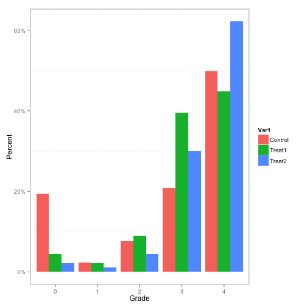
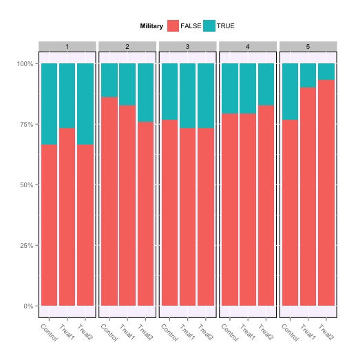
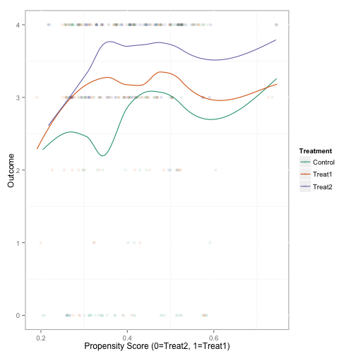
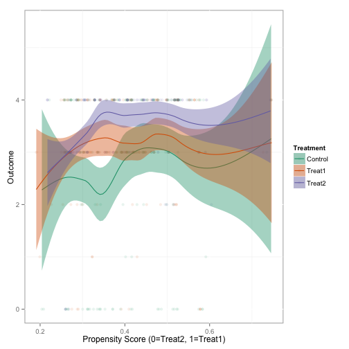

Non-Binary Treatments
========================================================


```r
> opts_knit$set(base.dir = "./", fig.path = "")
> require(TriMatch)
```

```
Loading required package: TriMatch
Loading required package: scales
Loading required package: reshape2
Loading required package: ez
```

```r
> 
> data(tutoring)
> str(tutoring)
```

```
'data.frame':	1142 obs. of  17 variables:
 $ treat     : Factor w/ 3 levels "Control","Treat1",..: 1 1 1 1 1 2 1 1 1 1 ...
 $ Course    : chr  "ENG*201" "ENG*201" "ENG*201" "ENG*201" ...
 $ Grade     : int  4 4 4 4 4 3 4 3 0 4 ...
 $ Gender    : Factor w/ 2 levels "FEMALE","MALE": 1 1 1 1 1 1 1 1 1 1 ...
 $ Ethnicity : Factor w/ 3 levels "Black","Other",..: 2 3 3 3 3 3 3 3 1 3 ...
 $ Military  : logi  FALSE FALSE FALSE FALSE FALSE FALSE ...
 $ ESL       : logi  FALSE FALSE FALSE FALSE FALSE FALSE ...
 $ EdMother  : int  3 5 1 3 2 3 4 4 3 6 ...
 $ EdFather  : int  6 6 1 5 2 3 4 4 2 6 ...
 $ Age       : num  48 49 53 52 47 53 54 54 59 40 ...
 $ Employment: int  3 3 1 3 1 3 3 3 1 3 ...
 $ Income    : num  9 9 5 5 5 9 6 6 1 8 ...
 $ Transfer  : num  24 25 39 48 23 ...
 $ GPA       : num  3 2.72 2.71 4 3.5 3.55 3.57 3.57 3.43 2.81 ...
 $ GradeCode : chr  "A" "A" "A" "A" ...
 $ Level     : Factor w/ 2 levels "Lower","Upper": 1 1 1 1 1 2 1 1 1 1 ...
 $ ID        : int  377 882 292 215 252 265 1016 282 39 911 ...
```

```r
> 
> table(tutoring$treat)
```

```

Control  Treat1  Treat2 
    918     134      90 
```


```r
> # Histogram of unadjusted grades
> tmp <- as.data.frame(prop.table(table(tutoring$treat, tutoring$Grade), 1))
> ggplot(tmp, aes(x = Var2, y = Freq, fill = Var1)) + geom_bar(position = "dodge", 
+     stat = "identity") + scale_y_continuous(labels = percent_format()) + xlab("Grade") + 
+     ylab("Percent") + scale_colour_hue("Treatment")
```

 


```r
> ## Phase I
> 
> # Note that the dependent variable is not included in the formula. The
> # TriMatch functions will replace the dependent variable depending on which
> # pair is being modeled.
> tutoring.formu <- ~Gender + Ethnicity + Military + ESL + EdMother + EdFather + 
+     Age + Employment + Income + Transfer + GPA
> 
> # trips will estimate the propensity scores for each pairing of groups
> tutoring.tpsa <- trips(tutoring, tutoring$treat, tutoring.formu)
> 
> plot(tutoring.tpsa, sample = c(200))
```

 

```r
> 
> # trimatch finds matched triplets.
> tutoring.matched <- trimatch(tutoring.tpsa)
> 
> # Partial exact matching
> tutoring.matched2 <- trimatch(tutoring.tpsa, exact = tutoring$Level)
> 
> # Plotting the results of trimatch is a subset of the triangle plot with
> # only points that were matched. There is also an additional parameter,
> # rows, that will overlay matched triplets.
> plot(tutoring.matched, rows = 1, line.alpha = 1, draw.segments = TRUE)
```

 

```r
> 
> ## Examine the unmatched students
> unmatched <- unmatched(tutoring.matched)
> summary(unmatched)
```

```
819 (71.7%) of 1142 total data points were not matched.
Unmatched by treatment:
    Control      Treat1      Treat2 
795 (86.6%)  17 (12.7%)   7 (7.78%) 
```

```r
> plot(unmatched)
```

 

```r
> 
> ## Check balance
> multibalance.plot(tutoring.tpsa)
```

```
Error: could not find function "cv.trans.psa"
```

```r
> 
> balance.plot(tutoring.matched, tutoring$Age, label = "Age")
```

```
Using propensity scores from model 3 for evaluating balance.
```

```
Error: could not find function "describeBy"
```

```r
> balance.plot(tutoring.matched, tutoring$Military, label = "Military")
```

```
Using propensity scores from model 3 for evaluating balance.
```

```

	Friedman rank sum test

data:  Covariate and Treatment and ID
Friedman chi-squared = 0.4, df = 2, p-value = 0.8187
```

 

```r
> 
> # Create a grid of figures.
> bplots <- balance.plot(tutoring.matched, tutoring[, all.vars(tutoring.formu)], 
+     legend.position = "none", x.axis.labels = c("C", "T1", "T1"), x.axis.angle = 0)
```

```
Error: could not find function "describeBy"
```

```r
> bplots[["Military"]]  # We can plot one at at time.
```

```
Error: object 'bplots' not found
```

```r
> summary(bplots)  # Create a data frame with the statistical results
```

```
Error: object 'bplots' not found
```

```r
> plot(bplots, cols = 3, byrow = FALSE)
```

```
Error: object 'bplots' not found
```

```r
> 
> ## Phase II The summary function performs a number of statistical tests
> ## including Friedman rank sum test, repeated measures ANOVA, and if one or
> ## both of those tests have p values less than 0.5 (the default, but
> ## configurable), then a pairwise Wilcox test and three paired t-tests will
> ## also be performed.
> (sout <- summary(tutoring.matched, tutoring$Grade))
```

```
$PercentMatched
Control  Treat1  Treat2 
 0.1340  0.8731  0.9222 

$friedman.test

	Friedman rank sum test

data:  Outcome and Treatment and ID
Friedman chi-squared = 17.4, df = 2, p-value = 0.0001663


$rmanova
$rmanova$ANOVA
     Effect DFn DFd     F         p p<.05     ges
2 Treatment   2 294 16.66 1.396e-07     * 0.06818

$rmanova$`Mauchly's Test for Sphericity`
     Effect      W         p p<.05
2 Treatment 0.8668 2.947e-05     *

$rmanova$`Sphericity Corrections`
     Effect    GGe     p[GG] p[GG]<.05    HFe     p[HF] p[HF]<.05
2 Treatment 0.8825 6.035e-07         * 0.8924 5.333e-07         *


$pairwise.wilcox.test

	Pairwise comparisons using Wilcoxon signed rank test 

data:  out$Outcome and out$Treatment 

            Treat1.out Treat2.out
Treat2.out  0.0046     -         
Control.out 0.0165     1.9e-06   

P value adjustment method: bonferroni 

$t.tests
              Treatments      t  df   p.value sig mean.diff  ci.min
1  Treat1.out-Treat2.out -3.096 147 2.352e-03  **   -0.3378 -0.5535
2 Treat1.out-Control.out  2.940 147 3.814e-03  **    0.4459  0.1462
3 Treat2.out-Control.out  5.443 147 2.141e-07 ***    0.7838  0.4992
   ci.max
1 -0.1222
2  0.7457
3  1.0683

attr(,"class")
[1] "trimatch.summary" "list"            
```

```r
> ls(sout)
```

```
[1] "friedman.test"        "pairwise.wilcox.test" "PercentMatched"      
[4] "rmanova"              "t.tests"             
```

```r
> 
> boxdiff.plot(tutoring.matched, tutoring$Grade, ordering = c("Treat2", "Treat1", 
+     "Control"))
```

 

```r
> parallel.plot(tutoring.matched, tutoring$Grade)
```

```
Error: could not find function "describeBy"
```

```r
> 
> # The Loess plot is imperfect with three sets of propensity scores. There is
> # a model parameter to specify which model to use. Once we a model is
> # selected we have propensity scores for two of the three groups. We impute
> # a propensity score on that model's scale for the third group as the
> # midpoint between the other two propensity scores that unit was matched to.
> loess3.plot(tutoring.matched, tutoring$Grade, se = FALSE, method = "loess")
```

 

```r
> # Turn on 95% confidence interval (see also the level parameter)
> loess3.plot(tutoring.matched, tutoring$Grade, se = TRUE, method = "loess")
```

 

```r
> # We can also pass other parameters to the loess function.
> loess3.plot(tutoring.matched, tutoring$Grade, se = TRUE, method = "loess", span = 1)
```

 

```r
> # This is a busy plot, but since all the lines are practically vertical, the
> # distance between each pair of propensity scores is minimal.
> loess3.plot(tutoring.matched, tutoring$Grade, se = FALSE, method = "loess", 
+     plot.connections = TRUE)
```

 

```r
> 
> # The merge function will add the outcome to the matched triplet data frame.
> # This is useful for other approaches to analyzing the matched triplets.
> tmatch.out <- merge(tutoring.matched, tutoring$Grade)
> head(tmatch.out)
```

```
  Treat1 Treat2 Control     D.m3      D.m2      D.m1  Dtotal Treat1.out
1    368     39     331 0.007054 0.0017886 0.0103932 0.01924          4
2    800   1088    1105 0.018478 0.0007361 0.0001822 0.01940          4
3    286    655     853 0.016860 0.0042372 0.0019477 0.02304          2
4    158    279     365 0.003374 0.0095307 0.0107119 0.02362          4
5    899    209     100 0.001929 0.0136333 0.0091836 0.02475          4
6   1034    791     484 0.010539 0.0085417 0.0092350 0.02832          4
  Treat2.out Control.out
1          4           0
2          4           3
3          4           4
4          4           4
5          3           4
6          4           4
```

