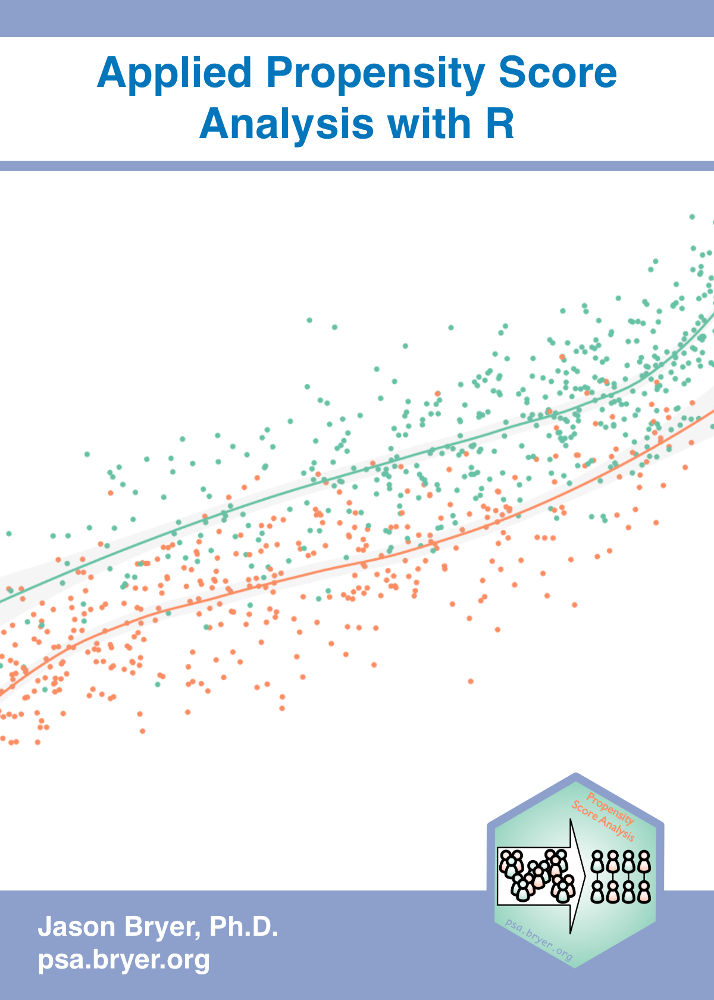

--- 
title: "Applied Propensity Score Analysis with R"
author: "Jason Bryer, Ph.D."
date: "2023-04-20"
site: bookdown::bookdown_site
documentclass: book
url: https://psa.bryer.org
cover-image: images/cover.png
description: |
  An introduction to conducting propensity score analysis with R.
biblio-style: apalike
bibliography: [book.bib, packages.bib]
---

# Preface {-}

Last updated: April 20, 2023

<a href="https://psa.bryer.org" target="_blank"></a>

I was first introduced to propensity score analysis (PSA) by my late dissertation advisor Robert Pruzek in 2006 when I entered graduate school. The notion that you could get reasonable causal estimates without the need of randomization was foreign to me and at first, I was skeptical. Many years later having used PSA for many projects, not only am I convinced it is possible, I believe there are instances where this may be preferred over the randomized control trial. I have been the Principal Investigator for two Federal grants to develop and test the [Diagnostic Assessment and Achievement of College Skills (DAACS)](https://daacs.net) where have attempted to conduct large scale randomized control trials (RCT) involving thousands of students. I have found through my experiences conducting these large scale RCTs that there are numerous compromises made in delivering an intervention that compromise the generalizability of the results. Moreover, RCTs assume a single, homogenous, causal effect for everyone. In reality this is rarely true. Not all interventions are equally effective for everyone. With PSA, particularly in the stratification section, it is possible to tease out how an intervention may vary by the observed covariates.

I have taught PSA many times over the years. This "book" is my attempt to collect my notes and experiences on conducting PSA. For the most part I will emphasize the applied and provide links to references if the reader wishes to explore the theoretical in more details. Additionally, the book will make extensive use of visualizations both to explain concepts as well their use for presenting results. The `psa` R package that accompanies this book is available on Github and can be installed using the `remotes` package with the command below. By setting the `dependencies = 'Enhances'` parameter will ensure that all the R packages used in this book are installed as well. The `psa` package contains a number of datasets and utility functions used throughout the book. But it also contains a [Shiny](https://shiny.rstudio.com) application designed to conduct PSA using a graphical user interface. Details on using the application are provided in the [appendix](#psa_shiny).


```r
remotes::install_github('jbryer/psa',
						build_vignettes = TRUE,
						dependencies = 'Enhances')
```

## Contributing {.unnumbered}

This books is a work in progress and contributions are welcome. Please adhere to the [code of conduct](https://github.com/jbryer/psa/blob/master/CODE_OF_CONDUCT.md). Each page has an edit link which will take you directly to the source file on [Github](https://github.com/jbryer/psa). You can also submit feedback using the [Github Issues](https://github.com/jbryer/psa/issues) tracker.

## Acknowledgements {.unnumbered}

This website was created using [bookdown](https://bookdown.org) and is hosted by [Github](https://github.com/jbryer/psa) [pages](https://www.google.com/search?client=safari&rls=en&q=github+pages&ie=UTF-8&oe=UTF-8).

## Colophon {.unnumbered}


```r
devtools::session_info()
```

```
## ─ Session info ───────────────────────────────────────────────────────────────
##  setting  value
##  version  R version 4.2.3 (2023-03-15)
##  os       Ubuntu 22.04.2 LTS
##  system   x86_64, linux-gnu
##  ui       X11
##  language (EN)
##  collate  C.UTF-8
##  ctype    C.UTF-8
##  tz       UTC
##  date     2023-04-20
##  pandoc   2.19.2 @ /usr/bin/ (via rmarkdown)
## 
## ─ Packages ───────────────────────────────────────────────────────────────────
##  ! package       * version  date (UTC) lib source
##    abind           1.4-5    2016-07-21 [1] CRAN (R 4.2.3)
##  P backports       1.4.1    2021-12-13 [?] RSPM (R 4.2.0)
##    bookdown        0.33     2023-03-06 [1] CRAN (R 4.2.3)
##  P boot            1.3-28.1 2022-11-22 [3] CRAN (R 4.2.3)
##  P bslib           0.4.2    2022-12-16 [?] RSPM (R 4.2.0)
##  P cachem          1.0.7    2023-02-24 [?] RSPM (R 4.2.0)
##  P callr           3.7.3    2022-11-02 [?] RSPM (R 4.2.0)
##    car           * 3.1-2    2023-03-30 [1] CRAN (R 4.2.3)
##    carData       * 3.0-5    2022-01-06 [1] CRAN (R 4.2.3)
##  P cli             3.6.1    2023-03-23 [?] RSPM (R 4.2.0)
##  P codetools       0.2-19   2023-02-01 [3] CRAN (R 4.2.3)
##    coin            1.4-2    2021-10-08 [1] CRAN (R 4.2.3)
##  P colorspace      2.1-0    2023-01-23 [?] RSPM (R 4.2.0)
##  P crayon          1.5.2    2022-09-29 [?] RSPM (R 4.2.0)
##  P devtools        2.4.5    2022-10-11 [?] RSPM (R 4.2.0)
##  P digest          0.6.31   2022-12-11 [?] RSPM (R 4.2.0)
##  P downlit         0.4.2    2022-07-05 [?] RSPM (R 4.2.0)
##  P dplyr         * 1.1.1    2023-03-22 [?] RSPM (R 4.2.0)
##  P ellipsis        0.3.2    2021-04-29 [?] RSPM (R 4.2.0)
##  P evaluate        0.20     2023-01-17 [?] RSPM (R 4.2.0)
##    ez            * 4.4-0    2016-11-02 [1] CRAN (R 4.2.3)
##  P fansi           1.0.4    2023-01-22 [?] RSPM (R 4.2.0)
##  P fastmap         1.1.1    2023-02-24 [?] RSPM (R 4.2.0)
##  P fs              1.6.1    2023-02-06 [?] RSPM (R 4.2.0)
##  P generics        0.1.3    2022-07-05 [?] RSPM (R 4.2.0)
##  P ggplot2       * 3.4.2    2023-04-03 [?] RSPM (R 4.2.0)
##    ggthemes        4.2.4    2021-01-20 [1] CRAN (R 4.2.3)
##  P glue            1.6.2    2022-02-24 [?] RSPM (R 4.2.0)
##    granova       * 2.2      2023-03-22 [1] CRAN (R 4.2.3)
##  P granovaGG     * 1.4.0    2015-12-18 [?] RSPM (R 4.2.0)
##  P gridExtra       2.3      2017-09-09 [?] RSPM (R 4.2.0)
##  P gtable          0.3.3    2023-03-21 [?] RSPM (R 4.2.0)
##  P highr           0.10     2022-12-22 [?] RSPM (R 4.2.0)
##  P htmltools       0.5.5    2023-03-23 [?] RSPM (R 4.2.0)
##  P htmlwidgets     1.6.2    2023-03-17 [?] RSPM (R 4.2.0)
##  P httpuv          1.6.9    2023-02-14 [?] RSPM (R 4.2.0)
##  P jquerylib       0.1.4    2021-04-26 [?] RSPM (R 4.2.0)
##  P jsonlite        1.8.4    2022-12-06 [?] RSPM (R 4.2.0)
##  P knitr         * 1.42     2023-01-25 [?] RSPM (R 4.2.0)
##  P later           1.3.0    2021-08-18 [?] RSPM (R 4.2.0)
##  P lattice         0.20-45  2021-09-22 [3] CRAN (R 4.2.3)
##    libcoin         1.0-9    2021-09-27 [1] CRAN (R 4.2.3)
##  P lifecycle       1.0.3    2022-10-07 [?] RSPM (R 4.2.0)
##    lme4            1.1-32   2023-03-14 [1] CRAN (R 4.2.3)
##  P magrittr        2.0.3    2022-03-30 [?] RSPM (R 4.2.0)
##  P MASS          * 7.3-58.2 2023-01-23 [3] CRAN (R 4.2.3)
##    Matching      * 4.10-8   2022-11-03 [1] CRAN (R 4.2.3)
##    MatchIt       * 4.5.3    2023-04-13 [1] CRAN (R 4.2.3)
##  P Matrix          1.5-3    2022-11-11 [3] CRAN (R 4.2.3)
##    matrixStats     0.63.0   2022-11-18 [1] CRAN (R 4.2.3)
##  P memoise         2.0.1    2021-11-26 [?] RSPM (R 4.2.0)
##  P mgcv            1.8-42   2023-03-02 [3] CRAN (R 4.2.3)
##  P mime            0.12     2021-09-28 [?] RSPM (R 4.2.0)
##  P miniUI          0.1.1.1  2018-05-18 [?] RSPM (R 4.2.0)
##    minqa           1.2.5    2022-10-19 [1] CRAN (R 4.2.3)
##    mnormt          2.1.1    2022-09-26 [1] CRAN (R 4.2.3)
##    modeltools      0.2-23   2020-03-05 [1] CRAN (R 4.2.3)
##    multcomp        1.4-23   2023-03-09 [1] CRAN (R 4.2.3)
##    multilevelPSA * 1.2.5    2018-03-22 [1] CRAN (R 4.2.3)
##  P munsell         0.5.0    2018-06-12 [?] RSPM (R 4.2.0)
##    mvtnorm         1.1-3    2021-10-08 [1] CRAN (R 4.2.3)
##  P nlme            3.1-162  2023-01-31 [3] CRAN (R 4.2.3)
##    nloptr          2.0.3    2022-05-26 [1] CRAN (R 4.2.3)
##    party           1.3-13   2023-03-17 [1] CRAN (R 4.2.3)
##  P pillar          1.9.0    2023-03-22 [?] RSPM (R 4.2.0)
##  P pkgbuild        1.4.0    2022-11-27 [?] RSPM (R 4.2.0)
##  P pkgconfig       2.0.3    2019-09-22 [?] RSPM (R 4.2.0)
##  P pkgload         1.3.2    2022-11-16 [?] RSPM (R 4.2.0)
##  P plyr            1.8.8    2022-11-11 [?] RSPM (R 4.2.0)
##  P prettyunits     1.1.1    2020-01-24 [?] RSPM (R 4.2.0)
##  P processx        3.8.1    2023-04-18 [?] RSPM (R 4.2.0)
##  P profvis         0.3.7    2020-11-02 [?] RSPM (R 4.2.0)
##  P promises        1.2.0.1  2021-02-11 [?] RSPM (R 4.2.0)
##  P ps              1.7.5    2023-04-18 [?] RSPM (R 4.2.0)
##    PSAboot       * 1.3.6    2023-03-22 [1] CRAN (R 4.2.3)
##    PSAgraphics   * 2.1.2    2023-03-21 [1] CRAN (R 4.2.3)
##    psych           2.3.3    2023-03-18 [1] CRAN (R 4.2.3)
##  P purrr           1.0.1    2023-01-10 [?] RSPM (R 4.2.0)
##  P R6              2.5.1    2021-08-19 [?] RSPM (R 4.2.0)
##  P randomForest    4.7-1.1  2022-05-23 [?] RSPM (R 4.2.0)
##  P RColorBrewer    1.1-3    2022-04-03 [?] RSPM (R 4.2.0)
##  P Rcpp            1.0.10   2023-01-22 [?] RSPM (R 4.2.0)
##  P remotes         2.4.2    2021-11-30 [?] RSPM (R 4.2.0)
##    reshape         0.8.9    2022-04-12 [1] CRAN (R 4.2.3)
##  P reshape2      * 1.4.4    2020-04-09 [?] RSPM (R 4.2.0)
##  P rlang           1.1.0    2023-03-14 [?] RSPM (R 4.2.0)
##  P rmarkdown       2.21     2023-03-26 [?] RSPM (R 4.2.0)
##  P rpart         * 4.1.19   2022-10-21 [3] CRAN (R 4.2.3)
##    sandwich        3.0-2    2022-06-15 [1] CRAN (R 4.2.3)
##  P sass            0.4.5    2023-01-24 [?] RSPM (R 4.2.0)
##  P scales        * 1.2.1    2022-08-20 [?] RSPM (R 4.2.0)
##  P sessioninfo     1.2.2    2021-12-06 [?] RSPM (R 4.2.0)
##  P shiny           1.7.4    2022-12-15 [?] RSPM (R 4.2.0)
##  P stringi         1.7.12   2023-01-11 [?] RSPM (R 4.2.0)
##  P stringr         1.5.0    2022-12-02 [?] RSPM (R 4.2.0)
##    strucchange     1.5-3    2022-06-15 [1] CRAN (R 4.2.3)
##  P survival        3.5-3    2023-02-12 [3] CRAN (R 4.2.3)
##    TH.data         1.1-2    2023-04-17 [1] CRAN (R 4.2.3)
##  P tibble          3.2.1    2023-03-20 [?] RSPM (R 4.2.0)
##  P tidyselect      1.2.0    2022-10-10 [?] RSPM (R 4.2.0)
##    TriMatch      * 0.9.9    2017-12-06 [1] CRAN (R 4.2.3)
##  P urlchecker      1.0.1    2021-11-30 [?] RSPM (R 4.2.0)
##  P usethis         2.1.6    2022-05-25 [?] RSPM (R 4.2.0)
##  P utf8            1.2.3    2023-01-31 [?] RSPM (R 4.2.0)
##  P vctrs           0.6.1    2023-03-22 [?] RSPM (R 4.2.0)
##  P withr           2.5.0    2022-03-03 [?] RSPM (R 4.2.0)
##  P xfun            0.38     2023-03-24 [?] RSPM (R 4.2.0)
##  P xml2            1.3.3    2021-11-30 [?] RSPM (R 4.2.0)
##  P xtable        * 1.8-4    2019-04-21 [?] RSPM (R 4.2.0)
##  P yaml            2.3.7    2023-01-23 [?] RSPM (R 4.2.0)
##    zoo             1.8-12   2023-04-13 [1] CRAN (R 4.2.3)
## 
##  [1] /home/runner/.cache/R/renv/library/psa-1b3136f9/R-4.2/x86_64-pc-linux-gnu
##  [2] /home/runner/.cache/R/renv/sandbox/R-4.2/x86_64-pc-linux-gnu/e11edd0e
##  [3] /opt/R/4.2.3/lib/R/library
## 
##  P ── Loaded and on-disk path mismatch.
## 
## ──────────────────────────────────────────────────────────────────────────────
```

## License {.unnumbered}

<a rel="license" href="http://creativecommons.org/licenses/by-nc-sa/4.0/"></a><br />This work by [Jason Bryer](https://bryer.org/) is licensed under a <a rel="license" href="http://creativecommons.org/licenses/by-nc-sa/4.0/">Creative Commons Attribution-NonCommercial-ShareAlike 4.0 International License</a>.
